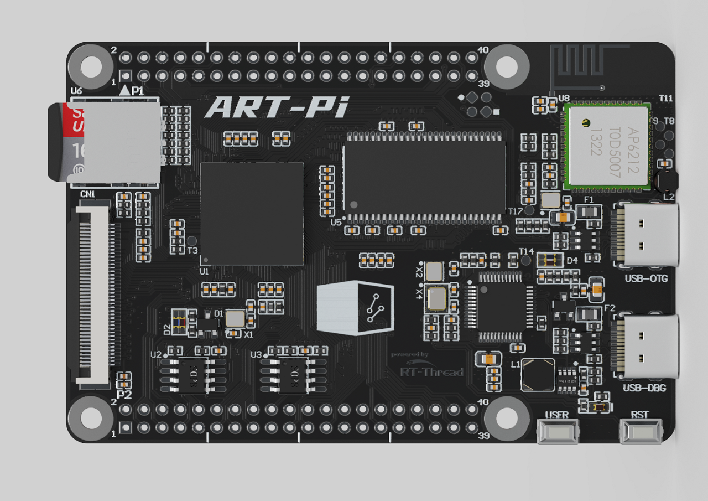

## Introduction

[中文页](README_ZH.md) | English Page

sdk-bsp-stm32h750-realthread-artpi is a support package made by the RT-Thread team for the ART-Pi development board. It can also be used as a software SDK for user development, allowing users to develop their own applications more easily and conveniently.

ART-Pi is a DIY open source hardware with extended functions specially designed for embedded software engineers and open source makers after half a year of careful preparation by the RT-Thread team.



## Directory Structure

```
$ sdk-bsp-stm32h750-realthread-artpi
├── README.md
├── RealThread_STMH750-ART-Pi.yaml
├── debug
├── documents
│   ├── coding_style_cn.md
│   ├── board
│   └── figures
├── libraries
│ ├── STM32H7xx_HAL
│ ├── drivers
│ ├── rt_ota_lib
│ └── wlan_wiced_lib
├── projects
│ ├── art_pi_blink_led
│ ├── art_pi_bootloader
│ ├── art_pi_factory
│ ├── art_pi_wifi
│ └── industry_io_gateway
├── rt-thread
└── tools
```

-RealThread_STMH750-ART-Pi.yaml
  Describe the hardware information of ART-Pi
-debug
  QSPI FLASH download algorithm, etc.
-documents
  Drawings, documents, pictures and datasheets, etc.
-libraries
  STM32H7 firmware library, general peripheral driver, rt_ota firmware library, wlan firmware library, etc.
-projects
  Sample project folder, including factory program, gateway program, etc.
-rt-thread
  rt-thread source code
-tools
  wifi firmware, BT firmware, rbl packaging tool, etc.
## Use

sdk-bsp-stm32h750-realthread-artpi supports RT-Thread Studio and MDK development

### RT-Thread Studio development


1. Open the package manager of RT-Thread Studio and install the ART-PI SDK resource package

  


2. After the installation is complete, choose to create a project based on BSP
    

### MDK Development
1. Download the SDK in [ART-Pi SDK Warehouse](https://github.com/RT-Thread-Studio/sdk-bsp-stm32h750-realthread-artpi)

2. Enter the project directory. Such as: sdk-bsp-stm32h750-realthread-artpi\projects\art_pi_blink_led

3. Use [ENV](https://club.rt-thread.org/ask/question/5699.html) tool to execute the mklink command to create symbolic links for the `rt-thread` and `libraries` files respectively

   ```
   E:\project\sdk-bsp-stm32h750-realthread-artpi\projects\art_pi_blink_led>mklink /D rt-thread ..\..\rt-thread
   symbolic link created for rt-thread <<===>> ..\..\rt-thread
   
   E:\project\sdk-bsp-stm32h750-realthread-artpi\projects>mklink /D libraries ..\..\libraries
   symbolic link created for libraries <<===>> ..\..\libraries
   
   E:\project\sdk-bsp-stm32h750-realthread-artpi\projects>
   ```
4. Use [ENV](https://club.rt-thread.org/ask/question/5699.html) tool to execute 'scons --target=mdk5'
   

## ART-Pi Communication Platform

ART-Pi is an open source creative hardware platform. We look forward to having more friends who can discover more fun together. If you have any ideas and suggestions during use, we suggest you contact us through the following methods.

RT-Thread [Facebook](https://www.facebook.com/RT-Thread-IoT-OS-110395723808463).

## Contributing code

If you are interested in ART-Pi and have some fun projects willing to share with you, welcome to contribute code to us, you can refer to [ART-Pi Code Contribution Manual](https://github.com/RT-Thread-Studio/sdk-bsp-stm32h750-realthread-artpi/blob/master/documents/UM5004-RT-Thread%20ART-Pi%20%E4%BB%A3%E7%A0%81%E8%B4%A1%E7%8C%AE%E6%89%8B%E5%86%8C.md).
