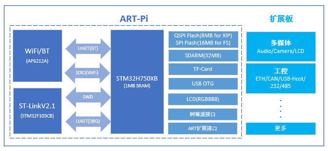
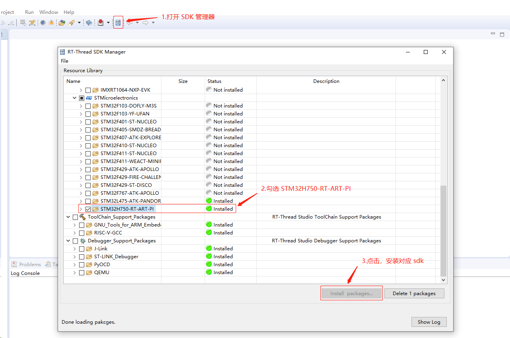
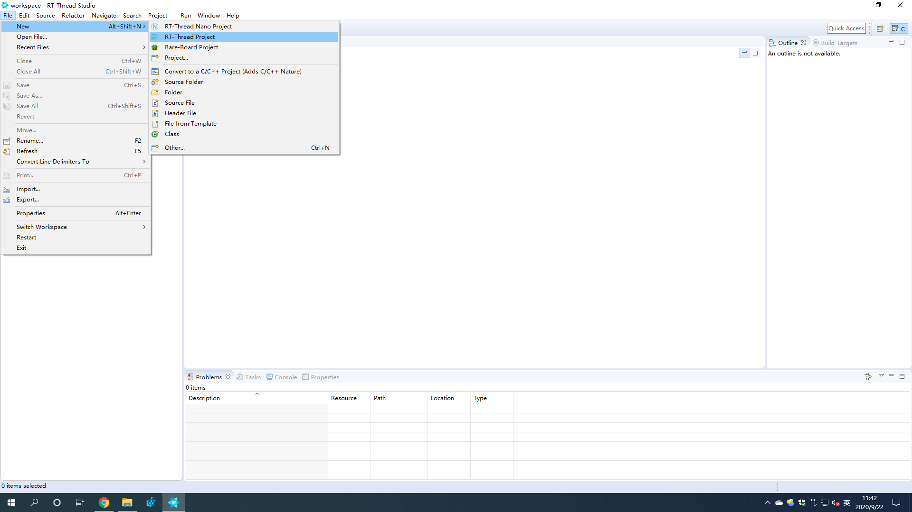
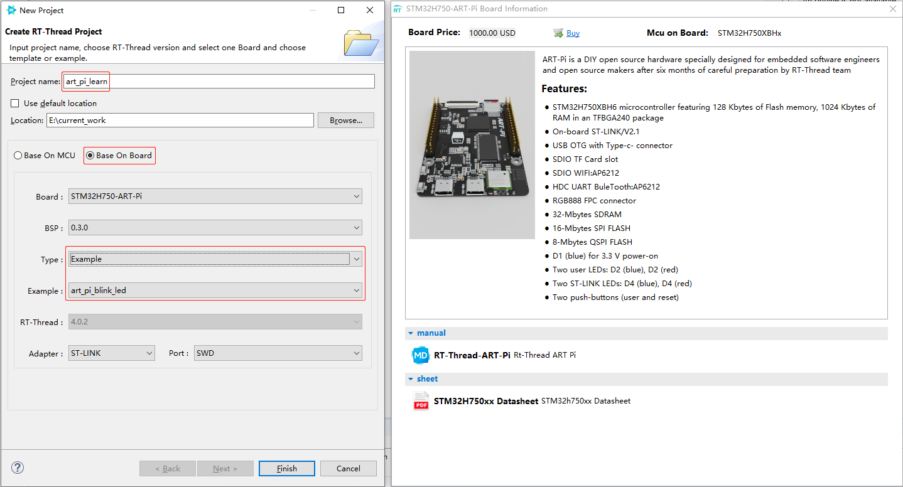
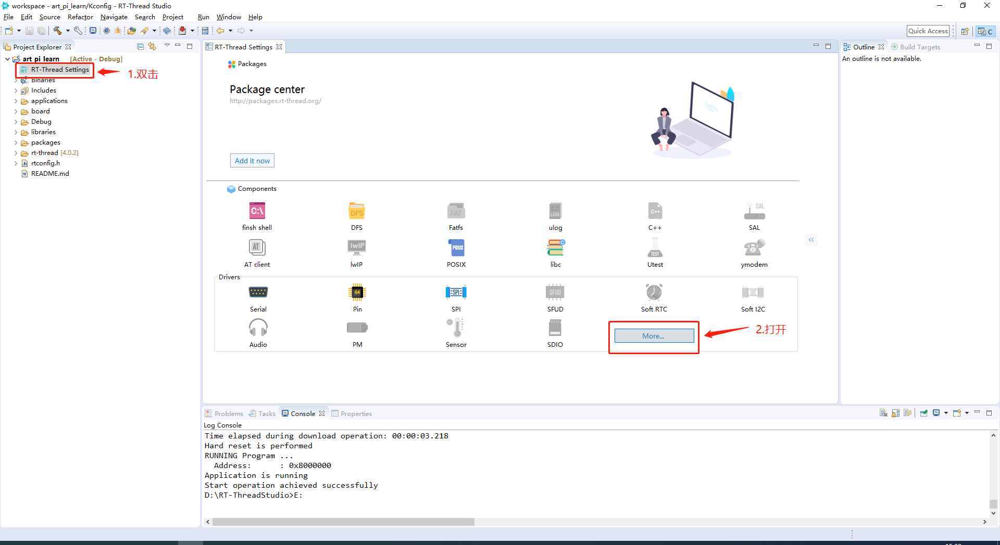
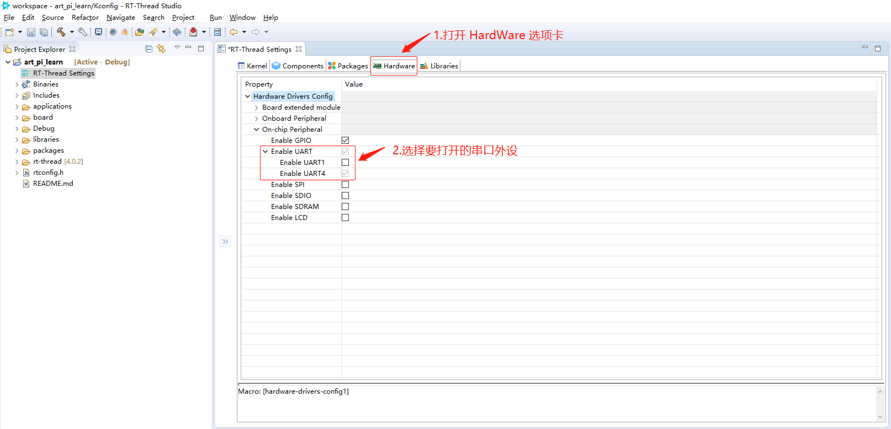
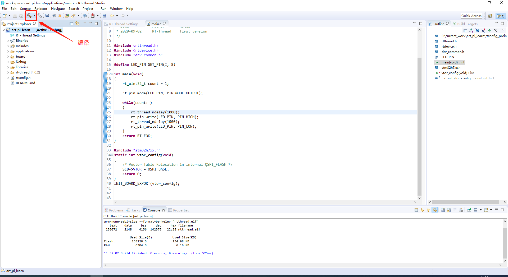
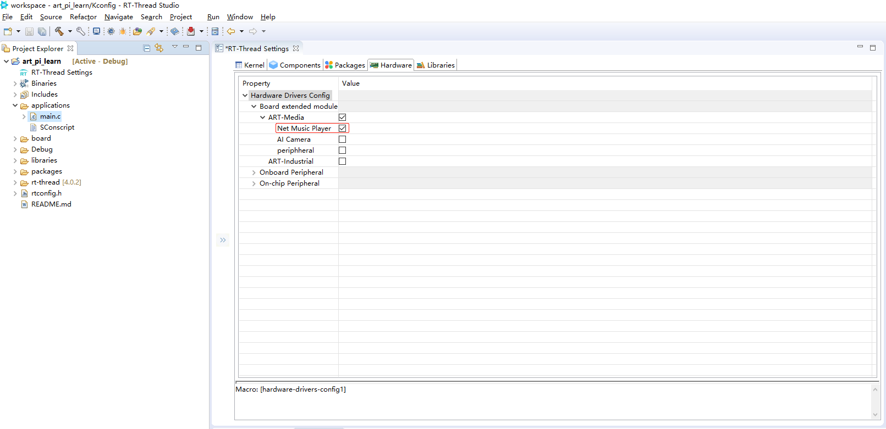

# ART-Pi开发指南

## 前言
   本文主要讲述如何在 ART-Pi 上运行 RT-Thread 的开发流程。包括驱动的加载，以及使用。本文档适用于有一定 RT-Thread 开发经验的工程师。
## 软件资源
   ART-Pi 使用 RT-Thread 4。0。3 版本的操作系统，提供丰富的系统资源和其他软件资源。 ART-Pi  SDK 提供了 bootloader，下载算法，各种驱动，以及各种软件包。并提供基于 RTT-Studio 和 MDK 的开发环境。

|  **名称**  | **描述** | **支持情况** | **是否开源** |
| :--------: | :------: | :------: | :----------: |
| bootloader |   从 0x08000000 跳转到 0x90000000 的程序   | 支持 |     开源     |
|  下载算法  |   片外 FLASH 下载算法   |   支持   |     开源     |
|    驱动    |   板载外设驱动   |   支持  |     开源     |
|   软件包   |   社区开发的 DEMO 使用到的软件包   |   支持  |     开源     |

## 硬件资源

   ART-Pi 是 RT-Thread 团队基于 ST 公司超高性能 MCU STM32H7 系列开发的一套开源硬件。该开源硬件除了丰富的核心板资源以外，还有丰富的扩展接口。

   核心板采用 ST 公司的 STM32H750XB 作为主控 MCU，板载 TF Card, SDRAM,LCD(RGB 888),WIFI ,BT ,SPI FLASH ,QSPI FLASH,USB-OTG。核心板用排针的方式，引出了2路扩展接口，扩展外设资源丰富，其中一路完全兼容树莓派，可以很方便的实现扩展功能。
ART-Pi 资源如下：

1. **主控芯片:** STM32H750XB。（采用Cortex-M7内核，主频高达480Mhz，具有16KB I/D Cache，1Mbytes RAM，128Kbytes FLASH，支持QSPI，4个DMA控制器，4个I2C，4个USART/UART，1个LPUART，6个SPI，4个SAI，2个SDMMC控制器，2个USB OTG(一个FS，一个HS/FS)，1个ETH，2个CAN控制器(2个CAN FD，1个(TT-CAN))，3个16位ADC，2个12位 DAC，2个超低功耗比较器，TFTLCD控制器，DMA2D，硬件JPEG，1个高分辨率定时器，2个32位定时器，2个16位点击控制定时器，10个16位通用定时器，5个16位低功耗定时器，2个开门狗，1个系统定时器，1个RTC(带日历)，支持加密加速，最高可达 168 I/O。)
2. **WIFI/BT:** AP6212A。（无线模块符合ieee802。11 b/g/n标准，在802。11n草案中单流可达到72。2Mbps的速度，IEEE规定为54Mbps 802。11g，或IEEE 802。11b的11Mbps连接到无线局域网。集成模块提供WiFi的SDIO接口，蓝牙的UART / I2S / PCM接口，以及调频的UART / I2S / PCM接口。）
3. **板载仿真器:** ST-LinkV2。（支持虚拟串口，拖拽下载）
4. **片外 SDRAM 内存:** 32MB 大内存。
5. **QSPI FLASH :** 8MB 用于存放执行代码。
6. **TF-Card :** TF 卡座。
7. **USB OTG :** 采用 typec 接口。
8. **LCD接口 :** RGB888
9. **树莓派接口 :** 完美兼容树莓派模组。
10. **ART 扩展接口 :** RT-Thread 官方自定义的接口。
11. **扩展板 :** 多媒体扩展板;工控板扩展板。(开发者们可以自己 DIY art-pi 的扩展板)

最大可扩展外设
|  **外设**  | **数量** |
| :--------: | :------|
| UART |   7   |
|  SPI  |   4   |
|    IIC    |   3   |
|   SAI   |   -   |
| ETH |   1   |
|  CAN  |   2   |
|   DCMI   |   1   |
| USB_FS | 1 |

## 开发环境

本章节将介绍如何使用 ART-Pi 的开发环境。通过阅读本章节，你将了解软件工具的使用，并能快速的搭建 DIY 开发环境。

### 软件环境

为了方便创客快速上手 art-pi ，RTT 研发团队为开发者们在 rt-thread studio 里提供了 art-pi-sdk。进行开发前，需要安装最新版 rt-thread studio。[下载链接](https://www.rt-thread.org/page/studio.html)

[RTT-Studio 使用教程](https://www.rt-thread.org/document/site/rtthread-studio/nav/)

安装完 rt-thread studio 后，需要如下图所示在 sdk 管理器里安装 art-pi-sdk 。

### 硬件环境

使用 art-pi 只需要 一台电脑 + typec线 + art-pi 三样东西即可实现硬件环境的搭建。

## 驱动使用与应用开发

本章节将介绍 art-pi 的驱动使用与应用开发。阅读本章节需要开发者具有一颗爱折腾的心。

### 驱动添加说明

RT-Thread 开发团队为 art-pi 提供了几乎全部可用的底层驱动,并且与 RT-Thread studio 结合。开发者们可以使用图形化选项,非常方便直观的为工程添加驱动文件。之所以这么做,我们是希望开发者们能更多的关注代码本身,而不是将时间耗费在工程的搭建上。

以串口驱动的使用为例,截图步骤如下：

点击 File->New->RT-Thread Project 创建新工程；

填写工程名称；选择 Base On Board；选择 Example；

双击 RT-Thread Setting 打开图形配置界面。

打开 HardWare 选项卡；选择 Enable UART4；

如图所示进行编译；

更多关于串口驱动的使用可以参考官网文档 [串口使用文档](https://www.rt-thread.org/document/site/programming-manual/device/uart/uart/)

### 应用开发

在熟练的掌握了驱动的添加使用流程后,就是运用驱动写一些自己喜欢的 DIY 应用了。当然 art-pi-sdk 自身也提供了几个社区开发者制作的应用作为参考。

以网络播放器应用为例，打开 HardWare 选项卡；选择 Net Music Player；

