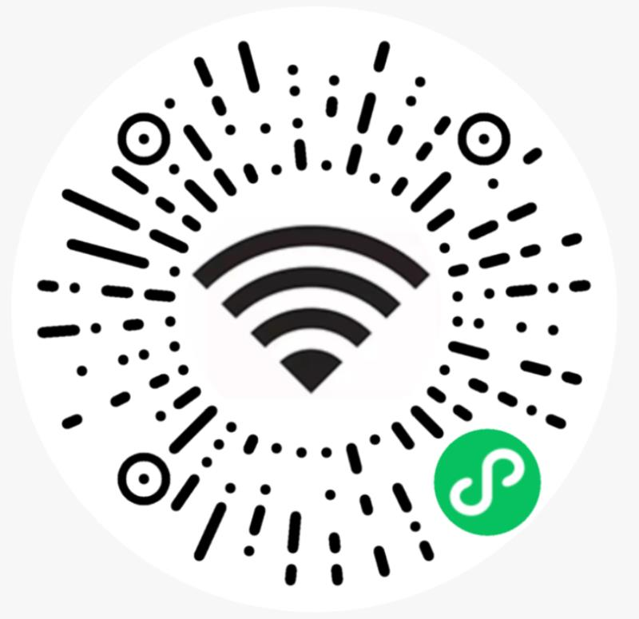
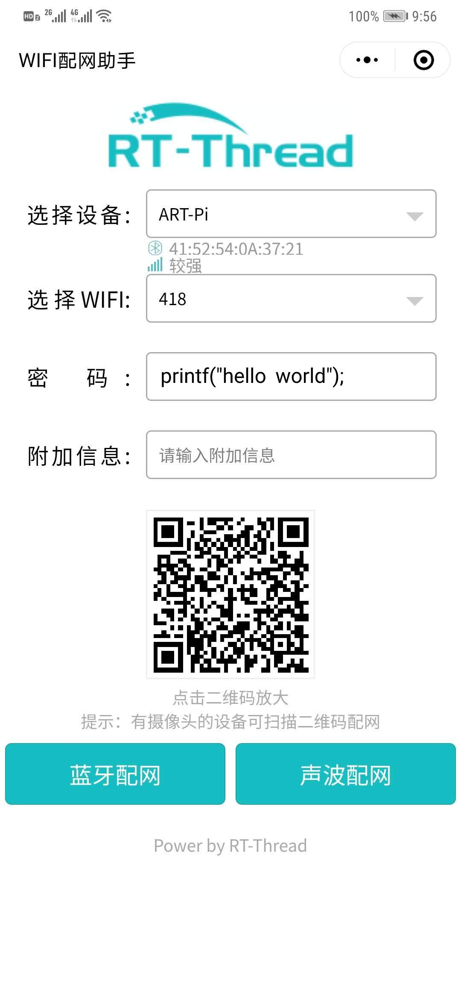
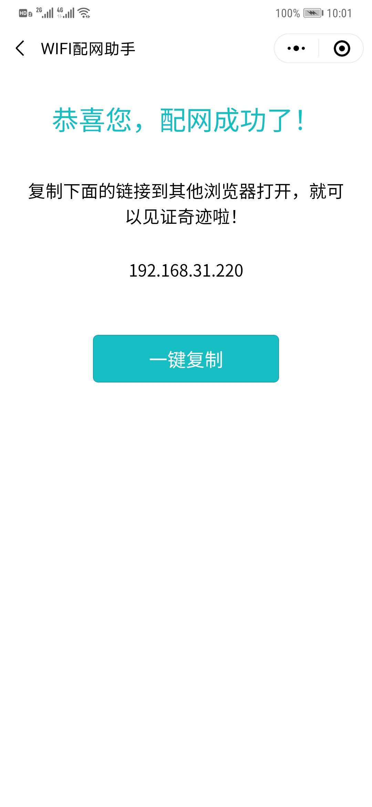
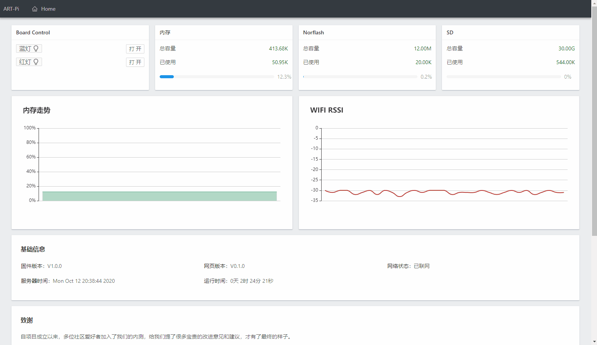
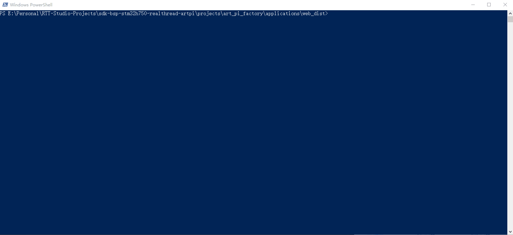

# ART-Pi 快速上手

## 简介

ART-Pi 是 RT-Thread 官方推出一款具有高度可扩展性的硬件，能很好的满足绝大多数开发人员的 DIY 想法，其具备性能强大的主控，实用的外设，丰富的扩展接口，是学习、开发、DIY 的不二之选。

ART-Pi 出厂自带一个好玩的例程，可通过蓝牙对开发板进行配网，内置一个 web 服务器，配网成功后能够通过网页显示开发板的基本信息，并对开发板的板载 LED 进行简单的控制。

## 硬件连接

使用包装盒里附带的 TYPE-C 线连接 ART-Pi 与 PC，如下图所示：

## 运行

**开发板上电后请按一下步骤进行配网**：

1. **微信** 扫描二维码打开 **WIFI 配网助手**

2. 设备选择 **ART-Pi**，输入所要连接的 WIFI SSID 和密码，输入完成后点击 **蓝牙配网** 按钮进行配网。

3. 配网成功后小程序会跳出成功页面，并且显示开发板获取到的 IP 地址。

4. 此时点击 **一键复制** 将 IP 地址复制到剪切板并粘贴到浏览器中即可打开开发板主页。

## 注意事项

- 开发板主页依赖于外网资源，请确保开发板连接的无线网能够接入互联网。

### 固件或网页丢失

**出厂例程的正常运行需要蓝牙固件，WIFI 固件以及网页文件的支持，如果开发板缺少这些文件，则需要参照下方注意事项上传固件及网页**

- 出厂默认刷好了 wifi 和蓝牙固件和网页文件，若固件丢失，可以按照文档 `UM3004-RT-Thread ART-Pi BT_WIFI 模块固件下载手册` 所描述方法重新传入。

- 网页文件存在于 `/projects/art_pi_factory/applications/web_dist` 目录下，不同于 WIFI 及蓝牙固件的上传，网页文件需要联网后通过 **adb** 工具进行上传, 需要将 `webnet` 目录上传到开发板的 `/flash / 目录下 `。具体的使用方法如下：
[ADB 使用说明](https://github.com/heyuanjie87/adbd#readme)

---------------------------

本例程中包含了 BTstack Bluetooth Stack, 需要注意的是，BTstack 非商业用途是免费的。但是，对于商业用途，<a href="mailto:contact@bluekitchen-gmbh.com"> 请联系 BTstack 官方 </a > 以获得商业合作。

