# ART-Pi 开发手册

## 简介

本文将详细介绍 ART-Pi 开发流程，让用户掌握如何使用 ART-Pi 进行应用开发。包括以下内容：

- 如何下载 ART-Pi SDK
- 使用 RT-Thread Studio 开发应用
- 使用 MDK 开发应用
- 使用 RT-Thread Studio 添加驱动

## 如何下载 ART-Pi SDK

本章节将列举几种获取 sdk 的渠道。

### 1. 在 RT-Thread Studio 里直接下载 sdk

  RT-Thread Studio 提供的一站式的开发流程，如下图是 ART-Pi SDK 在  RT-Thread Studio 里的下载流程：

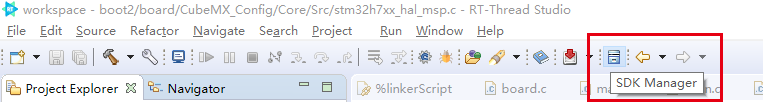

### 2. 在 GitHub 里直接下载 sdk

  ART-Pi 是 RT-Thread 官方发起的一个开源社区活动，它是开源的。所以你同样可以在各大开源代码托管网站里下载到 ART-Pi 的 sdk 源码。
  在 GitHub 网站里，我们 ART-Pi 官方的 sdk 源码地址是： [链接](https://github.com/RT-Thread-Studio/sdk-bsp-stm32h750-realthread-artpi)

  如下图所示从 GitHub 下载 ART-Pi SDK ：


## 使用 RT-Thread Studio 开发应用

如下图所示创建一个工程：

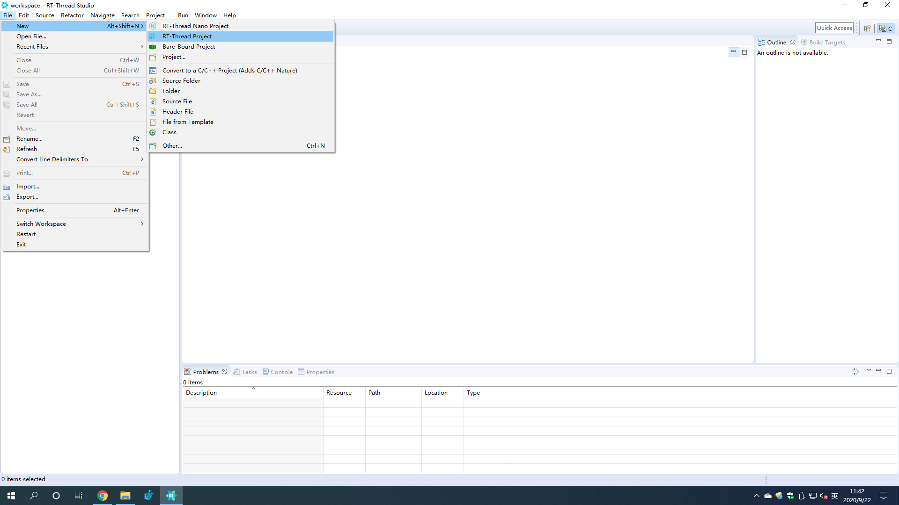

填写工程名称；选择 Base On Board；选择 Example；点击 Finsh 按钮。

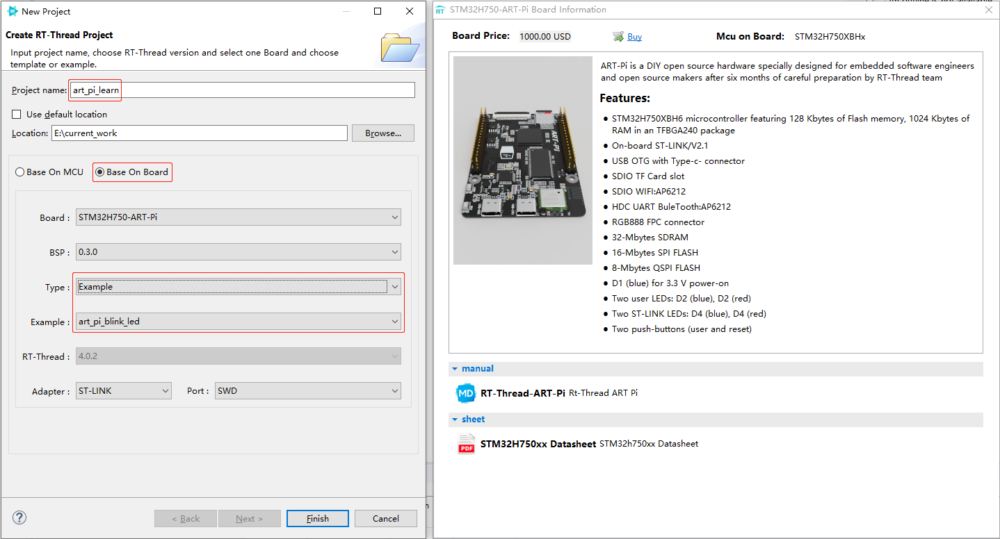

如图所示进行编译；

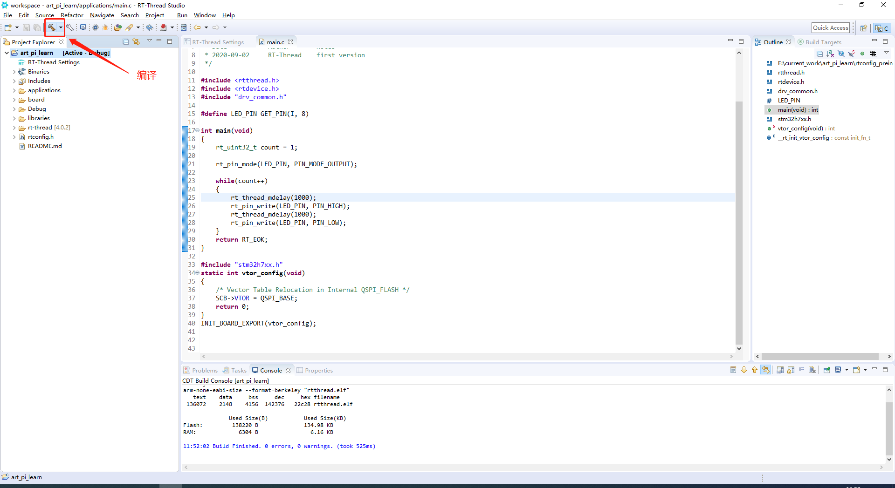

在下载烧录程序前确认下 debuger 配置情况：

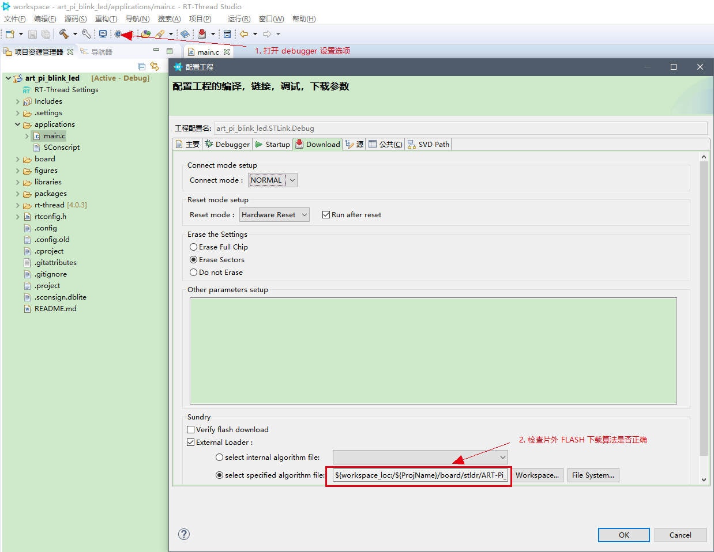

点击下载按钮，下载烧录程序：

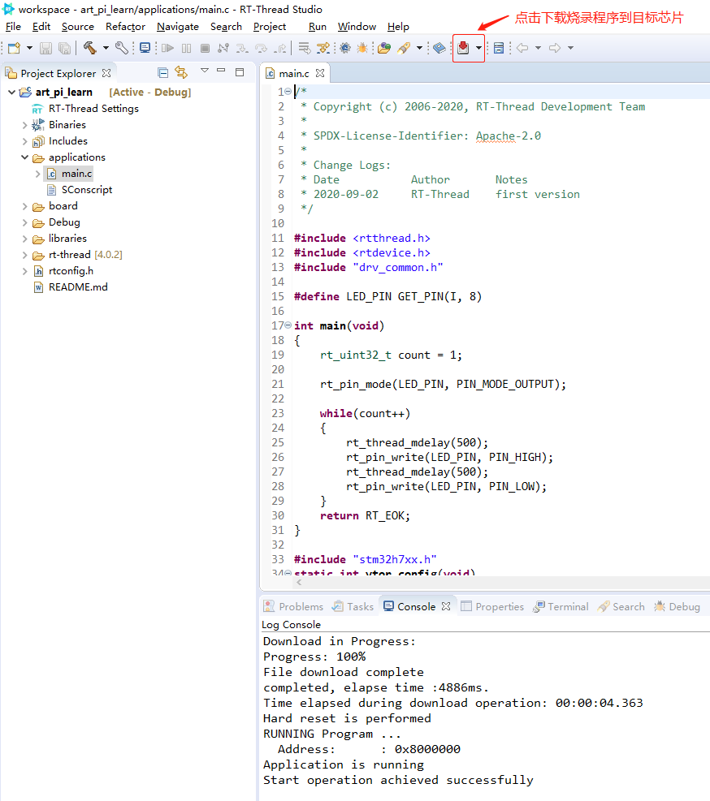

## 使用 MDK 开发应用

如果您使用 **MDK** 进行开发，需要为 `project` 创建 `rt-thread` `libraries` 创建文件夹链接，有以下两种方式：

首先进入工程目录。如：sdk-bsp-stm32h750-realthread-artpi\projects\art_pi_blink_led

##### 方法一：

执行工程目录(例如：sdk-bsp-stm32h750-realthread-artpi\projects\art_pi_blink_led)下的 `mklinks.bat`,双击运行即可看到以下两个文件夹，表示链接成功。

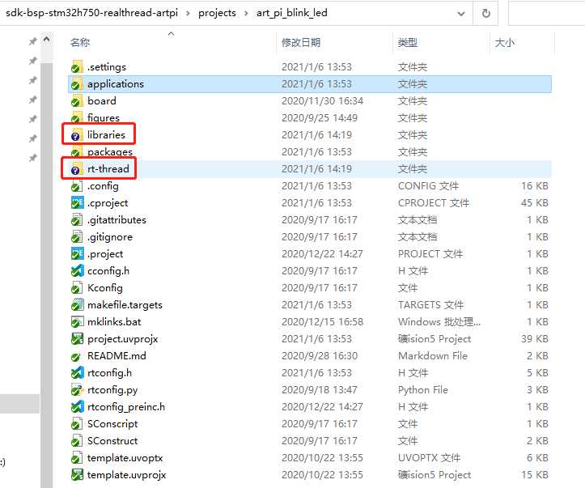

##### 方法二：

如图所示以管理员身份打开 PowerShell：

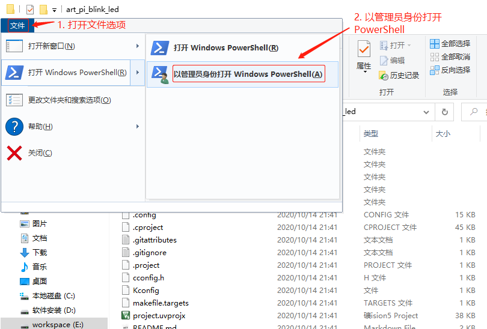

依次输入如下三个命令：

```c
cmd
mklink /D rt-thread ..\..\rt-thread
mklink /D libraries ..\..\libraries
```

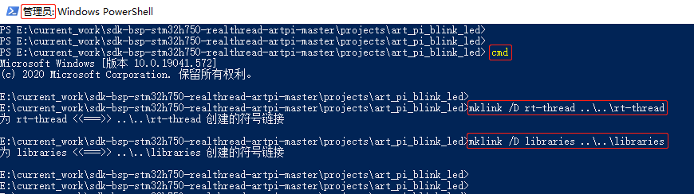

然后在该目录下，使用 RT-Thread 官方提供的 env 工具按照 rt-thread 开发的正常流程创建 MDK 工程。

输入 `scons --target=mdk5` 命令生成 MDK 工程。

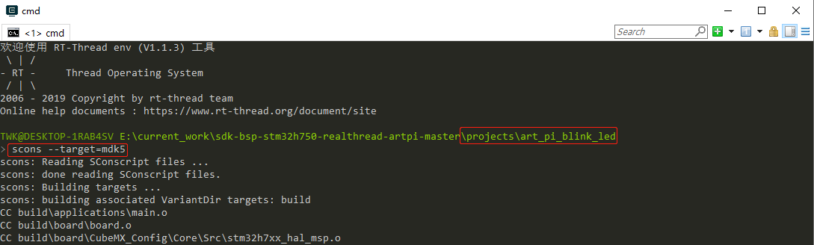

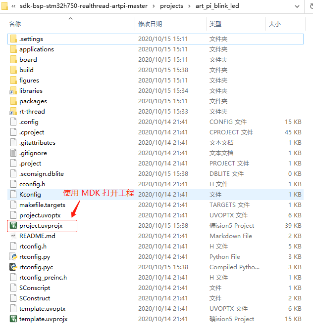

## 使用 RT-Thread Studio 添加驱动

本章节将介绍如何使用 RT-Thread Studio 添加驱动，以添加串口驱动为例：

双击 RT-Thread Setting 打开图形配置界面。

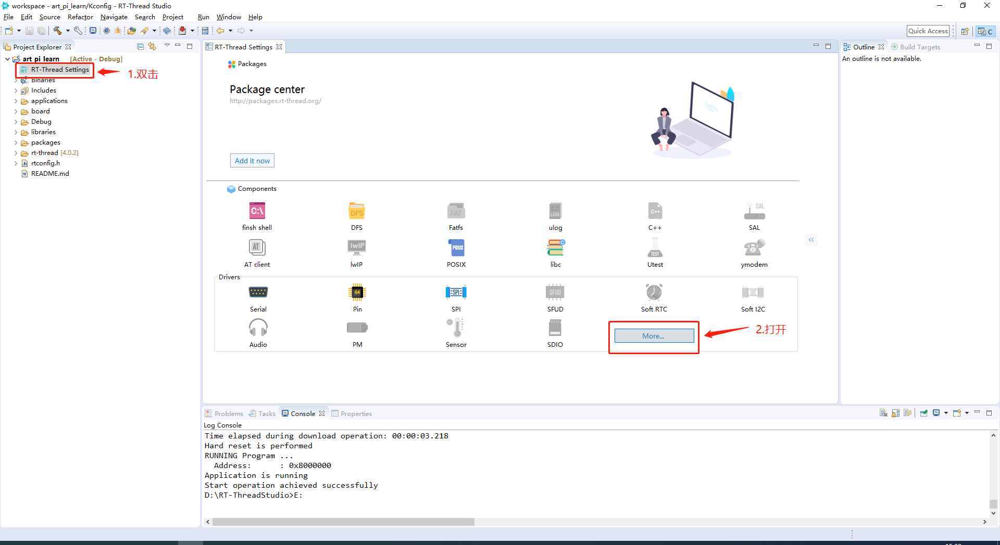

打开 HardWare 选项卡；选择 Enable UART4；选择完后 ctrl+S 保存当前配置，RT-Thread Studio 会自动刷新生成工程。

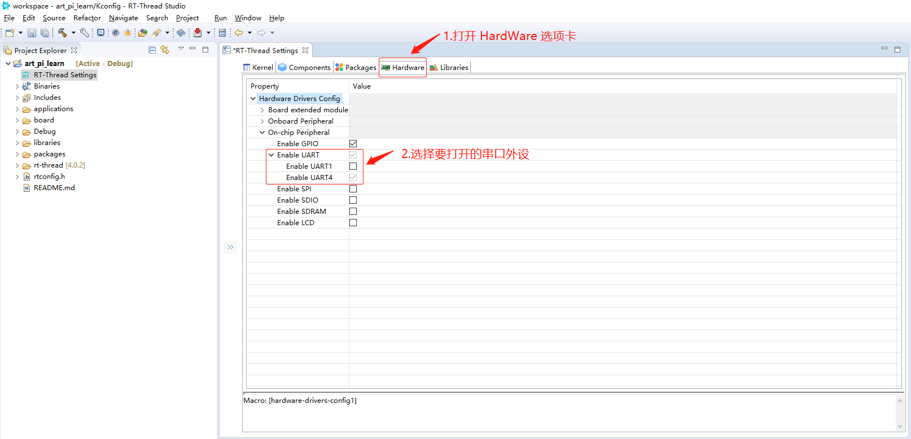