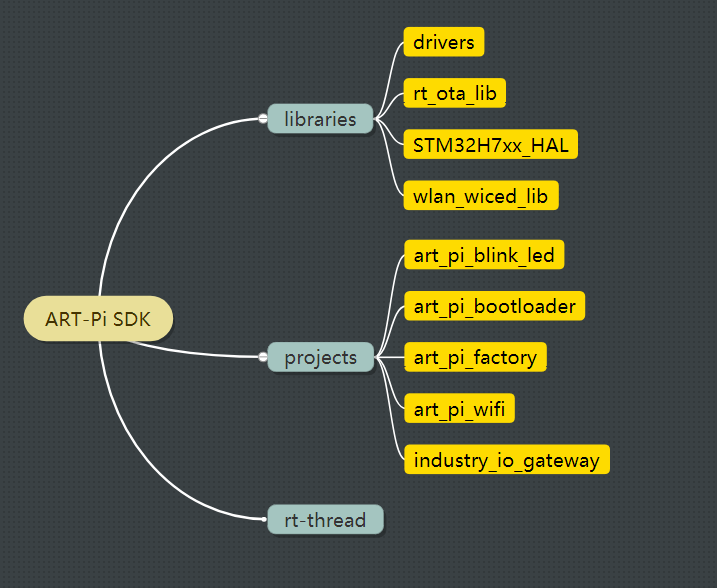
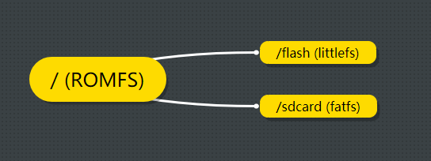
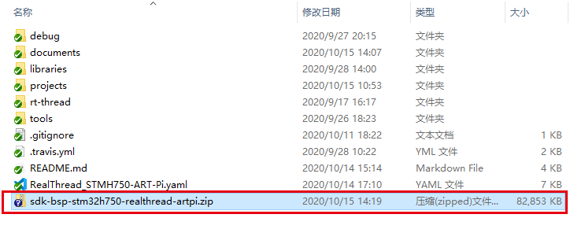
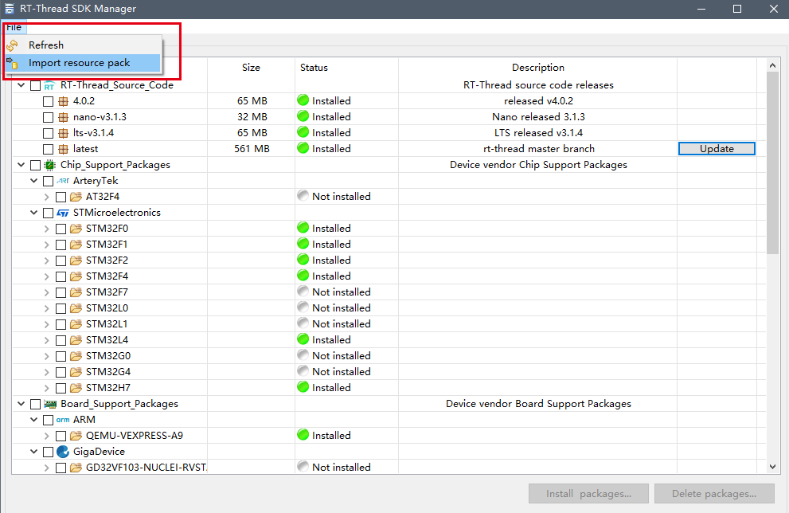
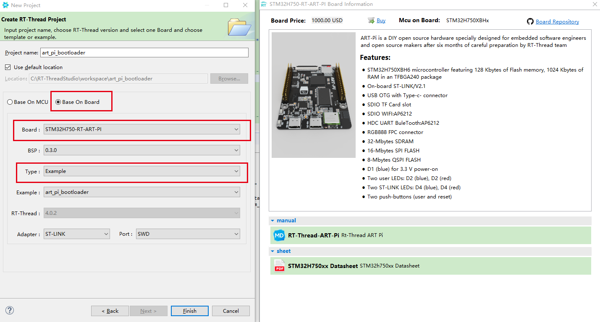

# ART-Pi 代码贡献手册

非常感谢您对 ART-Pi 开源硬件的支持，因为您的支持，我们将会做的越来越好。

## 1. SDK 代码 框架介绍



工程项目代码由三部分构成，分别是 通用驱动库，工程逻辑代码，RT-Thread 源码，下面的表格来详细介绍这个三个部分：

| 工程项目代码   | 文件夹    | 说明                                                       |
| -------------- | --------- | :--------------------------------------------------------- |
| 通用驱动库     | libraries | 用于存放 HAL 库以，基于 HAL 库的外设驱动文件以及其他通用库 |
| 工程逻辑代码   | projects  | 项目工程文件夹,包含了各种开源例程                          |
| RT-Thread 源码 | rt-thread | RT-Thread 源码                                             |

## 2.  文件系统介绍

为了保证用户在不同的工程之间切换数据的安全性，对文件系统做了统一约束，挂载情况如下图所示：



为了保证 NOR FLASH (W25Q128) 的数据的安全性，对 NOR FLASH 做了统一约束，使用 [FAL](https://github.com/RT-Thread-packages/fal) 制定统一分区，分区情况见下表：

| 分区名     | 分区起始地址    | 分区大小(bytes) |说明 |
| ---------- | --------------- | :-------------- | :-------------- |
| wifi_image | 0               | 512 K           | 保存 WIFI 固件 |
| bt_image   | 512 * 1024      | 512 K           | 保存 BT 固件 |
| download   | 1024 * 1024     | 2048 K          | 下载固件分区 |
| easyflash  | 3 * 1024 * 1024 | 1024 K          | easyflash 保存参数分区 |
| filesystem | 4 * 1024 * 1024 | 12 M            | 挂载文件系统分区 |

## 3. 如何提交代码

充分了解上述信息后，就可以提交代码啦。

如果您提交的是开源项目工程，那么您还需要进行下面几步操作：

### 1. 准备阶段
- 克隆最新的 [ART-Pi SDK](https://github.com/RT-Thread-Studio/sdk-bsp-stm32h750-realthread-artpi)
- 参考 art_pi_blink_led 例程，复制该例程，并更名为相关的例程文件夹名，例如：art_pi_wifi

### 2. 开发阶段
1. 按照例程需求，编写例程代码，代码编写需符合《[RT-Thread 编程风格](coding_style_cn.md)》，Git 提交日志信息描述清晰
2. 软件代码尽可能的简洁，保证用户看到的代码清晰，容易理解。在 menuconfig 中也不要开启无关选项
   
    menuconfig 中目录名称说明
```
  - Hardware Drivers Config    硬件驱动配置
    - Board extended module    外部扩展板相关的选项
      - ART-Media              多媒体扩展板相关选项 如：wm8988
      - ART-Industrial         工业扩展板相关选项 如：LWIP
      - ART-Lorawan Lorawan    扩展板相关选项
    - Onboard Peripheral       板载外设相关选项 如：AP6212
    - On-chip Peripheral       片上外设相关选项 如：ADC
  - External Libraries         外部扩展库选项 如：wifi Library
```

3. 片上外设驱动统一放在 libraries\drivers 目录下 如 drv_eth.c
4. 扩展板相关的组件在 libraries 目录下创建相关的文件夹，并放置相关代码 如：libraries/audio 目录下存放 drv_wm8988.c 以及 MP3 解码库
5. 如果项目中使用到了软件包
  - 软件包的版本 **必须** 选择为 **release** 版本。如果没有，请联系管理员尽快发布
6. 项目工程 README
  - 创建的例程必须详细写明该例程实现的功能
  - 写明该例程的操作说明
  - 写明该例程的注意事项
  - 填写维护人联系信息
7. 新建 `docs` 文件夹放在工程目录下 如：`sdk-bsp-stm32h750-realthread-artpi\projects\art_pi_wifi\docs`
  - 编写项目 `设计思想.md`。包含项目设计思想，简要的逻辑实现流程图。
8. 参考 RealThread_STMH750-ART-Pi.yaml 文件内信息，修改 yaml 文件，增加新例程的描述信息
9. 开发收尾前，需要手动打包 SDK 生成 ZIP 文件，使用 Studio 导入离线 SDK 的方式检查新建的 project 能正常被创建，能编译通过，能正常下载。保证开发者拿到手的例程是可以做到 **开箱即用**

  - 打包成 zip 文件

    

  - 导入离线 SDK

    

- 新建工程，保证能正常编译通过，能正常下载

  

### 审核阶段
- 该阶段主要指例程开发完成，提交代码至项目仓库，交给管理员 review  的阶段
- 推送代码至远端分支，在 CI 构建通过后，发起 merge request 并指派给管理员
- 等待 review 的结果，收到改动要求后，重新更正，直到管理员合并代码。