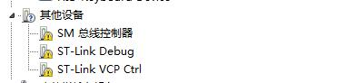
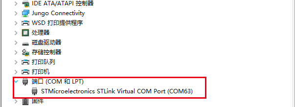
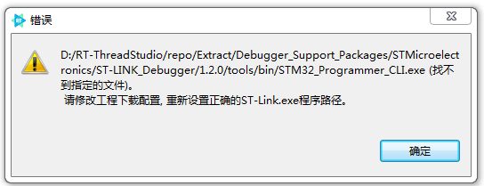
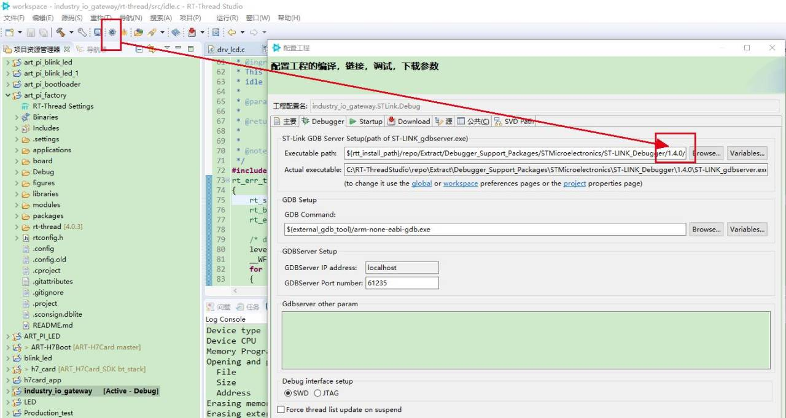
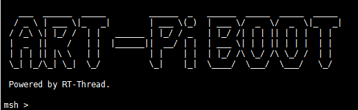
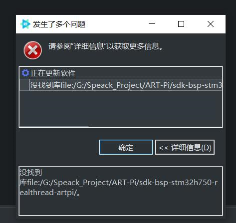
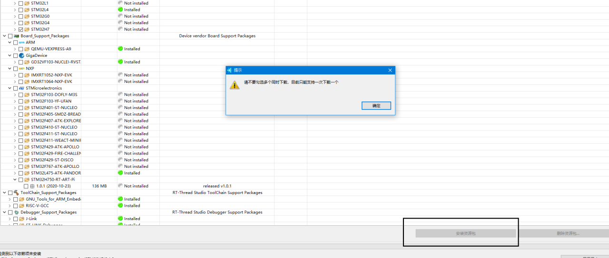
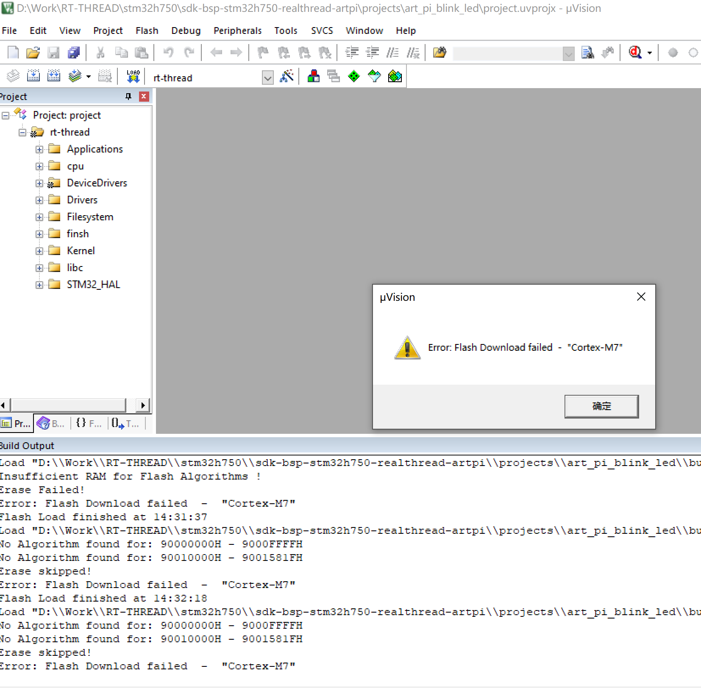
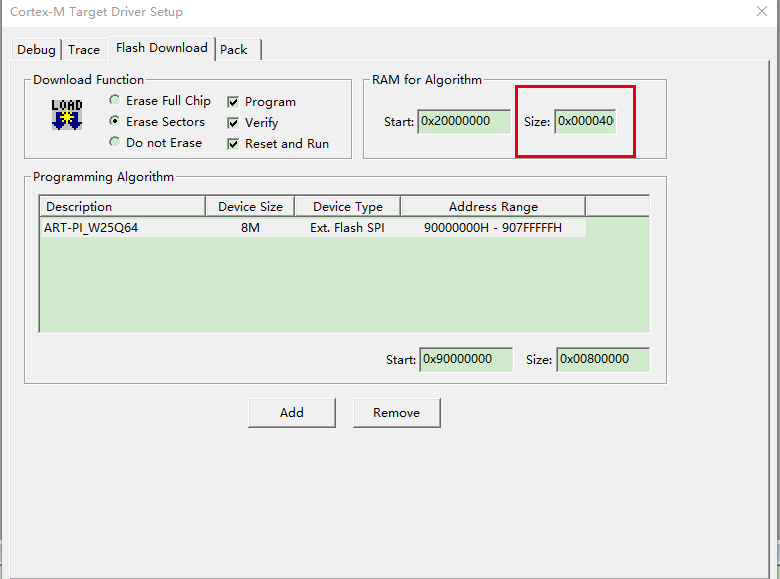
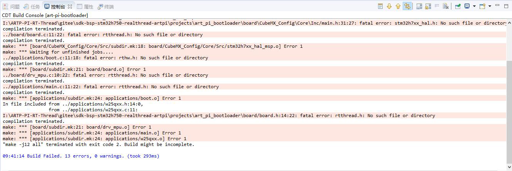

# ART-Pi 常见问题解答

### 在您遇到问题时，请先确认，RTT Studio  版本在 V1.1.5 以上版本，ART-Pi-SDK 在 V1.0.1 以上版本，ST-LINK Debugger 已安装 V1.4.0 以上

### Q1:  设备管理显示 ST-LINK 带感叹号，且 ST-LINK 红灯常亮 

### A: 需要更新 ST-LINK 驱动，[下载地址](https://www.st.com/zh/development-tools/stsw-link009.html)

### Q2: 设备管理器能看到 ST-LINK 虚拟串口，但是通用串行设备看不到 ST-LINK

### A: 查看我的电脑是否有一个 ART-Pi 的U盘图标，如果有请参考上一条重新安装驱动，如果还不行，请卸载掉原来的 ST-LINK 驱动后再重新安装一次

### Q3：RTT Studio 提示找不到 ST-LINK.exe 的路径

### A: 先确保已经通过 RTT Studio 资源管理器 下载了1.4版本的 ST-LINK，然后修改工程配置中ST-LINK版本为 V1.4

### Q4：为什么无法 debug 程序/为什么程序下载进去了不会运行

### A：STM32H750 执行片外 QSPI FLASH 上的程序需要有一个 bootloader 来跳转过去，出厂前已经默认烧录了 bootloader，所以可以运行，如果不小心擦除了，请重新烧录 bootloader。bootloader 烧录成功之后会打印 logo

### Q5: RTT Studio 报错

### A： 请使用 RTT Studio V1.1.5 以上版本，ART-Pi-SDK 请使用 V1.0.1以上版本

### Q6: 提示请不要同时勾选多个下载

### A： STM32H7 目录下有2个版本的资源包，请打开下拉框取消其中一个勾选

### Q7：使用MDK 下载程序失败

### A: 未添加下载算法导致，下载算法在 `"sdk-bsp-stm32h750-realthread-artpi\debug\flm\ART-Pi_W25Q64.FLM" `然后把`ART-Pi_W25Q64.FLM`拷贝到MDK安装目录`Keil_v5\ARM\Flash`下，注意`RAM for Algorithm` 需要调整成 `0x4000`

### Q8：使用 RTT Studio 编译示例工程失败

### A:  请使用 RTT Studio 安装离线资源包，然后基于开发板创建方式创建示例工程。如何使用请参考  **UM5002-RT-Thread ART-Pi 开发手册.md**

