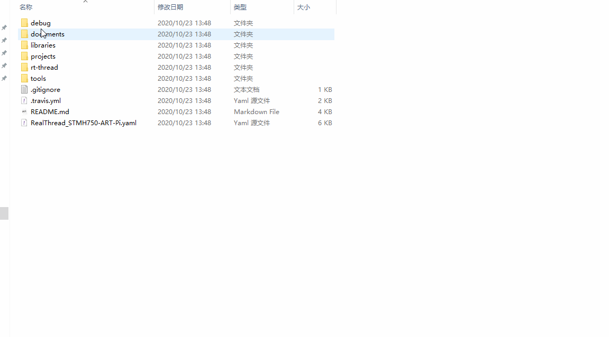
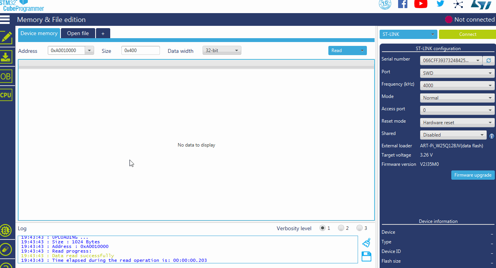
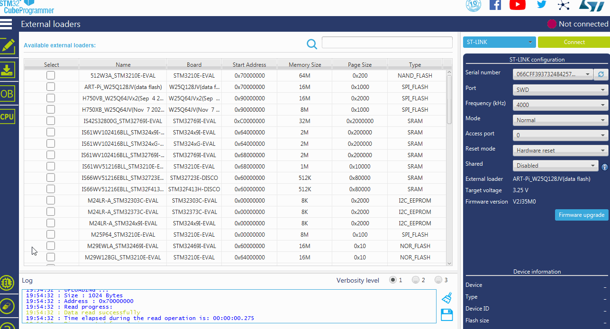
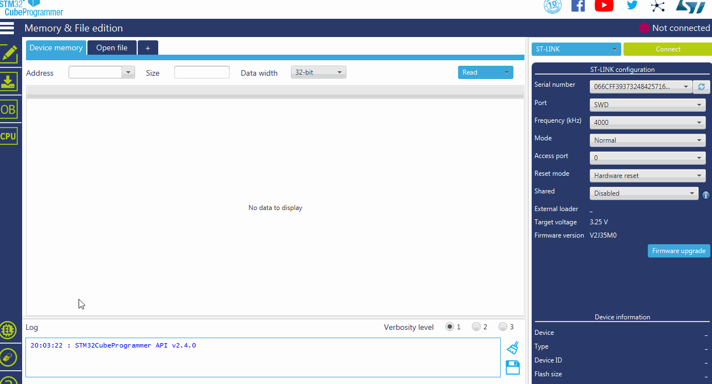

# UM5006-RT-Thread ART-Pi 数据 flash 擦写手册

## ART-Pi 数据 FLASH(W25Q128JV) 简介

ART-Pi 除了配备一颗 W25Q64JV 用于存放程序外,同时配备了另一颗 W25Q128JV 用于存放 WIFI 固件,蓝牙固件,等其它数据.官方建议这颗 W25Q128JV 的空间划分如下:

| 分区名     | 起始地址        | 分区大小 | 用途说明            |
| ---------- | --------------- | -------- | ------------------- |
| wifi_image | 0               | 512KB    | 保存 wifi 固件        |
| bt_image   | 512 * 1024      | 512KB    | 保存 bt 固件          |
| download   | 1 * 1024 * 1024 | 2048KB   | 固件下载分区        |
| easyflash  | 3 * 1024 * 1024 | 1024KB   | easyflash 参数保存区 |
| filesystem | 4 * 1024 * 1024 | 12MB     | 文件系统分区        |

ART-Pi 出厂时数据 flash 中已经刷入相应的数据信息,但有时我们可能意外破坏或擦除上面的数据,此时就要重新写入数据,为此编写了数据 flash 的 stldr 下载算法,通过 STM32CubeProgrammer 加载下载算法可方便读写数据 flash.

## STM32CubeProgrammer 下载算法加载

将文件 ART-Pi SDK-->debug-->stldr-->ART-Pi_W25Q128JV.stldr 拷贝到 STM32CubeProgrammer 的外部 flash 算法目录(如: C:\Program Files\STMicroelectronics\STM32Cube\STM32CubeProgrammer\bin\ExternalLoader) 下

## STM32CubeProgrammer 擦写数据 flash

本下载算法可以一次性擦除整块 flash,也可以按64KB块大小分别擦除.

下面以刷入 wifi 固件为例做演示(记住 flash 分区划分 wifi 固件起始地址是0,数据 flash 的在 STM32CubeProgrammer 中的地址是0x70000000,所以0x70000000+0(分区偏移)就是我们要写入的起始地址), STM32CubeProgrammer 只能打开 bin 等后缀名的文件,所以要将 wifi 固件文件名后缀改成 bin.

## STM32CubeProgrammer 恢复出厂 flash 固件

**出厂 flash** 固件在 `sdk-bsp-stm32h750-realthread-artpi/tools/firmware/Resource_16MB.bin` 。

因资源文件较大，下载时间会较长，请耐心等到。

