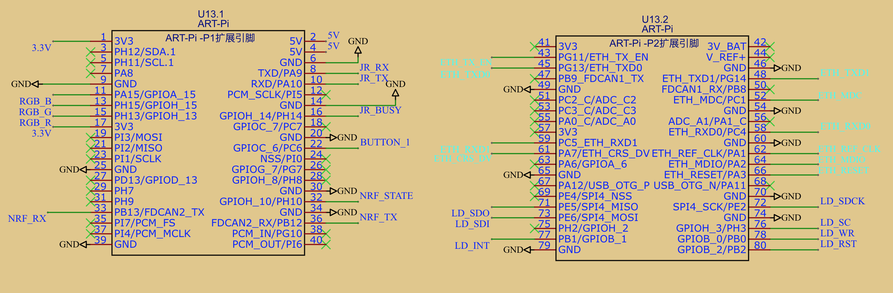
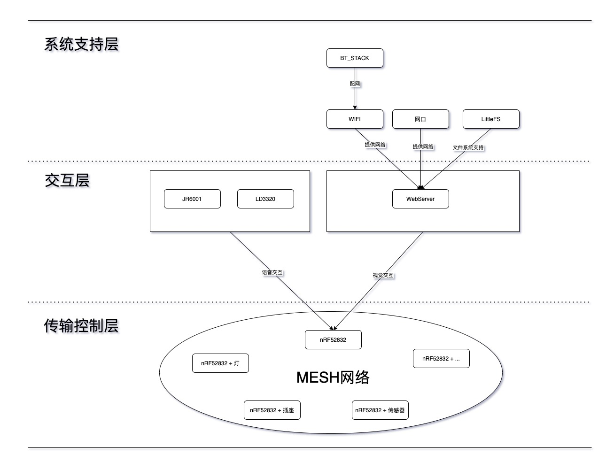

# 蓝牙MESH语音扩展板DEMO

## 简介

本例程基于mesh蓝牙网关扩展板开发，需要对应的扩展板和nrf52模块才可以运行。

需要用到的硬件部分已开源，[点击查看](https://oshwhub.com/hyhkjiy/lan-ya-wang-guan)。

## 硬件说明

扩展板主要部分：

- LD3320语音识别芯片
- JR6001语音播报模块引出
- LAN8720A网口
- nRF52串口引出

引脚如下：



在不使用语音功能情况下，可以用ART-PI用杜邦线直接连接nRF模块使用WEB API，要运行例程至少需要两个nRF模块。

## 软件说明

本例程在出产例程`ART_PI_FACTORY`基础上进行软件开发，并且保留了出产例程的小程序蓝牙配网功能。

nRF模块需要刷写固件，源码在：<https://gitee.com/jiy/n-rf5-sdk-for-mesh/tree/master/examples/serial_control>。

nRF模块的client端通过串口协议连接到开发板，默认RX为P26, TX为P25；server直接控制对应的设备或连接到传感器，示例程序为电灯。

项目软件架构：


WEB接口：

查找Mesh节点：

```
POST /cgi-bin/board_control HTTP/1.1
Host: 192.168.1.211
cache-control: no-cache
{
    "opcode": 193
}
```

获取节点列表：

```
GET /cgi-bin/basic_info HTTP/1.1
Host: 192.168.1.211
cache-control: no-cache
```

设置节点：

```
POST /cgi-bin/board_control HTTP/1.1
Host: 192.168.1.211
Content-Type: application/json
cache-control: no-cache
{"address": 79, "opcode": 195, "data":"01"}
```

读取节点数据：

```
POST /cgi-bin/board_control HTTP/1.1
Host: 192.168.1.211
Content-Type: application/json
cache-control: no-cache
{"address": 57, "opcode": 195}
```

注：

- address：设备单播地址
- opcode：操作码
- data：数据（1～8byte）

操作码定义：

```c
typedef enum
{
    COMMAND_OPCODE_FIND = 0xC1,     // 网关寻找设备
    COMMAND_OPCODE_REGISTER = 0xC2, // 设备向网关提交注册
    COMMAND_OPCODE_SET = 0xC3,      // 设置设备
    COMMAND_OPCODE_STATUS = 0xC4,   // 设备状态
    COMMAND_OPCODE_GET = 0xC5,      // 读取设备
    COMMAND_OPCODE_DATA = 0xC6      // 设备数据
} command_opcode_t;
```

## 运行

### 编译&下载

为ART-Pi编译烧录本项目例程，nRF模块Client、Server端分别烧录对应固件，将烧录Client端的nRF模块通过串口连接到开发板。

### 配网

使用`msh`或小程序为ART-Pi配网，过程参考`ART-PI-FACTORY`项目，也可以通过网线直接连接扩展板。

使用nRF Mesh APP搜索nRF模块进行mesh配网和设置：

- 静态OBB验证密码为```6E6F726469635F6578616D706C655F31```。
- 配网成功后为Client端和Server端绑定同一AppKey，并绑定到`Element1`的`Vendor Model`。
- 然后创建一个地址为`0xC023`的组，将`Element1`里面的`Vendor Model`的发布地址和订阅地址都添加该组。

设置完成，接下来就可以使用WEB API访问和控制Mesh节点了。

## 许可声明

This package contains a snapshot of the BTstack Bluetooth Stack by BlueKitchen GmbH.
It is free for non-commercial use. For commercial use, please contact BlueKitchen at contact@bluekitchen-gmbh.com。

---------------------------

本例程中包含了BTstack Bluetooth Stack,需要注意的是，BTstack 非商业用途是免费的。但是，对于商业用途，<a href="mailto:contact@bluekitchen-gmbh.com">请联系BTstack官方</a>以获得商业合作。


