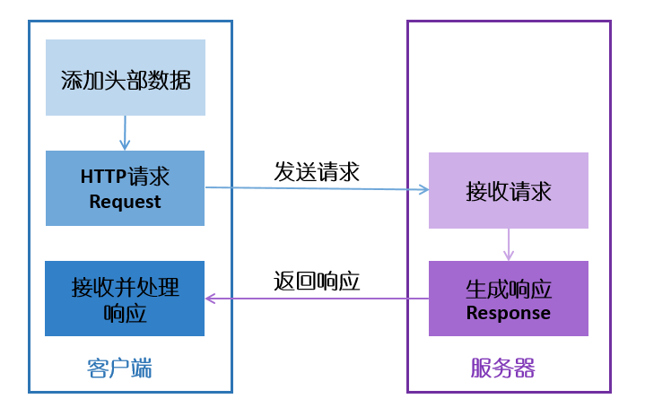

# 工作原理

 WebClient 软件包主要用于在嵌入式设备上实现 HTTP 协议，软件包的主要工作原理基于 HTTP 协议实现，如下图所示：

HTTP 协议定义了客户端如何从服务器请求数据，以及服务器如何把数据传送给客户端的方式。HTTP 协议采用了`请求/响应模型`。 客户端向服务器发送一个请求报文，请求报文包含请求的方法、URL、协议版本、请求头部和请求数据。服务器以一个状态行作为响应，响应的内容包括协议的版本、成功或者错误代码、服务器信息、响应头部和响应数据。

在 HTTP 协议的实际使用过程中，一般遵循以下流程：

1. 客户端连接到服务器

    通常是通过 TCP 三次握手建立 TCP 连接，默认 HTTP 端口号为 80。

2. 客户端发送 HTTP 请求（GET/POST）

    通过TCP套接字，客户端向Web服务器发送一个文本的请求报文，一个请求报文由请求行、请求头部、空行和请求数据四部分组成

3. 服务器接受请求并返回 HTTP 响应

    服务器解析请求，定位请求资源。服务器将需要发送的资源写到 TCP 套接字，由客户端读取。一个响应由状态行、响应头部、空行和响应数据四部分组成。

4. 客户端和服务器断开连接

    若客户端和服务器之间连接模式为普通模式，则服务器主动关闭 TCP 连接，客户端被动关闭连接，释放 TCP 连接。若连接模式为 keepalive 模式，则该连接保持一段时间，在该时间内可以继续接收数据。

5. 客户端解析响应的数据内容

    客户端获取数据后应该先解析响应状态码，判断请求是否成功，然后逐行解析响应报头，获取响应数据信息，最后读取响应数据，完成整个 HTTP 数据收发流程。

