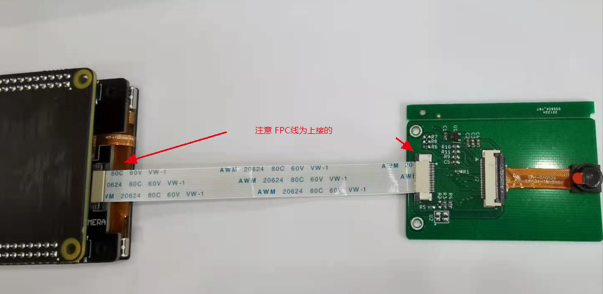
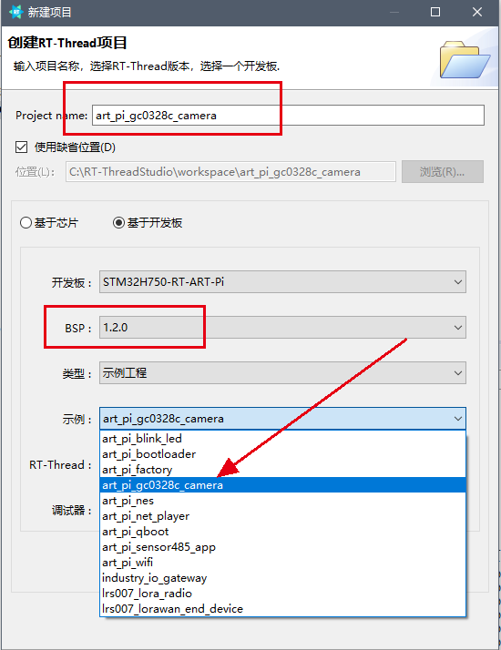
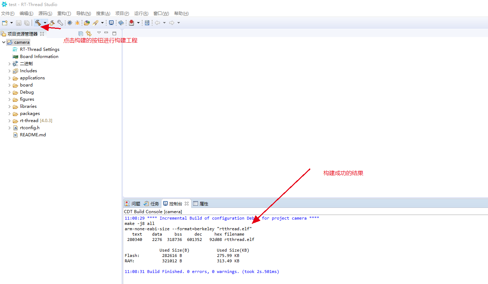
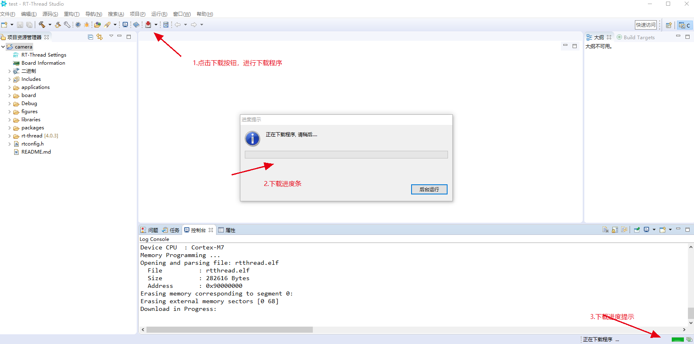
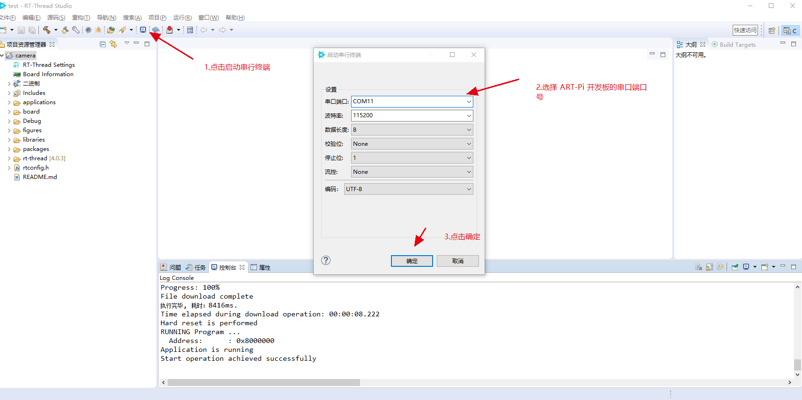
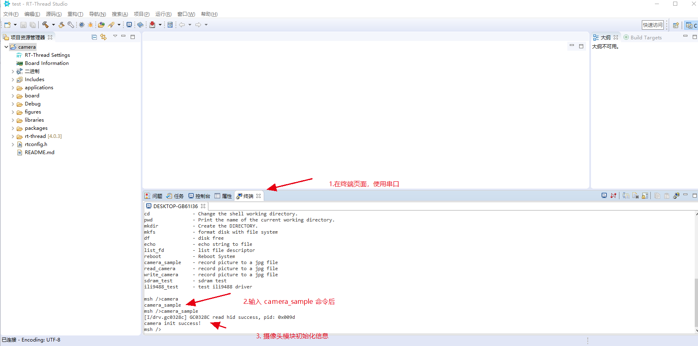
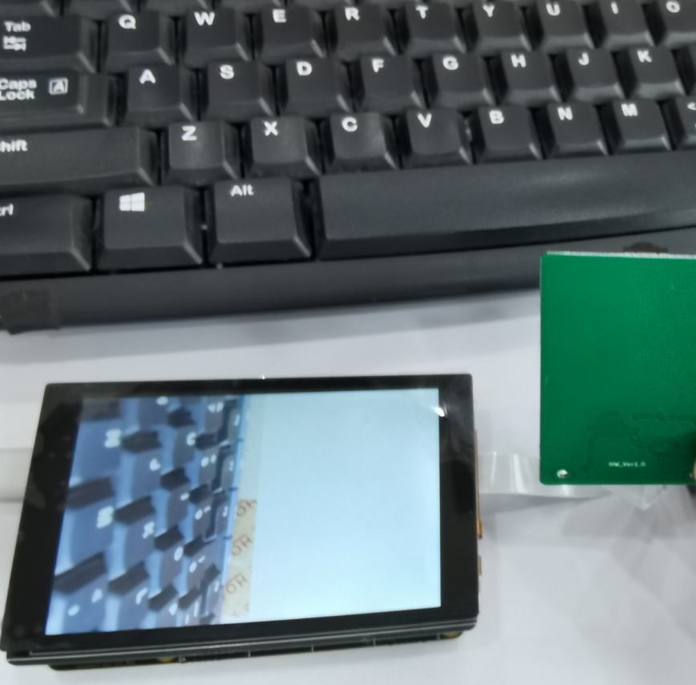

## ART-Pi Camera 示例操作说明文档

### 前提说明

ART-Pi Camera 模块为 ART-Pi 开发板的单独配件，需要配合 ART-Pi 开发板、ART-Pi 多媒体扩展板使用。

### 功能介绍

本示例中，主要实现的功能是ART-Pi 开发板配套 ART-Pi 多媒体扩展板连接摄像头模块，把摄像头模块拍摄的画面显示到 ART-Pi 多媒体扩展板上的屏幕上显示。

### 步骤1 硬件连接

在进行下面的步骤前，先需要正确连接 ART-Pi 的摄像头模块，通过 FPC 线连接到 ART-Pi 的多媒体扩展板上的 `Camera` FPC 接口，如下图所示：

注意：`FPC` 线的方向请严格按照图示来进行连接。

### 步骤2 使用 RT-Thread Studio IDE 创建工程编译下载

* 1. 打开 `RT-Thread Studio IDE` 通过`菜单栏`中的 `文件` 创建 `RT-Thread 项目`
     
参照图示的进行创建工程即可，工程名称可以修改也可使用默认的。
* 2.构建工程
  
  
* 3.下载程序
  

* 4.启动串口终端
  
  
* 5.启动摄像头模块
  

### 步骤3 观察运行效果

按照上面的步骤，摄像头模块已经经常开始工作了，接下来观察多媒体扩展板上的屏幕显示，程序中设置了半屏显示，所以会有屏幕有一半是空白的，一半是摄像头拍摄的画面。

