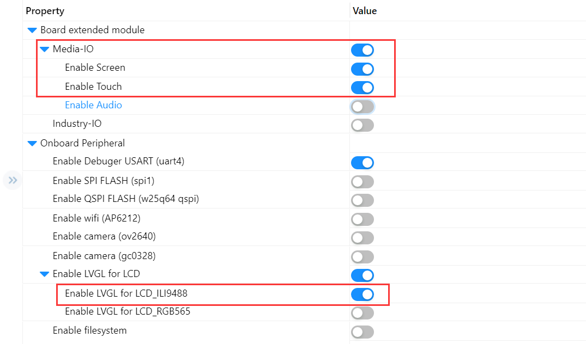
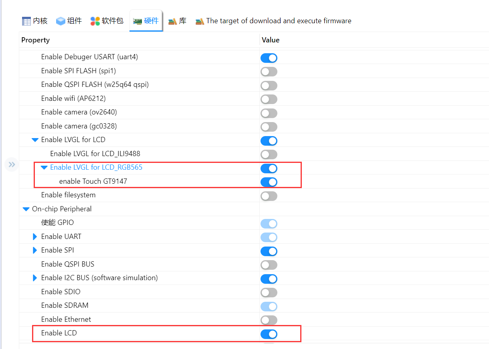
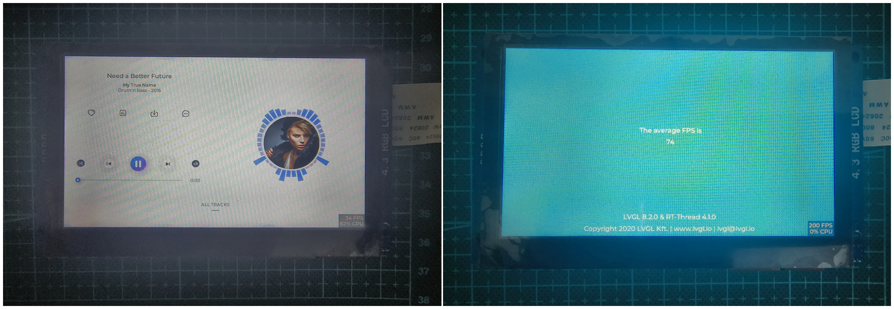

# LVGL Demo 例程

## 简介

本例程为使用 ART-PI 的多媒体拓展板（SPI）/正点原子（野火）RGB-LCD 屏幕实现的 LVGL Demo例程，使能 LVGL 相关配置选项即可实现自动/触摸方式演示音乐播放器 Demo。

## 软件说明

### 多媒体拓展板配置

在 `RT-Thread Studio` 中打开本工程的 `RT-Thread Settings` 配置文件，在硬件模块下使能以下选项，保存后即可编译、下载使用。

### RGB-LCD 屏幕配置

在 `RT-Thread Studio` 中打开本工程的 `RT-Thread Settings` 配置文件，在硬件模块下使能以下选项，保存后即可编译、下载使用。

## 运行
### 编译&下载

编译完成后，将开发板的 ST-Link USB 口与 PC 机连接，然后将固件下载至开发板。

### 运行效果

正常运行后，显示屏上会自动播放 LVGL 的音乐播放器demo。

## 维护人

[Rbb666(github.com)](https://github.com/Rbb666)
