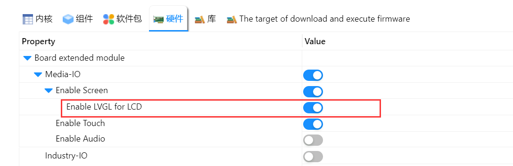

# LVGL 例程

## 简介

本例程为使用 ART-PI 的多媒体拓展板（SPI）实现的 LVGL 例程，使能 LVGL 的配置选项即可实现音乐播放器demo。

## 软件说明

在 `RT-Thread Studio` 中打开本工程的 `RT-Thread Settings` 配置文件，使能以下选项，保存后即可编译、下载使用。

## 运行
### 编译&下载

编译完成后，将开发板的 ST-Link USB 口与 PC 机连接，然后将固件下载至开发板。

### 运行效果

正常运行后，显示屏上会自动播放 LVGL 的音乐播放器demo。

