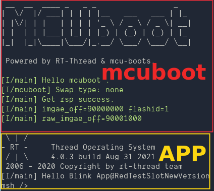

# BootLoader For MCUboot 例程

## 简介

本例程主要的功能是在原始 ART-PI bootloader 的基础上添加了 MCUboot 的支持,支持解析存储在 ART-PI 板载外部 8MB 的 Nor Flash 的 Image 并自动引导启动的 demo.
本 demo 依赖**软件包 mcuboot**, 使用默认的配置参数就可以识别存储在板载 Nor Flash W25Q64 起始地址的 Image. 注意这个 Image 需要满足两个条件:
1. 程序运行的地址不可以是 0x90000000, 建议选取在 0x90001000 位置.因为开始部分需要空出来存储 image header.
2. 默认的配置支持解密,所以需要使用 mcuboot 软件包中的 image_sign.pem 私钥进行加密.具体的加密指令参见 [mcuboot 软件包介绍](https://github.com/iysheng/rt_mcuboot/blob/master/README.md)

## 运行
### 编译&下载

编译完成后，将开发板的 ST-Link USB 口与 PC 机连接，然后将固件下载至开发板。

### 运行效果

- 上电之后会执行支持 mcuboot 的 bootloader 程序之后就会尝试在板载的外部 flash 0 地址处查找是否存在有效的 image, 如果有并且解密通过就会执行 image 的镜像程序.

- 测试更新时,可以使用命令 `do_mark_swap` 标记更新,在下次重启时会尝试从 secondary slot 更新 image 到 primary slot.

## 注意事项

* 如果板载的 flash 中没有有效的 image, 那么 MCU 就会结束执行.
* mcuboot package 初始配置支持镜像大小是 256KB.
