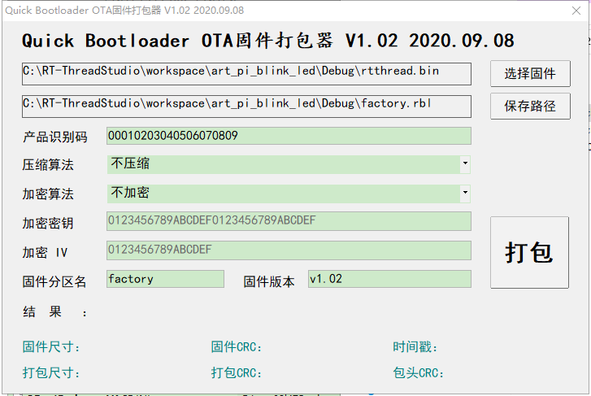

# ART-Pi-QBoot 例程

## 简介

本例程主要的功能是让程序从 `0x08000000`跳转到`0x90000000`。

STM32H750 的片上 ROM 大小为128K，无法满足一般的程序开发，必须使用 XIP 的方式运行程序。所以需要使用 BootLoader 来跳转到 XIP(0x90000000) 地址。
本例程基于 **软件包** [Quick bootloader](https://github.com/qiyongzhong0/rt-thread-qboot) 实现的。

## 硬件说明


**QSPI_FLASH** 与单片机的 QSPI 外设引脚相连，用来执行用户逻辑代码(APP)，在启动内存映射之后 QSPI FLASH 将变为无法写入的状态，如果希望能实现程序升级，则需要在 `boot` 阶段未开启内存映射模式之前完成对 QSPI FLASH 的写数据。


**SPI_FLASH** 与单片机的 SPI 外设引脚相连，用来保存用户升级代码以及恢复出厂代码，在 APP 执行过程中把符合 `RBL` 格式的升级固件写入 **SPI_FLASH** 的`download` 分区，在重启之后即可完成固件的升级操作。

## 软件说明

本例程的主要工作由软件包 [Quick bootloader](https://github.com/qiyongzhong0/rt-thread-qboot) 实现。

但是对 `qboot_stm32.c` 文件做了修改，以支持跳转到 **QSPI_FLASH** 的执行地址 `0x90000000`。

以下是非完整代码：

```
#define QBOOT_APP_RUN_IN_QSPI_FLASH

#ifdef QBOOT_APP_RUN_IN_QSPI_FLASH

#define VECT_TAB_OFFSET      0x00000000UL
#define APPLICATION_ADDRESS  (uint32_t)0x90000000

typedef void (*pFunction)(void);
pFunction JumpToApplication;

    SCB_DisableICache();
    SCB_DisableDCache();

    SysTick->CTRL = 0;
    __disable_irq();
    __set_CONTROL(0);
    __set_MSP(stk_addr);
    
    app_func = (app_func_t) (*(__IO uint32_t*) (QSPI_BASE + 4));
    app_func();

    LOG_E("Qboot jump to application fail.");
```

## 运行
### 编译&下载

编译完成后，将开发板的 ST-Link USB 口与 PC 机连接，然后将固件下载至开发板。

### 运行效果

```
   ___  ______ _____     ______ _   ___________  _____  _____ _____ 
  / _ \ | ___ \_   _|    | ___ (_) |  _  | ___ \|  _  ||  _  |_   _|
 / /_\ \| |_/ / | |______| |_/ /_  | | | | |_/ /| | | || | | | | |  
 |  _  ||    /  | |______|  __/| | | | | | ___ \| | | || | | | | |   
 | | | || |\ \  | |      | |   | | \ \/' / |_/ /\ \_/ /\ \_/ / | |   
 \_| |_/\_| \_| \_/      \_|   |_|  \_/\_\____/  \___/  \___/  \_/  

 Powered by RT-Thread.

[D/FAL] (fal_flash_init:63) Flash device |                norflash0 | addr: 0x00000000 | len: 0x01000000 | blk_size: 0x00001000 |initialized finish.
[D/FAL] (fal_flash_init:63) Flash device |                norflash1 | addr: 0x00000000 | len: 0x00800000 | blk_size: 0x00001000 |initialized finish.
[I/FAL] ==================== FAL partition table ====================
[I/FAL] | name       | flash_dev |   offset   |    length  |
[I/FAL] -------------------------------------------------------------
[I/FAL] | wifi_image | norflash0 | 0x00000000 | 0x00080000 |
[I/FAL] | bt_image   | norflash0 | 0x00080000 | 0x00080000 |
[I/FAL] | download   | norflash0 | 0x00100000 | 0x00200000 |
[I/FAL] | easyflash  | norflash0 | 0x00300000 | 0x00100000 |
[I/FAL] | filesystem | norflash0 | 0x00400000 | 0x00a00000 |
[I/FAL] | factory    | norflash0 | 0x00e00000 | 0x00200000 |
[I/FAL] | app        | norflash1 | 0x00000000 | 0x00800000 |
[I/FAL] =============================================================
[I/FAL] RT-Thread Flash Abstraction Layer (V0.5.0) initialize success.

Qboot startup ... 
Qboot version   : V1.0.5 2020.10.05 
Product name    : ART-Pi QBoot 
Product version : v1.00 2021.02.07 
Product mcu     : stm32h750 
Press [Enter] key into shell in 3 s : 

```

可以看到 `norflash0` `norflash1` 均被 [fal](https://github.com/RT-Thread-packages/fal) 管理。升级过程中的读写操作均由 `fal` 完成。

## 使用
### 如何生成升级固件

需要先获取到升级固件的 `bin` 格式的文件，然后使用 `art_pi_qboot\packages\qboot-v1.05\tools` 目录下的 `QBootPackager_V1.02` 工具来进行打包。



### 如何下载最新固件

使用 `YMODEM` 方式升级，需要在 `boot` 阶段使用 `ymodem_ota` 的命令来进行下载。


## 注意事项

1. `RT_NAME_MAX` 必须大于 **8**

2. 仅在 **RTT-Studio** 环境下测试通过。**MDK** 环境下编译报错。

3. [Quick bootloader](https://github.com/qiyongzhong0/rt-thread-qboot) 功能未全部展示，全部展示后 `ROM` 空间会超过 `128K` 可自行裁剪，或者调整优化等级。

4. 使用中遇到问题，可以在 [RT-Thread论坛]() 提问 [邀请回答](https://club.rt-thread.org/u/8644) 。

## 联系人信息

维护人:

-  [whj4674672](https://github.com/whj4674672), 邮箱：<whj4674672@163.com>

