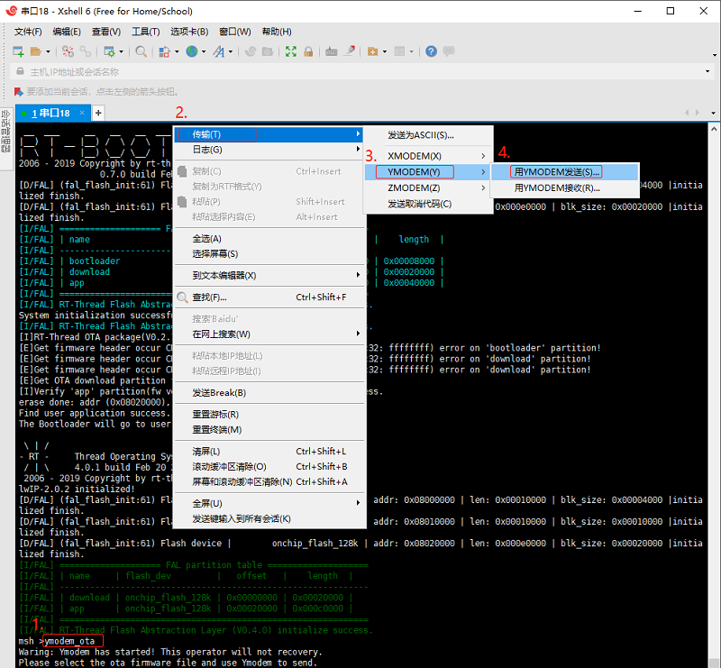
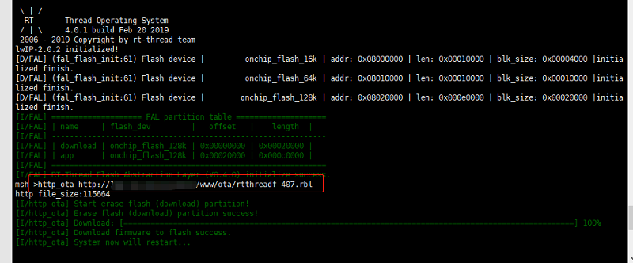

# OTA Downloader

[Chinese](README_ZH.md) | English

## 1. Introduction

This software package is a firmware downloader for OTA upgrade. The downloader provides multiple firmware download methods. Developers can flexibly choose the upgrade method according to their own needs. Each upgrade method only needs to call a function or command once. The currently supported download methods are as follows:

- HTTP/HTTPS protocol download firmware
- Ymodem protocol download firmware

### 1.1 License

OTA Downloader package complies with Apache2.0 license, please refer to `LICENSE` file for details.

### 1.2 Dependency

- RT-Thread 3.0+
- FAL package support
- Ymodem download method depends on Ymodem component
- HTTP/HTTPS download method depends on webclient software package

## 2. How to open OTA Downloader

To use OTA downloader package, you need to select it in the package manager of RT-Thread. The specific path is as follows:

```
RT-Thread online packages
    IoT-internet of things --->
        [*] The firmware downloader which using on RT-Thread OTA component --->
            [*] Enable OTA downloader debug
            [*] Enable HTTP/HTTPS OTA
                (http://xxx/xxx/rtthread.rbl) HTTP OTA URL
            [*] Enable Ymodem OTA
```

The detailed description of the package options is as follows:

| Option | Description |
|-|-|
| Enable OTA downloader debug | Enable firmware downloader debug mode |
| Enable HTTP/HTTPS OTA | Enable HTTP/HTTPS protocol download firmware function |
| Enable Ymodem OTA | Enable Ymodem protocol download firmware function |

After selecting the options you need, use RT-Thread's package manager to automatically update, or use the `pkgs --update` command to update the package to the BSP.

## 3. Use OTA Downloader

After opening the OTA downloader package and selecting the corresponding function option, it will be added to the BSP project for compilation when the BSP is compiled.
Burn the program to the target development board, and the user can find the corresponding command in the FinSH terminal. The upgrade methods currently supported by the software package are as follows:

| Function | Function call | Execute command |
|---|---|---|
| Use HTTP/HTTPS protocol firmware upgrade | `void http_ota(uint8_t argc, char **argv)` | `http_ota` |
| Use Ymodem protocol firmware upgrade | `void ymodem_ota(uint8_t argc, char **argv)` | `ymodem_ota` |

### 3.1 Ymodem protocol firmware upgrade command line demonstration

It is recommended to use Xshell which supports Ymodem protocol. After entering the `ymodem_ota` command in the terminal, right-click the mouse and find the YMODEM send option to send the file in the menu bar. The specific steps are as follows:



### 3.2 HTTP/HTTPS protocol firmware upgrade command line demonstration

Enter the `http_ota http://xxx/xxx/rtthreadf.rbl` command in the terminal. After executing the command, the firmware will be downloaded from the link `http://xxx/xxx/rtthreadf.rbl`. The specific steps are shown in the figure below:



## 4. Matters needing attention

 1. Make sure there is a downloader partition in the FAL.
 2. When upgrading firmware with Ymodem protocol, please use tools that support Ymodem protocol.
 3. When upgrading the firmware with HTTP/HTTPS protocol, make sure that the remote link address is available.

## 5. Reference materials

> "RT-Thread OTA User Manual": docs/RT-Thread-OTA User Manual.pdf

## 6. Contact & Thanks

* Maintenance: RT-Thread development team
* Homepage: https://github.com/RT-Thread-packages/ota_downloader