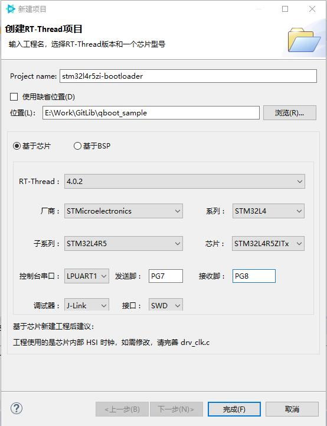
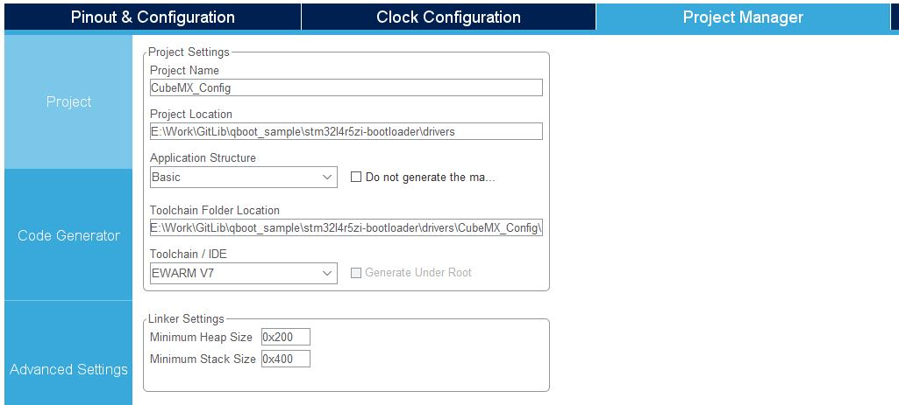
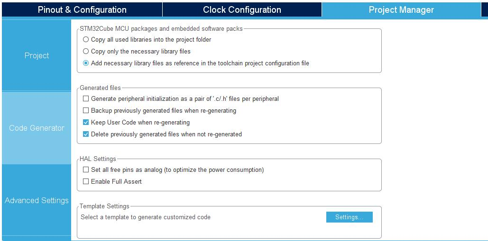
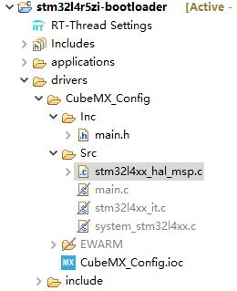
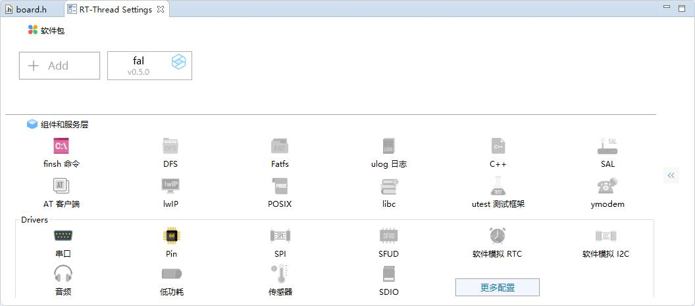
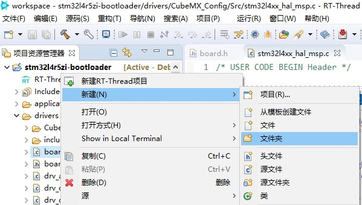
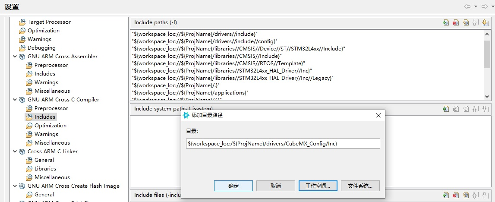
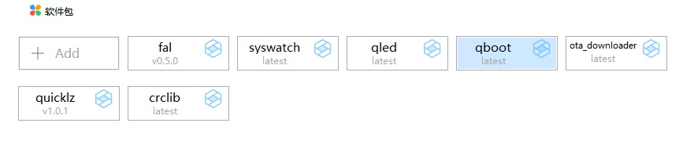
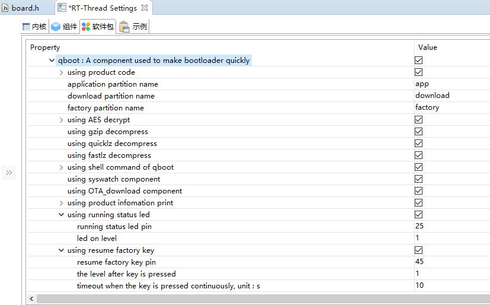
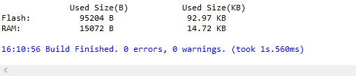

# QBoot使用指导 —— 基于RT-Thread 4.0快速打造bootloader

## 1. QBoot组件简介

#### QBoot组件全称是Quick bootloader，是用于快速制作bootloader程序的专用组件，组件说明详见[组件readme](https://gitee.com/qiyongzhong0/rt-thread-qboot/blob/master/readme.md)。本组件的设计初衷是帮助大家加速bootloader程序开发速度。组件基于RT-Thread 4.0设计，依赖Fal、crclib组件工作。目前版本V1.00，仅支持ARM系列芯片（作者也仅在STM32系列芯片上进行过测试），从下一版本V1.10将加入更多架构芯片的支持，希望大家提供帮助和支持。欢迎大家使用QBoot组件。

## 2. QBoot使用示例

### 2.1 创建基础工程

#### 2.1.1 使用RT-Thread Studio基于芯片创建工程（本示例使用的芯片型号是STM32L4R5ZI）


#### 2.1.2 修改board.h

##### 修改Flash和Ram尺寸定义：
```
#define ROM_START  ((uint32_t)0x08000000)
#define ROM_SIZE   (2048)
#define ROM_END((uint32_t)(ROM_START + ROM_SIZE * 1024))

#define RAM_START  (0x20000000)
#define RAM_SIZE   (640)
#define RAM_END(RAM_START + RAM_SIZE * 1024)
```
##### 修改为
```
#define ROM_START              ((uint32_t)0x08000000)
#define ROM_SIZE               (2048 * 1024)
#define ROM_END                ((uint32_t)(ROM_START + ROM_SIZE))

#define RAM_START              (0x20000000)
#define RAM_SIZE               (640 * 1024)
#define RAM_END                (RAM_START + RAM_SIZE)
```

##### 加入芯片flash驱动：
```
/*#define BSP_USING_ON_CHIP_FLASH*/
```
##### 修改为
```
#define BSP_USING_ON_CHIP_FLASH
```

##### 如果你使用了spi flash则须加入spi驱动，本示例未使用，在此不再赘述。

#### 2.1.3 修改main.c，删除main函数内的所有代码，仅保留`return RT_EOK;`
```
int main(void)
{
    return RT_EOK;
}
```

#### 2.1.4使用CubeMX生成芯片低层初始化代码，并保存到工程的`driver`文件夹下
##### project配置如下：

##### code generator配置如下：

##### 刷新Studio工程，将`driver/CubeMX_Config/EWARM`目录排除在构建之外，将`driver/CubeMX_Config/src`目录下除`stm32l4xx_hal_msp.c`之外的其它文件排除在构建之外，将`driver/CubeMX_Config/inc`目录下除`main.h`之外的其它文件删除，完成后如下图所示：


#### 2.1.5 添加Fal组件并保存


#### 2.1.6 在工程`driver`下创建文件夹`ports`


#### 2.1.7 添加`fal_cfg.h`到文件夹`ports`，代码如下：
```
#ifndef _FAL_CFG_H_
#define _FAL_CFG_H_

#include <rtconfig.h>
#include <board.h>

#define RT_APP_PART_ADDR            (0x08000000 + 128*1024)//app partition begin address

#define NOR_FLASH_DEV_NAME          FAL_USING_NOR_FLASH_DEV_NAME//"norflash0"

/* ===================== Flash device Configuration ========================= */
extern const struct fal_flash_dev stm32_onchip_flash;
//extern struct fal_flash_dev nor_flash0;

/* flash device table */
#define FAL_FLASH_DEV_TABLE                                          \
{                                                                    \
    &stm32_onchip_flash,                                             \
    /*&nor_flash0,*/                                                 \
}
/* ====================== Partition Configuration ========================== */
#ifdef FAL_PART_HAS_TABLE_CFG
/* partition table */
#define FAL_PART_TABLE                                                                      \
{                                                                                           \
    /*{FAL_PART_MAGIC_WORD,   "bl",           "onchip_flash",     0,          128*1024,  0},*/  \
    {FAL_PART_MAGIC_WORD,   "app",          "onchip_flash",     128*1024,   896*1024,  0},  \
    {FAL_PART_MAGIC_WORD,   "factory",      "onchip_flash",     1024*1024,  512*1024,  0},  \
    {FAL_PART_MAGIC_WORD,   "download",     "onchip_flash",     1536*1024,  512*1024,  0},  \
    /*{FAL_PART_MAGIC_WORD,   "filesys",      NOR_FLASH_DEV_NAME, 0,          8*1024*1024,  0},*/ \
}
#endif /* FAL_PART_HAS_TABLE_CFG */

#endif /* _FAL_CFG_H_ */
```
##### 注：使用不到的分区最好注释掉，可防止异常破坏数据。

#### 2.1.8 添加`drv_fal_init.c`到文件夹`ports`，代码如下：
```
#include <rtthread.h>

#ifdef PKG_USING_FAL

#include <fal.h>
extern int fal_init(void);
INIT_COMPONENT_EXPORT(fal_init);

#endif
```
#### 2.1.9 打开构建配置，修改`Optimization`页的`Optimization level`项配置为`Optimize size（-Os）`，向编译配置的`includes`中加入目录`drivers/CubeMX_Config/Inc`和`drivers/ports`


#### 2.1.10 刷新、保存和编译工程，如无错误，则创建基础工程完成。

### 2.2 添加和配置QBoot组件

#### 2.2.1 添加QBoot组件，在软件包中心界面选系统，在QBoot组件项点添加，最后关闭软件包中心


#### 2.2.2 配置QBoot组件，在`RT-Thread Settings`界面，双点qboot组件，进入选项配置界面


##### 本示例使用了组件的全部功能，修改了`running status led pin`、`resume factory key pin`、`the level after key is pressed`三个配置项，其它使用默认配置。你可以依据需要对其它配置项进行修改。配置完成后保存工程，完成组件更新。


##### 编译工程，代码flash使用92.97k，ram使用14.72，满足设计需求


##### 注：在使用gzip情况下，zlib组件的版本v1.0.0对flash使用较多ram较少，而版本laster则对flash使用较少，ram使用较多，请根据不同需要选择使用合适的版本。

# >_< 恭喜！你的bootloader制作完成了！

## 3. 帮助连接：
- 不同需求，须裁剪QBoot功能模块，请参考[qboot各项配置资源占用情况说明](https://gitee.com/qiyongzhong0/rt-thread-qboot/blob/master/doc/QBoot%E5%90%84%E9%A1%B9%E9%85%8D%E7%BD%AE%E8%B5%84%E6%BA%90%E5%8D%A0%E7%94%A8%E6%83%85%E5%86%B5%E8%AF%B4%E6%98%8E.md)
- 运行指示灯闪烁状态描述，详见[运行指示灯状态说明](https://gitee.com/qiyongzhong0/rt-thread-qboot/blob/master/doc/QBoot%E7%8A%B6%E6%80%81%E6%8C%87%E7%A4%BA%E7%81%AF%E8%AF%B4%E6%98%8E.md)
- 升级包打包工具[下载地址](https://gitee.com/qiyongzhong0/rt-thread-qboot/blob/master/tools/QBootPackager_V1.00.zip)
- shell命令行QBoot的相关命令描述，详见[QBoot命令详述](https://gitee.com/qiyongzhong0/rt-thread-qboot/blob/master/doc/QBoot%E5%91%BD%E4%BB%A4%E8%AF%A6%E8%BF%B0.md)

## 4. 联系方式

- 维护：qiyongzhong
- 主页：https://gitee.com/qiyongzhong0/rt-thread-qboot
- 邮箱：917768104@qq.com