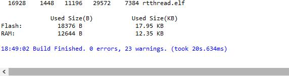
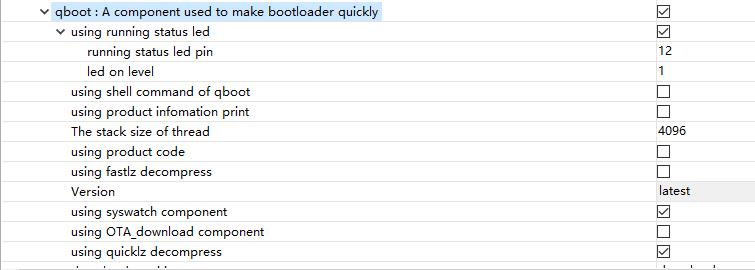

# 使用QBoot组件制作极简版Bootloader

## 1. 写在开始之前
#### 今天接到一个新项目，当拿到板子和原理图，我傻了！
#### 嗯？？？ 调试串口呢？？？ 运行指示灯呢？？？
#### 什么！！！ 怎么没有debug串口！！！ 怎么连运行指示灯都没有啊！！！
#### 悲催啊！！！ 这让我怎么调试啊！！！
#### 板子设计已然这样了，没办法！就这么干吧！
#### MCU使用的是stm32l431rc，flash尺寸256k，ram尺寸48k，没有外部flash。
#### 既然没有串口、没有指示灯，flash又这么小，那干脆做一版极简版的bootloader试试吧！
#### 开始动手...

## 2. 创建极简工程

### 2.1 基于芯片创建工程

#### 使用RT-Thread Studio基于芯片创建工程，配置如下：


#### 点击完成！等待Studio生成工程...

### 2.2 裁剪工程到极简

#### 在生成工程中，打开`RT-Thread Settings`，在Settings页面点击 `更多配置` 进入详细配置界面。在内核配置页面，取消所有打勾项，如下图所示：


#### 修改 `内核设备对象` 项如下图所示：


#### 切换到`组件`配置页面，取消`shell`，如下图所示：


#### 取消`设备驱动程序`中的`使用UART设备驱动程序`项和`使用设备IPC`项，仅保留`使用PIN设备驱动程序`项，如下图所示：


#### 保存工程，完成配置保存。

#### 进入`构建配置`界面，修改`优化选项`为`尺寸优化`，点`应用并关闭`保存修改，如图：


#### 编译工程，无错误，完成极简工程创建。flash使用13.15k，ram使用3.20k。


### 2.3 加入必备组件

#### 加入fal组件，打开软件包中心，搜索fal，将fal组件加入工程，保存工程，完成组件下载和安装。


#### 在工程的`driver`文件夹下创建文件夹`ports`，如图：


#### 在`ports`文件夹下，加入文件`fal_cfg.h`，代码如下：
```
#ifndef _FAL_CFG_H_
#define _FAL_CFG_H_

#include <rtconfig.h>
#include <board.h>

#define RT_APP_PART_ADDR            (0x08000000 + 32*1024)//app partition begin address

#define NOR_FLASH_DEV_NAME          FAL_USING_NOR_FLASH_DEV_NAME//"norflash0"

/* ===================== Flash device Configuration ========================= */
extern const struct fal_flash_dev stm32_onchip_flash;
//extern struct fal_flash_dev nor_flash0;

/* flash device table */
#define FAL_FLASH_DEV_TABLE                                          \
{                                                                    \
    &stm32_onchip_flash,                                             \
    /*&nor_flash0,*/                                                 \
}
/* ====================== Partition Configuration ========================== */
#ifdef FAL_PART_HAS_TABLE_CFG
/* partition table */
#define FAL_PART_TABLE                                                                      \
{                                                                                           \
    /*{FAL_PART_MAGIC_WORD,   "bl",           "onchip_flash",     0,          32*1024,  0},*/  \
    {FAL_PART_MAGIC_WORD,   "app",          "onchip_flash",     32*1024,   128*1024,  0},  \
    /*{FAL_PART_MAGIC_WORD,   "factory",      "onchip_flash",     160*1024,  92*1024,  0},*/  \
    {FAL_PART_MAGIC_WORD,   "download",     "onchip_flash",     160*1024,  92*1024,  0},  \
    /*{FAL_PART_MAGIC_WORD,   "param",        "onchip_flash",     252*1024,  4*1024,  0},*/  \
    /*{FAL_PART_MAGIC_WORD,   "filesys",      NOR_FLASH_DEV_NAME, 0,          8*1024*1024,  0},*/ \
}
#endif /* FAL_PART_HAS_TABLE_CFG */

#endif /* _FAL_CFG_H_ */
```

#### 在`ports`文件夹下，加入文件`drv_fal_init.c`，代码如下：
```
#include <rtthread.h>

#ifdef PKG_USING_FAL

#include <fal.h>
extern int fal_init(void);
INIT_COMPONENT_EXPORT(fal_init);

#endif
```

#### 修改`board.h`，将以下代码：
```
#define ROM_START              ((uint32_t)0x08000000)
#define ROM_SIZE               (256)
#define ROM_END                ((uint32_t)(ROM_START + ROM_SIZE * 1024))

#define RAM_START              (0x20000000)
#define RAM_SIZE               (48)
#define RAM_END                (RAM_START + RAM_SIZE * 1024)
```
#### 修改为
```
#define ROM_START              ((uint32_t)0x08000000)
#define ROM_SIZE               (256 * 1024)
#define ROM_END                ((uint32_t)(ROM_START + ROM_SIZE))

#define RAM_START              (0x20000000)
#define RAM_SIZE               (48 * 1024)
#define RAM_END                (RAM_START + RAM_SIZE)
```

#### 去掉`BSP_USING_ON_CHIP_FLASH`的注释，打开芯片flash驱动
```
/*#define BSP_USING_ON_CHIP_FLASH*/
```
#### 修改为
```
#define BSP_USING_ON_CHIP_FLASH
```

#### 修改main.c，删除main函数内的所有代码，仅保留`return RT_EOK;`
```
int main(void)
{
    return RT_EOK;
}
```

#### 打开构建配置，向编译配置的`includes`中加入目录`drivers/ports`


#### 保存、编译工程，无错误，添加fal组件完成。编译生成代码，flash使用14.67k，ram使用3.25k。


## 3. 加入QBoot组件

#### 打开软件包中心，搜索`qboot组件`，添加`qboot组件`到工程，关闭软件包中心。


#### 配置`qboot组件`，双击qboot组件，进入组件详细配置页面，取消所有打勾项，仅保留`using quicklz decompress`项，如图所示：


#### 保存配置，完成qboot组件添加。

#### 说明：因为没有debug串口、没有状态指示灯，所以shell和打印输出相关的功能都用不上，所以统统去掉了。为什么仅保留quicklz解压呢？因为AES解密功能的flash使用比较多，所以未使用；gzip解压功能使用flash软多，不适用于资源较小的MCU，所以未选用；fastlz的资源使用与quicklz差不多，但其压缩率没有quicklz好，所以最终使用了quicklz解压功能；不用解压功能岂不是更省资源吗？为什么还要用quicklz呢？因为quicklz使用flash很少，不足1k，而使用了压缩后download区就可节省出1/4的空间（因为quicklz的压缩率在70~75%左右），比如app分区是128k，那么download分区就可以减少到96k，由此可见使用压缩还是很划算的。QBoot各功能资源使用情况详见：[qboot各项配置资源占用情况说明](https://gitee.com/qiyongzhong0/rt-thread-qboot/blob/master/doc/QBoot%E5%90%84%E9%A1%B9%E9%85%8D%E7%BD%AE%E8%B5%84%E6%BA%90%E5%8D%A0%E7%94%A8%E6%83%85%E5%86%B5%E8%AF%B4%E6%98%8E.md)

#### 编译工程，无错误，极简版bootloader制作完成。flash使用17.95k，ram使用12.35k。


## 4. 测试验证

#### 烧入刚制作完成的bootloader到0x08000000处，再烧入app到0x08000800处。重新上电，app可以运行，说明bootloader可正常跳转到app执行。

#### 修改app版本，然后将新的app打包为rbl固件包，将生成的固件包扩展名改为.bin，使用烧写工具将扩展名为bin的固件包写入download分区地址0x08028000处。重新上电运行。

#### 使用仿真器查看app分区程序版本号，已变成修改后的版本号，说明bootloader释放download分区固件到app分区功能正常。

## 5. 加入未来支持

#### 极简版bootloader虽然可用，但调试起来太不方便了；经与硬件设计人员沟通确定，下一版本将加上debug串口和运行指示灯，所以现在在极简版的基础上，加入log输出和运行指示功能。为方便调试，自己飞线引出了debug串口。

#### 进入内核配置页，加入控制台功能，如图： 


#### 切换到组件配置页，加入UART设备驱动，如图：


#### 进入qboot配置页，加入状态指示灯功能和syswatch组件（可能是强迫症犯了，总感觉不保险，所以加了syswatch），注意！注意！使用syswatch后，app中必须有看门狗喂狗，否则app会发生看门狗复位，因为syswatch会开启看门狗。如图：


#### 保存、编译，flash使用28.90k，ram使用13.09k。


#### 下载运行，哇！终于又能看到log了...


#### 通过ymodem下载固件包到download，bootloader可正常释放固件到app


## 6. 总结：通过极简版bootloader的制作可见，基于RT-Thread V4.0通过裁剪也可以制作出尺寸较小的bootloader，最小尺寸不足20k，如果加入log输出和syswatch，尺寸不足32k，能够满足大多数小资源MCU的使用；而且通过RT-Thread V4.0制作bootloader比较简单和容易。