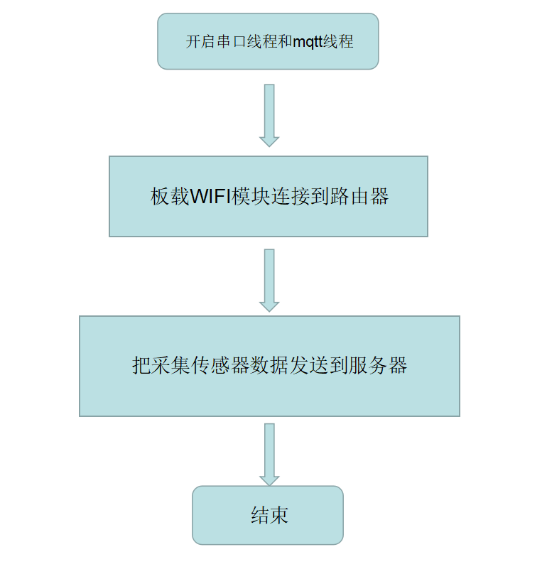

# 485传感器数据采集例程

## 简介

本例程主要功能是让板卡采集485传感器数据，并上报 EMQ 的 mqtt 服务器，并用手机 App 展示。


## 硬件说明

如上图所示，串口（PC6 / PC7）采集485传感器数据，并通过板载 wifi 发送到服务器，手机 App 订阅传感器的数据主题进行折线展示。  
[App仓库链接](https://github.com/NoobSmall/art_pi_485_App)

## 连接说明



## 软件说明

主要的源代码位于 `/projects/art_pi_Sensor485_App/applications/main.c` 中。首先定义了一个宏 `SAMPLE_UART_NAME ` ，代表串口编号，然后与 （**PC6 / PC7**）对应：

```
#define SAMPLE_UART_NAME       "uart6"      //开启的串口名称
```

在 main 函数中，调用串口并开启 mqtt 线程。

```
int main(void)
{
    rt_uint32_t count = 1;

    rt_pin_mode(LED_PIN, PIN_MODE_OUTPUT);
    uart_sample(1,"uart6");  //调用串口（向本串口发送数据，连接到mqtt服务器后就可以在App里看到数据了）
    mqtt_emqx(); //开启mqtt线程，注意要在ST-Link USB端口里配置一下板载wifi连接自己的路由器的名称和密码

    while(count++)
    {
        rt_thread_mdelay(500);
        rt_pin_write(LED_PIN, PIN_HIGH);
        rt_thread_mdelay(500);
        rt_pin_write(LED_PIN, PIN_LOW);
    }
    return RT_EOK;
}
```


## 运行
### 编译&下载

编译完成后，将开发板的 ST-Link USB 口与 PC 机连接，然后将固件下载至开发板。

### 运行效果

正常运行后，配置完 wifi 与路由器连接的名称和密码，向串口6发送16进制数据，就可以在App里看到数据了。

[展示视频](https://www.bilibili.com/video/BV17T4y1M792)

## 注意事项

**1. 注意先添加串口再进行连接路由器。**

用 USB 数据线连接 ST-Link USB 串口，然后用以下命令设置需要连接的 **WiFi**  

```
1. wifi config     				//查找 wifi
2. wifi join 你的 wifi 名称    你的 wifi 密码	  //连接 wifi    例如: wifi join liuda123.club 123456
```


**2. mqtt 主题**
```
温度：   sensor/temper
湿度：   sensor/humidity
```
