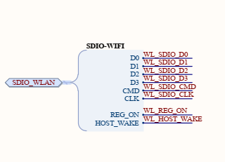
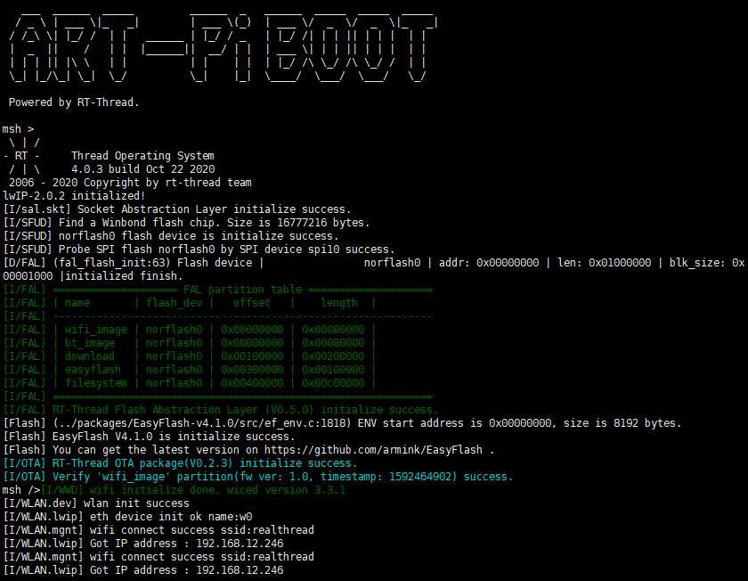

# 板载 Wi-Fi 例程

## 简介

本例程为 WIFI 例程，使用 AP6212 来连接到网络。并实现了断电自动重连。如果对本例程想进一步了解可以阅读[设计思想](./docs/设计思想.md)。

## 硬件说明

AP6212是正基AMPAK推出的一款低功耗高性能的WiFi+BT4.2模块，该模块符合802.11b/g/n，其中WiFi功能采用SDIO接口，蓝牙采用UART/I2S/PCM接口，具有StationMode，SoftAP，P2P功能等。该芯片硬件电路连接方式如上图所示。

## 软件说明

本例程仅实现了 WIFI 联网的功能，并支持重连，可以作为您开发其他网络相关应用的基础工程。

## 运行
### 编译&下载

编译完成后，将开发板的 ST-Link USB 口与 PC 机连接，然后将固件下载至开发板。

### 运行效果

## 注意事项

1. AP6212 正常运行依赖 WIFI 固件，如果固件丢失，参考[WIFI固件下载手册](https://github.com/RT-Thread-Studio/sdk-bsp-stm32h750-realthread-artpi/blob/master/documents/UM5003-RT-Thread%20ART-Pi%20BT_WIFI%20%E6%A8%A1%E5%9D%97%E5%9B%BA%E4%BB%B6%E4%B8%8B%E8%BD%BD%E6%89%8B%E5%86%8C.md)。

