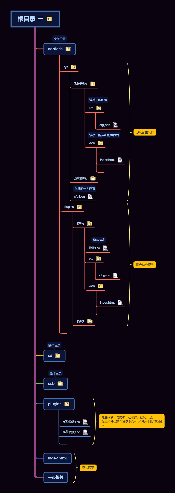
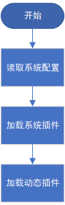

# INDUSTRY-IO-GATEWAY 设计思想

## 前言

在拿到开发板的时候，看到板上那么多资源就想做个好玩的东西。当时胡思乱想了好久，想做好多功能，再一合计还要为未来的拓展性行方便，头都大了。

这时候正好是在接触Linux应用编程，了解了一点动态模块的知识，发现RT-Thread也有动态模块功能，再一看好家伙 `32M SDRAM`，放手开干。

在写代码前思考了一段时间，最终明确了目标：

1. 除必要的底层代码外，内核代码最精简，极少改动
2. 所有应用代码均可动态实现
3. 动态插件可视化配置

基于以上的目标实现了第一版代码。当然与最终目标还有不少出入，但会在接下来的版本中不断完善。

## 设计与实现

### 思路

#### 调试

调试功能虽说是占整个项目的很小一块，确实极为重要的一块。基于RT-Thread的finsh组件可以很容易的实现这一功能，但在实施过程中却遇到了几个问题：

1. 目前只能单一的输入输出
2. 不能更方便的进行多通道的扩展

在仔细研究了一番设备框架后，理解了select的本质实现，进而衍生出了 `agile_console` 软件包来对调试设备的多通道输入输出进行管理。同时对 `agile_telnet` 作了适配，实现了串口、以太网的同步调试。并且目前已经进一步实现了 `mqtt` 适配，实现了远程调试(未开放插件)。

#### 目录结构

目录结构如图，从图中可以看到 **目标2：所有应用代码均可动态实现** 和 **目标3：动态插件可视化配置** 的影子。

### 实现

