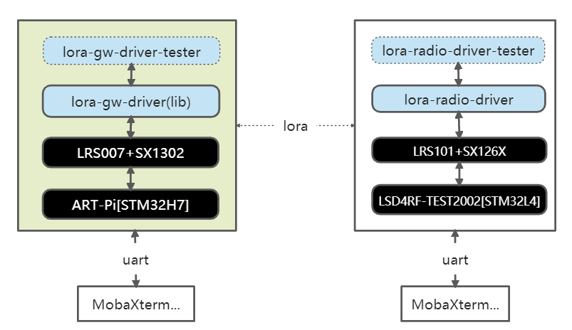

# ART-Pi  lora-gw-driver-tester例程

## 简介

ART-Pi lora-gw-driver-tester基于RTOS(RT-Thread)、ART-Pi与LRS007[SX1302]等实现，通过串口shell命令来控制LoRa网关模块(SX1302)的工作模式（Concentrator mode、device mode、CW mode），实现LoRa网关模块(SX1302)点对点单\双\主\从通信、空口抓包、CW性能测试等。

详细说明可查看《[基于ART-Pi与SX1302的lora-gw-driver应用笔记](https://club.rt-thread.org/ask/article/3056.html)》



- CW模式

  - SX1302发送载波信号，可用于测试发射功率等

- Concentrator模式

  - 上电后，SX1302默认处于Concentrator模式，即一直保持接收模式，接收到lora终端设备数据后，并自动回发ACK给终端设备。

- Device模式

  - SX130x模拟lora终端设备，SX130x主动发送ping包，等待接收设备回发ack。
  - 

该例程基于ART-Pi与LoRa多功能扩展板(LRS007)实现，LRS007插接470M LoRa网关模块(LSD4WN-2K730NE0[SX1302] Mini PCIe模块 。

[LSD4WN-2K730NE0[SX1302] Mini PCIe模块 (CN470频段) ](http://wsn.lierda.com/index.php/Home/product/detail/id/100.html)主要技术参数：

- LoRa芯片：SX1302

- 频段范围：

  - TX: 470~510 MHz，最大发射功率约22dBm
  - RX: 470~480 MHz

- 发射性能：~1W@5V、17dBm

- 接收性能:  ~250mW@5V

- 晶振类型：TCXO

- 通信接口：SPI

- **125kHz LoRa 接收器**

  \- 8×8 通道的 LoRa 数据包引擎

  \- 8×SF5-SF12 LoRa 解调器

  \- 8×SF7-SF12 LoRa 解调器

## 硬件说明

如上图所示，LRS007插接470M LoRa网关模块(LSD4WN-2K730NE0[SX1302] Mini PCIe模块，其采用硬件SPI接口(SPI2)与ART-Pi主板连接。

## 软件说明

在包管理器中，使能lora-gw-driver-lib软件包，并选择 ART-Pi and LRS007[LSD4WN-2K730NE0(SX1302)]

```
RT-Thread online packages  --->
  peripheral libraries and drivers  --->
     [*] lora-gw-driver-lib is lora gateway chip(SX130x) driver binary libraries.  --->	
    	   [*]   Enable lora-gw-driver GPIO Setup                                              
                       Select Supported Target Borad  --->
        		 [*] ART-Pi and LRS007[LSD4WN-2K730NE0(SX1302)]  --->
```

lora-gw-driver-tester示例代码位于 `/lrs007_lora_gw_driver/packages/lora-gw-driver-lib-master/samples/lgd-tester` 。
具体使用方式可参考[《lora-gw-driver-lib软件包使用说明》](https://github.com/Forest-Rain/lora-gw-driver-lib/tree/master/docs)


## 运行
### 编译&下载

编译完成后，将开发板的 ST-Link USB 口与 PC 机连接，然后将固件下载至开发板。

### 运行效果

。

## 注意事项

1. LoRa网关模块(SX1302)需连接天线后使用，避免因未接天线导致天线阻抗不匹配，进而影响接收的情况
2. 在实验室等极近距离通信(比如1~2米)，可能会出现邻信道干扰情况,这种场景，可适当拉远距离或者减小发射功率等
3. 为了保证日志输出完整，ulog日志最大长度可设置大些，比如≥1024
4. 当前在ART-Pi平台测试发现MPU使能的时候，会出现SPI访问不稳定情况，目前采用的是不使能MPU的方式
5. 配置STM32CubeMX后，出现Error: L6218E: Undefined symbol DelayBlock_Enable，解决方式如下

```
手动修改 stm32h7xx_hal_conf.h USE_SD_TRANSCEIVER 为0
\#define  USE_SD_TRANSCEIVER           0U  
```