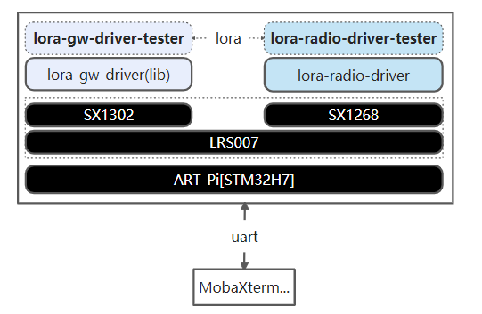
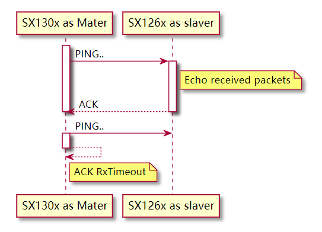
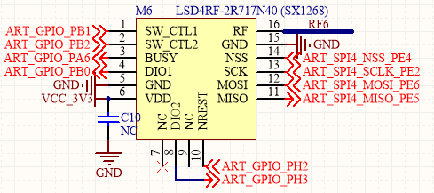

# ART-Pi lora-loopback示例

## 简介

ART-Pi lookback示例基于RTOS(RT-Thread)、ART-Pi、LRS007的SX1302模块与SX1268模块实现，lookback主要实现了在同一个ART-Pi硬件板上同时运行lora-gw-driver-tester与lora-radio-driver-tester，进而实现LRS007板上的SX1302模块与SX1268模块的双向通信测试等。

详细说明可查看《[基于ART-Pi与SX1302的lora-gw-driver应用笔记](https://club.rt-thread.org/ask/article/3056.html)》



- SX1302模块主动发送ping包，等待LoRa终端模块[SX1268]回发ack。
- 或者lora终端模块[SX1268]主动发送ping包，等待接收设备[SX1302]回发ack
  - 

该例程基于ART-Pi与LoRa多功能扩展板(LRS007)实现，LRS007扩展板插接470M LoRa网关模块(LSD4WN-2K730NE0[SX1302] Mini PCIe模块 与LRS007板载LoRa 470MHz LSD4WN-2R717N40[SX1268] SPI模块。

[LSD4WN-2K730NE0[SX1302] Mini PCIe模块 (CN470频段) ](http://wsn.lierda.com/index.php/Home/product/detail/id/100.html)主要技术参数：

- LoRa芯片：SX1302

- 频段范围：

  - TX: 470~510 MHz，最大发射功率约22dBm
  - RX: 470~480 MHz

- 发射性能：~1W@5V、17dBm

- 接收性能:  ~250mW@5V

- 晶振类型：TCXO

- 通信接口：SPI

- **125kHz LoRa 接收器**

  \- 8×8 通道的 LoRa 数据包引擎

  \- 8×SF5-SF12 LoRa 解调器

  \- 8×SF7-SF12 LoRa 解调器

470M LoRa模块[LSD4RF-2R717N40[SX1268]](http://bbs.lierda.com/forum.php?mod=viewthread&tid=87)主要技术参数：

- LoRa芯片：SX1268
- 频段范围：470~510M
- 发射性能：~105mA@ 22dBm(max)
- 接收性能:  ~6mA, -124dBm@SF7&BW125
- 晶振类型：TXCO
- 通信接口：SPI

## 硬件说明

如上图所示，LRS007插接470M LoRa网关模块(LSD4WN-2K730NE0[SX1302] Mini PCIe模块，其采用硬件SPI接口(SPI2)与ART-Pi主板连接。



如上图所示，LRS007扩展板的M6位号当前默认贴装470M LoRa模块(LSD4RF-2R717N40[SX1268])，其采用硬件SPI接口(SPI4)与ART-Pi主板连接。

## 软件说明

### 使能lora-gw-driver-lib软件包

在包管理器中，使能lora-gw-driver-lib软件包，并选择 ART-Pi and LRS007[LSD4WN-2K730NE0(SX1302)]

```
RT-Thread online packages --->
    peripheral libraries and drivers --->
        [*] lora_gw_driver_lib: lora-gw-driver-lib is lora gateway chip(SX130x) driver binary libraries. --->
    	     Select LoRa Gateway Chip (SX1302)  ---> 
    		(lgd1302) Setup LoRa Gw Driver Spi Device Name
    	    (spi2) Setup LoRa Gw Driver Spi Bus Name (eg:spi1,spi2..,Define BSP_USING_SPIx in [Target Platform]\Board\Kconfig)
            (i2c3) Setup LoRa Gw Driver I2C Device Name for Temperture(eg:i2c1,i2c2..,Define BSP_USING_IICx in [Target Platform]\Board\Kconfig)
    		[ ]   Select lora-gw-driver Services
    	     [*]   Enable lora-gw-driver GPIO Setup
    			Select Supported Target Borad  --->
    				  --- ART-Pi and LRS007[LSD4WN-2K730NE0(SX1302)]                                         
                          [ ]   Select LoRa Gw GPIO by Pin Name (NEW)                                           
                          [*]   Select LoRa Gw GPIO by Pin Number (NEW)                                         
                          (128)   LoRa Gw SPI NSS Pin number (NEW)                                             
                          (15)    LoRa Gw RESET Pin number (NEW)                                                
                          (126)   LoRa Gw PowerOn Pin number (NEW)                                                
                          (127)   LoRa Gw PPS Pin number (NEW)                                                
                          (119)   LoRa Gw GPIO6 Pin number (NEW)
   		    Select LoRa GW Driver Samples  --->                                           
             Version (latest)  --->
```

lora-gw-driver-tester示例代码位于 `/lrs007_lora_loopback/packages/lora-gw-driver-lib-lastest/samples/lgd-tester` 。
具体使用方式可参考[《lora-gw-driver-lib软件包使用说明》](https://github.com/Forest-Rain/lora-gw-driver-lib/tree/master/docs)

### 使能lora-radio-driver软件包

在包管理器中，使能lora-radio-driver软件包，并选择 APR-Pi [STM32H750XB] and LRS007 RF_B Channel

```
RT-Thread online packages --->
    peripheral libraries and drivers --->
        [*] lora_radio_driver: lora chipset(sx126x\sx127x.)driver. --->
            Select LoRa Radio Object Type (LoRa Radio Single-Instance)
                (lora-radio0)Setup LoRa Radio Device Name       
                (spi4)  Setup LoRa Radio Spi Name (Define BSP_USING_SPIx in [Target Platform]\Board\Kconfig)
                        Select LoRa Chip Type (LoRa Transceiver [SX126X])  --->
                        Select Supported LoRa Module [SX126X]  --->
                        	[*] LSD4RF-2R717N40 [SX1268]  --->
                        		[*] APR-Pi [STM32H750XB] and LRS007 RF_B Channel  --->
                [ ]     Enable LoRa Radio Debug
                        Select LoRa Radio Driver Sample --->  
                    Version (latest)  --->
```

lora-radio-driver-tester示例代码位于 `/lrs007_lora_loopback/packages/lora-radio-driver-lastest/samples/lora-radio-tester` 。
具体使用方式可参考[《lora-radio-driver软件包使用说明》](https://github.com/Forest-Rain/lora-radio-driver/tree/master/doc)


## 运行
### 编译&下载

编译完成后，将开发板的 ST-Link USB 口与 PC 机连接，然后将固件下载至开发板。

### 运行效果


- SX1302作为主机，SX1268作为从机（发送与接收同频）
  - 打印Debug等级日志( ulog_lvl 7)
- SX1302作为主机，SX1268作为从机
  - 打印Info等级日志(ulog_lvl 6)
- SX1268作为主机，SX1302作为从机
  - 打印Info等级日志(ulog_lvl 6)
- SX1268作为主机，SX1302作为从机
  - 打印Debug等级日志(ulog_lvl 7)

## 注意事项

1. 由于lora loopback示例工作在同一个板子上，SX1302模块与SX1268模块两者距离很近，loopback测试时未连接天线，避免因距离过近，导致输入功率饱和等可能问题
2. 为了保证日志输出完整，ulog日志最大长度可设置大些，比如≥1024
3. 当前在ART-Pi平台测试发现MPU使能的时候，会出现SPI访问不稳定情况，目前采用的是不使能MPU的方式
4. 配置STM32CubeMX后，出现Error: L6218E: Undefined symbol DelayBlock_Enable，解决方式如下

```
手动修改 stm32h7xx_hal_conf.h USE_SD_TRANSCEIVER 为0
\#define  USE_SD_TRANSCEIVER           0U  
```

