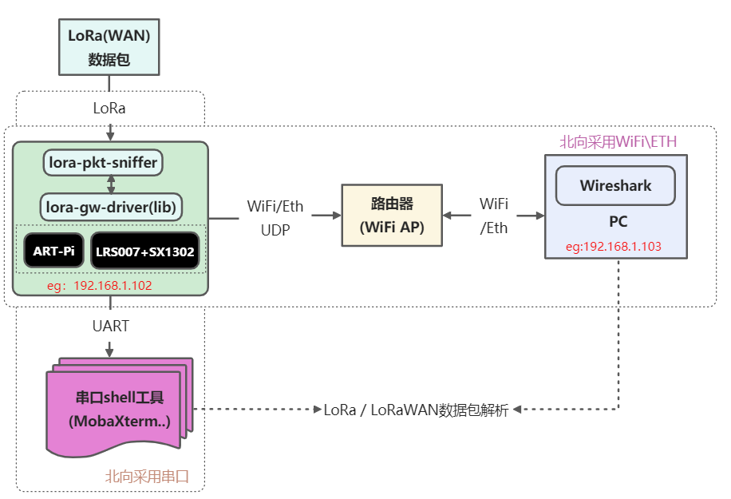
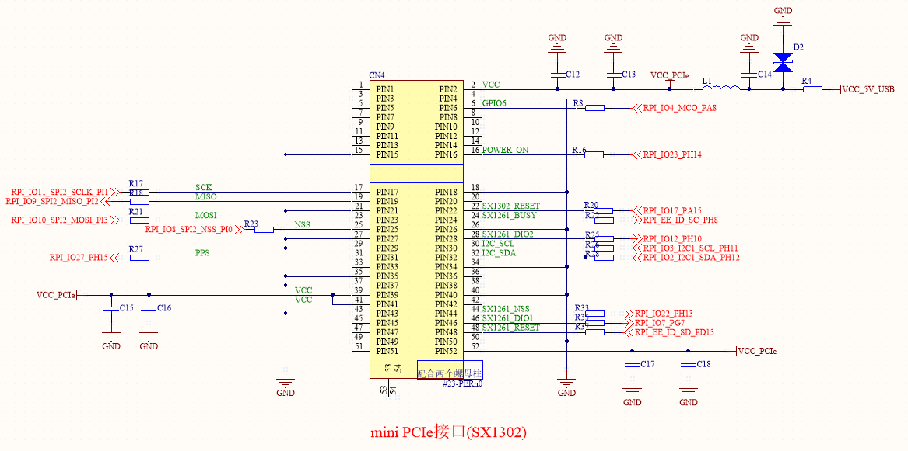
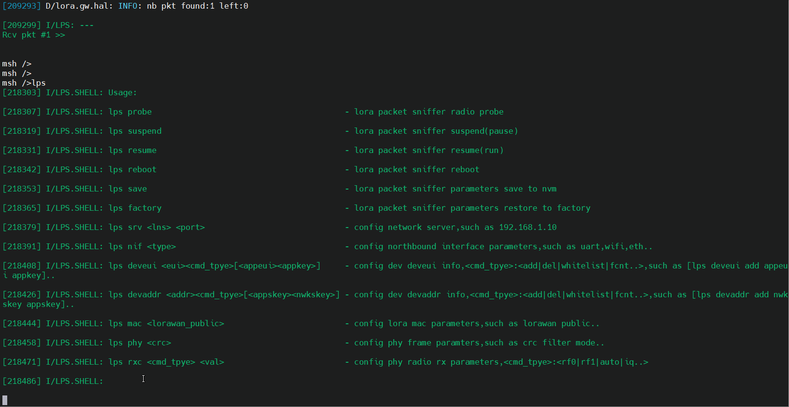
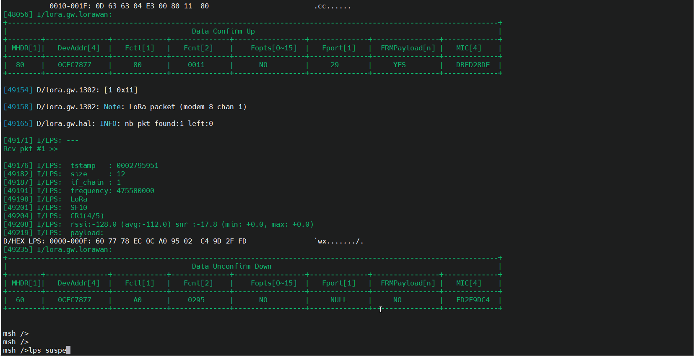
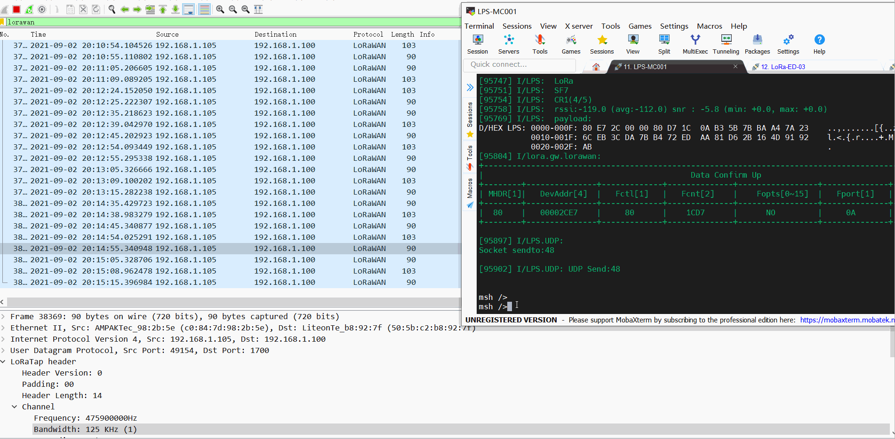

# ART-Pi lora-pkt-sniffer抓包工具

## 简介

ART-Pi lora-pkt-sniffer抓包工具基于RTOS(RT-Thread)、ART-Pi与LoRa网关模块(SX1302模块..)实现，主要用于捕获与解析空口的LoRa(WAN)数据包，可以辅助用于理解LoRa私有协议\LoRaWAN协议、分析LoRa\LoRaWAN产品开发问题等。

详细说明可查看《[基于ART-Pi与SX1302的lora-pkt-sniffer抓包工具应用笔记](https://club.rt-thread.org/ask/article/3054.html)》



lora-pkt-sniffer抓包工具支持两种数据包解析方式，分别是

- 本地串口直显模式（基础显示）

- - lps北向通过串口连接到PC shell工具）
  - lps接收到空口lora数据包后，根据lorawan协议解析，然后通过串口输出格式化后的数据包到PC的串口调试工具（如MobaXterm...）

- Wireshark显示模式（在本地串口直显模式基础上，额外通过Wireshark解析）

- - lps北向通过ETH、WiFi连接到PC Wireshark工具
  - lps接收到空口lora数据包后，打包成满足wireshark格式的数据帧，然后通过UDP输出到PC的UDP服务器（Wireshark）

lora-pkt-sniffer抓包工具默认接收参数：

- - 8个LoRa信道: 475.3、475.5、475.7、475.9、476.1、476.3、476.5、476.7
  - 多速率: SF7~SF12

该例程基于ART-Pi与LoRa多功能扩展板(LRS007)实现，LRS007插接470M LoRa网关模块(LSD4WN-2K730NE0[SX1302] Mini PCIe模块 。

[LSD4WN-2K730NE0[SX1302] Mini PCIe模块 (CN470频段) ](http://wsn.lierda.com/index.php/Home/product/detail/id/100.html)主要技术参数：

- LoRa芯片：SX1302

- 频段范围：

  - TX: 470~510 MHz，最大发射功率约22dBm
  - RX: 470~480 MHz

- 发射性能：~1W@5V、17dBm

- 接收性能:  ~250mW@5V

- 晶振类型：TCXO

- 通信接口：SPI

- **125kHz LoRa 接收器**

  \- 8×8 通道的 LoRa 数据包引擎

  \- 8×SF5-SF12 LoRa 解调器

  \- 8×SF7-SF12 LoRa 解调器

## 硬件说明

如上图所示，LRS007插接470M LoRa网关模块(LSD4WN-2K730NE0[SX1302] Mini PCIe模块，其采用硬件SPI接口(SPI2)与ART-Pi主板连接。

## 软件说明

### 使能lora-pkt-sniffer软件包

在包管理器中，使能lora-pkt-sniffer软件包

```
RT-Thread online packages  --->
  IoT - internet of things  --->
      [*] lora_pkt_sniffer is a sniffer tool of lora(wan) packets.  --->
            [*]   Enable Wireshark Mode                                                            
            [*]   Use lora-gw-driver-lib                                                      
                  Select lora-pkt-sniffer Debug  --->
                  Version (latest)  --->
```

### 配置lora-gw-driver-lib软件包

使能lora-pkt-sniffer 软件包后，会自动使能lora-gw-driver-lib软件包，根据实际情况，配置软件包，例如ART-Pi+LRS007硬件中，选择 ART-Pi and LRS007[LSD4WN-2K730NE0(SX1302)]

```
RT-Thread online packages  --->
  peripheral libraries and drivers  --->
        [*] lora_gw_driver_lib: lora-gw-driver-lib is lora gateway chip(SX130x) driver binary libraries. --->
    	     Select LoRa Gateway Chip (SX1302)  ---> 
    		(lgd1302) Setup LoRa Gw Driver Spi Device Name
    	    (spi2) Setup LoRa Gw Driver Spi Bus Name (eg:spi1,spi2..,Define BSP_USING_SPIx in [Target Platform]\Board\Kconfig)
            (i2c3) Setup LoRa Gw Driver I2C Device Name for Temperture(eg:i2c1,i2c2..,Define BSP_USING_IICx in [Target Platform]\Board\Kconfig)
    		[ ]   Select lora-gw-driver Services
    	     [*]   Enable lora-gw-driver GPIO Setup
    			Select Supported Target Borad  --->
    				  --- ART-Pi and LRS007[LSD4WN-2K730NE0(SX1302)]                                         
                          [ ]   Select LoRa Gw GPIO by Pin Name (NEW)                                           
                          [*]   Select LoRa Gw GPIO by Pin Number (NEW)                                         
                          (128)   LoRa Gw SPI NSS Pin number (NEW)                                             
                          (15)    LoRa Gw RESET Pin number (NEW)                                                
                          (126)   LoRa Gw PowerOn Pin number (NEW)                                                
                          (127)   LoRa Gw PPS Pin number (NEW)                                                
                          (119)   LoRa Gw GPIO6 Pin number (NEW)
   		    Select LoRa GW Driver Samples  --->                                           
             Version (latest)  --->
```

lora-gw-driver-tester示例代码位于 `/lrs007_lora_gw_driver/packages/lora-gw-driver-lib-master/samples/lgd-tester` 。
具体使用方式可参考[《lora-gw-driver-lib软件包使用说明》](https://github.com/Forest-Rain/lora-gw-driver-lib/tree/master/docs)


## 运行
### 编译&下载

编译完成后，将开发板的 ST-Link USB 口与 PC 机连接，然后将固件下载至开发板。

### 运行效果

## shell参数配置



### 本地串口直显模式

wireshark显示模式



## 注意事项

1. LoRa网关模块(SX1302)需连接天线后使用，避免因未接天线导致天线阻抗不匹配，进而影响接收的情况
2. 在实验室等极近距离通信(比如1~2米)，可能会出现邻信道干扰情况,这种场景，可适当拉远距离或者减小发射功率等
3. 为了保证日志输出完整，ulog日志最大长度可设置大些，比如≥2048
4. 当前在ART-Pi平台测试发现MPU使能的时候，会出现SPI访问不稳定情况，目前采用的是不使能MPU的方式
5. 配置STM32CubeMX后，出现Error: L6218E: Undefined symbol DelayBlock_Enable，解决方式如下

```
手动修改 stm32h7xx_hal_conf.h USE_SD_TRANSCEIVER 为0
\#define  USE_SD_TRANSCEIVER           0U  
```

