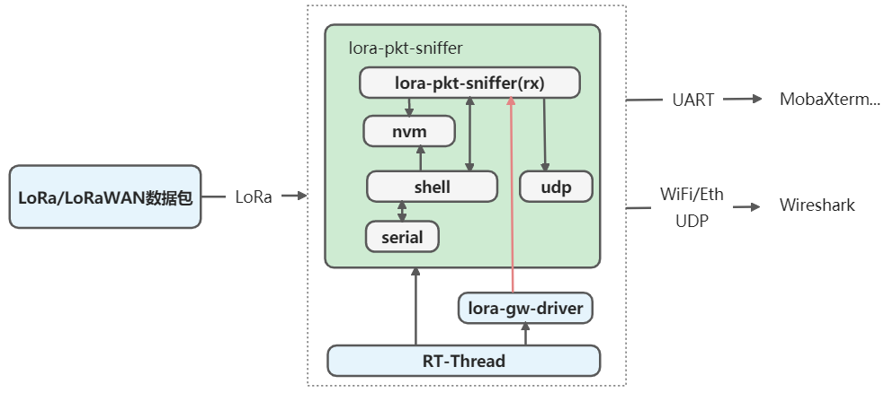
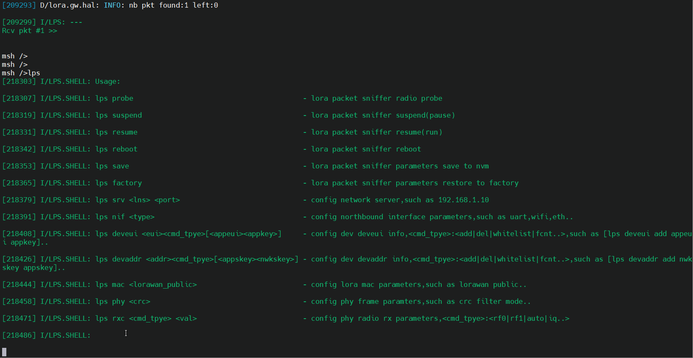
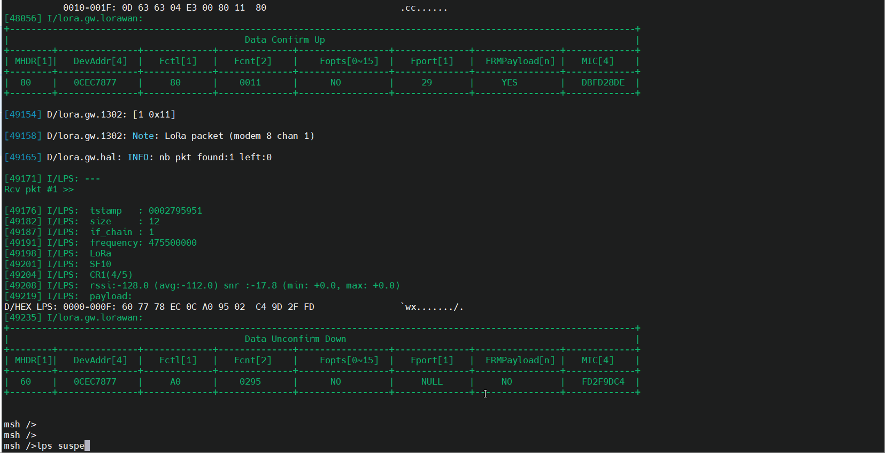
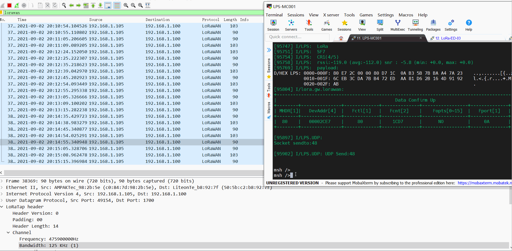

# 1 前言
lora-pkt-sniffer软件包基于RTOS(RT-Thread)与LoRa网关模块(SX1302模块..)实现了LoRa(WAN)数据包的抓取与解析等功能。基于lora-pkt-sniffer软件包可以进一步构建多通道（典型：8个LoRa通道）的lora抓包工具，用以捕获LoRa\LoRaWAN空口数据包，辅助LoRa\LoRaWAN等产品开发等。
lora-pkt-sniffer软件包使用了lora-gw-driver-lib软件包作为下层服务接口。
## 1.1 lora-pkt-sniffer软件包功能简介
lora-pkt-sniffer软件包当前主要支持以下功能：

- 抓取空口LoRa数据包
   - 8个并行的LoRa BW125KHz通道
   - 支持CRC过滤机制
- 串口shell支持参数读写，模式控制等
   - 可动态灵活配置与重启lora-pkt-sniffer的运行参数
   - 支持设定8个工作频点
      - 支持自定义频率组方式
      - 支持自动设置频率组方式等
   - 支持设定上行\下行（IQ反向接收）
   - 支持设定LoRaWAN公网\私有
   - 支持CRC过滤机制等
   - 支持抓包暂停\恢复\重启等
- 私有lora协议原始数据抓取
- LoRaWAN1.0.x协议数据抓取
   - 支持解析与格式化lorawan 1.0.x(解密)数据
   - 支持注册\删除\配置\过滤终端设备等
      - 支持设置OTAA三要素、ABP三要素
      - 支持修改设备的Fcnt
      - 支持白名单过滤机制，只接收与解析白名单的数据帧
         - 可指定设备DevEUI，用于OTAA设备入网过程
         - 可指定设备DevAddr，用于ABP设备或者OTAA设备通信过程
   - 支持LoRaWAN同频模式（如CN470同频、EU868、AS923等）双向抓包
   - 支持LoRaWAN异频模式（如AU915异频等）上行\下行单方向分别抓包
- 支持参数掉电存储
   - 恢复出厂参数
   - 掉电保存等
- 支持多种北向接口与解析模式
   - 本地串口直显
      - 北向通过串口与PC端串口助手(如mobaxterm等)传输
      - LPS直接进行LoRaWAN协议解析与格式化处理
   - WiFi或者ETH
      - 北向通过WIFI（UDP）与PC传输
      - 通过Wireshark进行协议解析

# 2 lora-pkt-sniffer软件包概述
<a name="pp8Lu"></a>
## 2.1 lora-pkt-sniffer软件包功能框图
lora-pkt-sniffer软件包功能框图如下所示


## 2.2 lora-pkt-sniffer软件包组织结构
```c
$ lora-pkt-sniffer
├── README.md
├── docs
|   ├── images
|   └── readme.md 
├── inc
├── src
	├── lora_pkt_sniffer.c
    ├── lora_pkt_sniffer_shell.c
    ├── lora_pkt_sniffer_nvm.c
    └── lora_pkt_sniffer_udp.c
```

- lora_pkt_sniffer.c 实现lps主线程
- lora_pkt_sniffer_shell.c实现lps shell功能
- lora_pkt_sniffer_nvm.c实现lps参数掉电存储与恢复
- lora_pkt_sniffer_udp.c实现lps UDP方式的数据转发到PC Wireshark等工具
## 2.3 lora-pkt-sniffer软件包shell命令
lora-pkt-sniffer软件包shell功能基于finsh命令行来进一步实现
### 2.3.1 shell缺省参数
串口通信参数 115200N81
### 2.3.2 Shell命令集
lora-pkt-sniffer软件包当前支持的Shell命令如下所示:

| 序号 | shell命令 | 命令说明 |
| --- | --- | --- |
| 0 | lps | 显示lps所有支持的命令 |
| 1 | lps probe | 测试LGD设备(SPI)访问是否正常，读取SX1302芯片版本号与芯片固化的EUI |
| 2 | lps suspend  | 挂起lps线程 |
| 3 | lps resume | 恢复lps线程  |
| 4 | lps reboot | 重启lps线程 |
| 5 | lps save | 保存参数到FLASH |
| 6 | lps factory | 恢复出厂参数 |
| 7 | lps srv <cmd_tpye> <val> | 设置网关连接的服务器地址、端口等<br><cmd_type>为命令参数类型<br>当<cmd_type>="srv"，<br>- <val>: 为服务器IP地址或者域名<br>当<cmd_type>="pup"，<br>- <val>:<br> 为服务器的上行端口，缺省值1700<br>当<cmd_type>="pdn"，<br>- <val>: 为服务器的下行端口，缺省值1700<br> |
| 8 | lps nif <type> | 设置北向接口（uart、wifi、eth）<br> 当<type>="wifi"，设置北向接口为wifi<br> 当<type>="eth"，设置北向接口为eth<br> 当<type>="uart", 设置北向接口仅为uart |
| 9 | lps deveui <eui><cmd_tpye>[<appeui><appkey>] | 设置deveui信息，适用于OTAA设备入网过程<br> <eui>: 设备DevEUI，8个字节长度,例如deveui设置为0095690001020304<br> <cmd_type> 命令参数类型<br>- add: 注册一个设备三要素，可设置appeui与appkey，缺省情况下 appeui为1122334455667780,appkey为(deveui<<64 + deveui)<br>- del：删除一个设备<br>- fcnt: 设置设备deveui的uplink counter与downlink counter<br>- whitelist: 添加该设备到白名单<br>   - deveui全0，则清除当前白名单<br> |
| 10 | lps devaddr <addr><cmd_tpye>[<appskey><nwkskey>] | 设置devaddr信息,适用于ABP设备通信过程或者OTAA异频通信过程<br>    <eui>: 设备DevAddr，4个字节长度，例如DevAddr设置为01020304（0x01020304）<br>    <cmd_type> 命令参数类型<br>- add: 注册一个设备三要素，可设置appeui与appkey，缺省情况下 appeui为1122334455667780,appkey为(deveui<<64 | deveui)<br>- del：删除一个设备<br>- fcnt: 设置设备deveui的uplink counter与downlink counter<br>- whitelist: 添加该设备到白名单<br>   - deveui全0，则清除当前白名单<br>    |
| 11 | lps mac <lorawan_public> | 配置MAC参数<br>    <lorawan_public> 设置LoRaWAN公网(同步字)<br>- 0: No<br>- 1: Yes<br> |
| 12 | lps phy <crc> | 配置Phy参数<br> <crc>:设置CRC过滤方式<br>- 0: CRC_OK_ONLY<br>- 1: NO_CRC_ONLY<br>- 2: CRC_OK与 NO_CRC<br>- 3: 所有情况(CRC_OK、NO_CRC、CRC_BAD)<br> |
| 13 | lps rxc <cmd_type> <val> | 配置接收参数<br><cmd_type>:变参类型，有效值: "rf0"、"rf1"、"auto"<br>当<para>="rf0" 或者 "rf1"，<br>- <val>:为radio chain0\1的channel Center Frequence，单位Hz<br>当<para>设置为"auto",<br>- <val>为LGD工作信道组的起始频点，单位Hz<br>当<para>设置为"iq",<br>- <val>:rx iq invert，0-disable invert，1-enable invert<br> |

# 3 lora-pkt-sniffer软件包使用说明
## 3.1 依赖
### 3.1.1 RT-Thread
lora-pkt-sniffer软件包目前主要基于RT-Thread 4.0.3测试验证。
### 3.1.2 lora-gw-driver-lib
lora-gw-sniffer软件包使用lora-gw-driver-lib软件包提供的基于SX130x模块的lora数据包接收服务。
使能lora-gw-sniffer后，会自动使能 lora-gw-driver-lib软件包，用户需要根据实际情况，配置 lora-gw-driver-lib软件包中SX130x模块的相关选项（如SX130x模块的引脚）。
```c
RT-Thread online packages  --->
  peripheral libraries and drivers  --->
     [*] lora-gw-driver-lib is lora gateway chip(SX130x) driver binary libraries.  --->
```
### 3.1.3 内核组件 
#### 3.1.2.1 ulog

- ulog组件——用于打印日志信息
   - 使能ulog
      - ulog缓存大小设置≥ 2048 Byte
      - 可选 使能ulog内置过滤功能
         - 可根据需要过滤不同等级的日志
   - 如果没有使用ulog，默认使用rt_kprintf来实现信息输出功能（取决于用户是否开启lora-pkt-sniffer的debug功能）
      - rt_kprintf buf配置大小
```c
RT-Thread Components --->
   Utiliess --->
       [*] Enable ulog                                      
         The static output log level. (Debug)  --->                                      
       [ ]   Enable ISR log.                                                                  
       [*]   Enable assert check.                                                             
       (2048) The log's max width.
```
#### 3.1.2.2 easyflash[可选]
lora-pkt-sniffer软件包使用了easyflash进行参数的掉电存储与恢复
```c
RT-Thread online packages  --->
   tools packages  --->
    [*] EasyFlash: Lightweight embedded flash memory library.  --->
```
## 3.2 获取软件包
使用 lora-pkt-sniffer 软件包，需要在 RT-Thread 的包管理中选中它：

- lps默认采用本地串口直显模式
- 如果需要使用Wireshark显示模式，则勾选"Enable Wireshark Mode"
   - 注意该模式lps作为UDP客户端，因此要求板子wifi或者eth功能是OK
```c
RT-Thread online packages  --->
   IoT - internet of things  --->
       [*] lora_pkt_sniffer is a sniffer tool of lora(wan) packets.  --->
       --- lora_pkt_sniffer is a sniffer tool of lora(wan) packets.                                                 
               [ ]   Enable Wireshark Mode                                                       
               Select lora-pkt-sniffer Debug  --->                                            
               Version (latest)  --->
```
# 4 使用示例
## 4.1 硬件测试平台
当前所使用的硬件测试平台如下所示

| 序号 | 硬件平台 | MCU | LoRa模块 | 主要用户接口 |
| :-- | --- | --- | --- | --- |
| 1 | ART-Pi  | STM32H750XB | [LSD4WN-2K730NE0](http://bbs.lierda.com/forum.php?mod=viewthread&tid=87)<br />[ ( SX1302 )](http://bbs.lierda.com/forum.php?mod=viewthread&tid=87) | <br />- 用户接口定义<br />   - VCC  - 3.3V<br />   - GND<br />   - SCK    - PI1 (SPI2)<br />   - MISO  - PI2 (SPI2)<br />   - MOSI  - PI3 (SPI2)<br />   - NSS    - PI0<br />   - RESET - PA15<br />   - POWER_ON  - PH14<br />   - GPIO6- PA8<br /> |

<a name="bw4pP"></a>
## 4.2 lps shell操作示例


- lps suspend 挂起当前lps rx线程,暂停接收空口数据包
- lps probe查询设备
- lps srv 查询服务器地址（用于wireshark显示模式）
- lps nif 查询北向接口（串口、wifi等）
- lps mac 查询lorawan公网设置等
- lps phy 查询crc过滤设置等
- lps deveui 查询注册的设备（用于OTAA设备入网）
- lps devaddr 查询注册的设备 (用于ABP设备或者OTAA设备)
- lps deveui d896e0ff00010b0c add 使用deveui注册一个OTAA设备{d896e0ff00010b0c }
   - 缺省appeui为11223344556667780
   - 缺省appkey为d896e0ff00010b0c d896e0ff00010b0c 
- lps deveui d896e0ff00010b0c del 删除一个OTAA设备{d896e0ff00010b0c }
- lps devaddr 11223344 add 使用devaddr注册一个（OTAA\ABP）设备{11223344 }
   - 缺省appskey为001122334455666778899aabbccddeeff
   - 缺省nwkskey为001122334455666778899aabbccddeeff
- lps devaddr 11223344 del 使用devaddr删除一个设备{11223344 }
- lps resume 恢复lps rx线程,重新开始接收空口数据包
- ...
## 4.3 本地直显模式示例

本地串口直显模式

- lps捕获空口lora数据，北向通过uart连接到PC串口调试助手(MabaXterm)
- lps工作频点
   - 上行与下行: 475.3、475.5、475.7、475.9、476.1、476.3、476.5、、476.7
   - 多速率: SF7~SF12
- 终端设备注册
   - 如果需要解密数据，需要先注册设备（如果不需要解密数据，则无需注册设备）
- 入网数据 join request、join accept
- 通信通信
   - 设备上报 data confirm up 
   - 服务器应答 data unconfirm down

## 4.4 wireshark显示模式

Wireshark显示模式

- lps捕获空口lora数据，北向通过wifi连接到PC ，同时通过串口与Wireshark解析与显示
- lps工作频点
   - 上行与下行: 475.3、475.5、475.7、475.9、476.1、476.3、476.5、、476.7
   - 多速率: SF7~SF12
- 通信通信
   - 设备上报 data confirm up 
   - 服务器应答 data unconfirm down

# 5 注意事项

1. LoRa网关模块(SX1302)需连接天线后使用，避免因未接天线导致天线阻抗不匹配，进而影响接收的情况
1. 在实验室等极近距离通信(比如1~2米)，可能会出现邻信道干扰情况,这种场景，可适当拉远距离或者减小发射功率等
1. 使能ulog进行日志输出，为了保证日志输出完整，日志最大长度建议设置≥2048