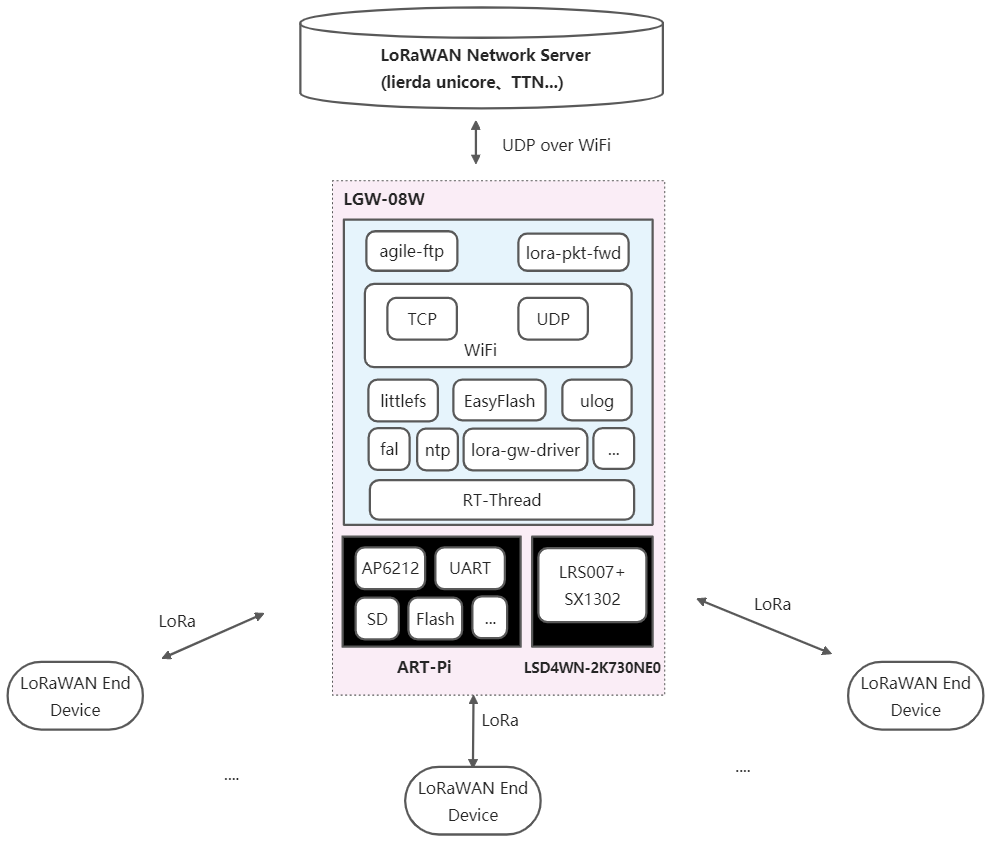
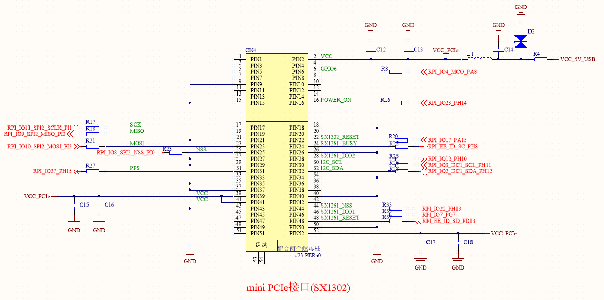
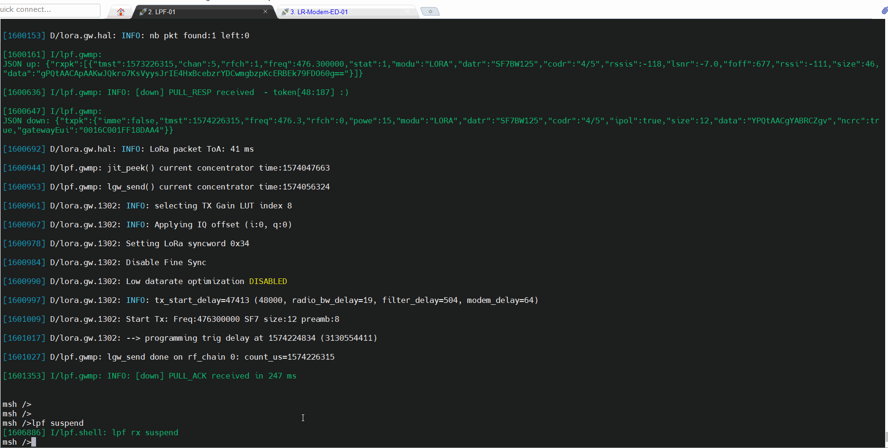
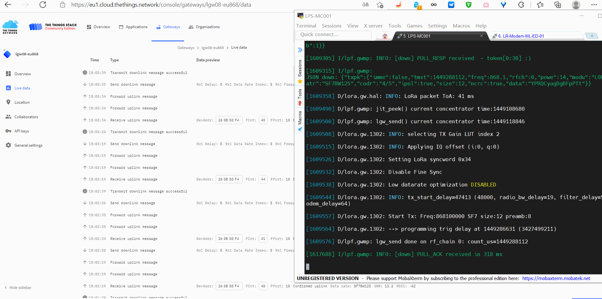

# ART-Pi LoRaWAN 8通道室内网关

## 简介

ART-Pi LoRaWAN 8通道室内网关基于ART-Pi[STM32H7与LRS007[SX1302]模块实现，支持Semtech定义GWMP协议，可对接到利尔达Unicore平台、TTN平台、腾讯云IoT explorer平台等LoRaWAN服务器。

详细说明可查看《[基于ART-Pi与SX1302的8通道LoRaWAN室内网关(WiFi)应用笔记](https://club.rt-thread.org/ask/article/3055.html)》



- LGW-08W室内网关demo当前主要支持如下功能：

  - 符合Semtech定义的第一代LoRaWAN网关协议

  - - 支持Semtech定义的GWMP协议（UDP）

  - - - 支持接入标准LoRaWAN终端设备
      - 可对接到利尔达Unicore平台、TTN平台、腾讯云IoT explorer平台等LoRaWAN服务器

  - 北向接口

  - - WIFI
    - ETH

  - 串口shell

  - - 支持动态调整LoRa网关工作参数（8个LoRa信道的工作频点）等
    - 支持设置北向接口

  - - 支持设置服务器地址、端口号、网关json配置文件名
    - 支持网关接收暂停与恢复

  - 参数配置

  - - 本地直接配置

  - - - 可通过本地shell直接配置网关参数
      - 支持本地参数掉电存储与恢复、恢复出厂设置等

  - - JSON配置文件

  - - - 可以通过JSON配置网关工作参数

  - 详细的开发日志信息

  - - 可过滤日志等级

  - 可选功能

  - - ntp时间同步
    - 支持SD卡

  - - 支持FTP文件传输配置文件

  - 当前测试的IDE

  - - MDK5.29
    - RT-Thread Studio 2.x

[LSD4WN-2K730NE0[SX1302] Mini PCIe模块 (CN470频段) ](http://wsn.lierda.com/index.php/Home/product/detail/id/100.html)主要技术参数：

- LoRa芯片：SX1302

- 频段范围：

  - TX: 470~510 MHz，最大发射功率约22dBm
  - RX: 470~480 MHz

- 发射性能：~1W@5V、17dBm

- 接收性能:  ~250mW@5V

- 晶振类型：TCXO

- 通信接口：SPI

- **125kHz LoRa 接收器**

  \- 8×8 通道的 LoRa 数据包引擎

  \- 8×SF5-SF12 LoRa 解调器

  \- 8×SF7-SF12 LoRa 解调器

## 硬件说明

如上图所示，LRS007插接470M LoRa网关模块(LSD4WN-2K730NE0[SX1302] Mini PCIe模块，其采用硬件SPI接口(SPI2)与ART-Pi主板连接。

## 软件说明

### 使能lora-pkt-fwd软件包

使用 lora-pkt-fwd软件包，需要在 RT-Thread 的包管理中选中它：

```
RT-Thread online packages  --->
   IoT - internet of things  --->
     [*] lora_pkt_fwd:lora(wan) packet forward based on Semtech GWMP protocol(UDP)  --->
      --- lora_pkt_fwd:lora(wan) packet forward based on Semtech GWMP protocol(UDP)                                 
  			  [*]   Use lora-gw-driver-lib                                                             
  					Select LoRaWAN Network Server (Lierda Unicore)  --->                                         
				    Enable LoRa Packet Forward Debug  --->                                                                                  
```

### 配置lora-gw-driver-lib软件包

使能lora-gw-fwd软件包后，会自动使能lora-gw-driver-lib软件包，根据实际需要进一步配置，对于ART-Pi+LRS007硬件平台，选择 ART-Pi and LRS007[LSD4WN-2K730NE0(SX1302)]

```
RT-Thread online packages  --->
  peripheral libraries and drivers  --->
        [*] lora_gw_driver_lib: lora-gw-driver-lib is lora gateway chip(SX130x) driver binary libraries. --->
    	     Select LoRa Gateway Chip (SX1302)  ---> 
    		(lgd1302) Setup LoRa Gw Driver Spi Device Name
    	    (spi2) Setup LoRa Gw Driver Spi Bus Name (eg:spi1,spi2..,Define BSP_USING_SPIx in [Target Platform]\Board\Kconfig)
            (i2c3) Setup LoRa Gw Driver I2C Device Name for Temperture(eg:i2c1,i2c2..,Define BSP_USING_IICx in [Target Platform]\Board\Kconfig)
    		[ ]   Select lora-gw-driver Services
    	     [*]   Enable lora-gw-driver GPIO Setup
    			Select Supported Target Borad  --->
    				  --- ART-Pi and LRS007[LSD4WN-2K730NE0(SX1302)]                                         
                          [ ]   Select LoRa Gw GPIO by Pin Name (NEW)                                           
                          [*]   Select LoRa Gw GPIO by Pin Number (NEW)                                         
                          (128)   LoRa Gw SPI NSS Pin number (NEW)                                             
                          (15)    LoRa Gw RESET Pin number (NEW)                                                
                          (126)   LoRa Gw PowerOn Pin number (NEW)                                                
                          (127)   LoRa Gw PPS Pin number (NEW)                                                
                          (119)   LoRa Gw GPIO6 Pin number (NEW)
   		    Select LoRa GW Driver Samples  --->                                           
```

lora-gw-driver-tester示例代码位于 `/lrs007_lora_gw_driver/packages/lora-gw-driver-lib-master/samples/lgd-tester` 。
具体使用方式可参考[《lora-gw-driver-lib软件包使用说明》](https://github.com/Forest-Rain/lora-gw-driver-lib/tree/master/docs)


## 运行
### 编译&下载

编译完成后，将开发板的 ST-Link USB 口与 PC 机连接，然后将固件下载至开发板。

### 运行效果

### 本地shell参数配置方式



### 对接利尔达unicore平台测试(自主CN470同频)


### 对接TTN平台测试(EU868)



## 注意事项

1. LoRa网关模块(SX1302)需连接天线后使用，避免因未接天线导致天线阻抗不匹配，进而影响接收的情况
2. 在实验室等极近距离通信(比如1~2米)，可能会出现邻信道干扰情况,这种场景，可适当拉远距离或者减小发射功率等
3. 为了保证日志输出完整，ulog日志最大长度可设置大些，比如≥1024
4. 当前在ART-Pi平台测试发现MPU使能的时候，会出现SPI访问不稳定情况，目前采用的是不使能MPU的方式
5. 配置STM32CubeMX后，出现Error: L6218E: Undefined symbol DelayBlock_Enable，解决方式如下

```
手动修改 stm32h7xx_hal_conf.h USE_SD_TRANSCEIVER 为0
\#define  USE_SD_TRANSCEIVER           0U  
```

6. 若要使用ntp服务，需要增加UDP Socket服务数量

