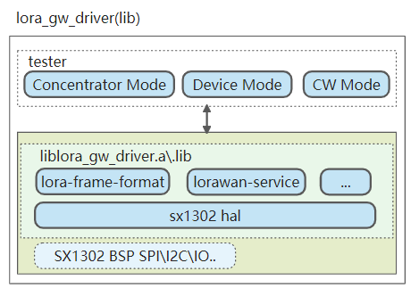
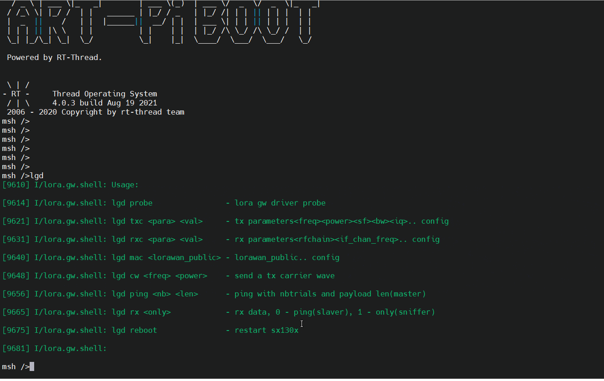

# lora-gw-driver-lib软件包使用说明

# 1 简介
lora-gw-driver软件包(以下简称lgd)是基于RTOS( RT-Thread ) 实现的LoRa网关芯片(SPI)的驱动文件，当前支持SX1302芯片,可以用于创建基于lora网关芯片SX130x的多通道自组网LoRa集中器、LoRa\LoRaWAN网关、多通道LoRa Sniffer工具等。

注：当前lora-gw-driver软件包的SX130x驱动部分，对外版本以二进制lib库形式(lora-gw-driver-lib)提供。

> lora-gw-driver基于Semtech的libloragw进一步构建实现,可参考官方实现如下
>
> [libloragw]: https://github.com/Lora-net/sx1302_hal/tree/master/libloragw

## 1.1 功能简介

- 当前支持LoRa网关芯片（sx130x ）
   - [x] SX1302
     - [x] 支持IF0~IF7 LoRa Multi-SF(BW125)
- 支持lgd tester功能

   - 丰富shell命令可灵活\动态配置lgd运行参数

   - 支持设定8个LoRa接收信道
      - 支持自定义频率组方式
      - 支持自动设置频率组方式等
      - 支持设定上行\下行（IQ反向接收）
   - 支持设定TX运行参数（发射功率、发送频点、IQ反向等）
   - 支持设定LoRaWAN公网\私有等
- 支持TX\RX同频模式与异频模式
- 支持常用的射频性能测试、空口数据包监听、单向\双向\主\从通信测试等功能
   - Concentrator模式
      - 连续接收与应答
   - Device模式
      - 主动发送，支持自定义数据包个数、数据包长度
   - CW模式
      - 载波发射，支持设定CW频率等
   - 支持上述工作模式的动态切换
- 可以与[lora-radio-driver](https://github.com/Forest-Rain/lora-radio-driver/tree/master)配合进行单向\双向空口loopback测试(ping-pong)
- 可作为驱动层进一步对接到lora-pkt-sniffer软件包，构建lora抓包工具等
- 可作为驱动层进一步对接到lora-pkt-fwd软件包，构建lorawan网关等
- 当前主要测试的LoRa 网关模块
   - LoRa  Gateway Baseband Processor (SPI)
      - SX130X
         - SX1302
            - [x] [LSD4WN-2K730NE0 (CN470频段)](http://wsn.lierda.com/index.php/Home/Product/detail/id/100.html)
              - TX: 470~510 MHz，最大功率约22dBm
              - RX: 470~480 MHz
            - [ ] [LSD4WN-2K830NE0 (EU868频段)](http://wsn.lierda.com/index.php/Home/Product/detail/id/99.html)
              - TX: 860~870 MHz，最大功率约27dBm
              - RX: 860~870 MHz
- 当前测试的MCU平台
   - 硬件平台独立，可用于不同硬件平台
   - LoRa GW Driver当前功能主要在STM32平台测试通过
      - [x] STM32H7系列
      - [ ] ....
- 当前支持的RTOS
   - [x] RT-Thread
- 当前测试的IDE
   - [x] MDK5.29
   - [x] RT-Thread Studio 2.x

# 2 lora-gw-driver-lib软件包系统概述

## 2.1 lora-gw-driver-lib软件包功能框图



lora-gw-driver-lib主要实现了SX1302模块的SPI方式寄存器读写控制、数据收发、lorawan解析服务、lora数据包格式化等功能

lora-gw-driver-teser用于测试\演示lora-gw-driver的使用等，基于finish实现，当前支持CW模式、Concentrator模式、Device模式。

- CW模式

- - sx130x发送载波信号，可用于测试发射功率等

- Concentrator模式

- - 上电后，sx130x默认处于Concentrator模式，即一直保持接收模式，接收到lora终端设备数据后，并自动回发ACK给终端设备。

- Device模式

- - Device模式，sx130x模拟lora终端设备，sx130x主动发送ping包，等待接收设备回发ack。

- - 

## 2.2 lora-gw-driver-lib软件包组织结构

```
$ lora-gw-driver-lib
├── README.md
├── docs
|   ├── images
|   └── readme.md 
├── libraries
│   └── libs    
├── ports
│   └── stm32_adapter
├── samples
    └── lora-gw-driver-tester
```

- samples
   - lora gw driver samples
      - lgd-tester
         - lgd-tester示例，当前主要实现了Concentrator模式、Device模式、CW模式，可进行lora性能评估与通信功能测试等
           - ping(pong)单\双向通信测试
           - CW射频载波性能测试
           - 空口数据包监听(接收)等

## 2.3 Shell命令

lgd tester当前支持shell命令如下所示

| 序号 | finish命令                         | 说明                                                         |
| ---- | ---------------------------------- | ------------------------------------------------------------ |
| 0    | lgd                                | 显示lgd当前支持shell命令                                     |
| 1    | lgd probe                          | 测试LGD设备(SPI)访问是否正常，读取芯片版本号与芯片固化的EUI  |
| 2    | lgd txc <freq> <power><sf><bw><iq> | 配置LGD发送参数<br><freq>:发射频率，单位Hz<br><power>:发射功率，单位dBm<br><sf>:扩频因子，有效范围7~12<br/><bw>:带宽，有效范围125，250，500,only for LoRa High Speed IF8<br/><iq>:IQ invert, 0 - No, 1 - Yes |
| 3    | lgd rxc <para> <val>               | 配置LGD接收参数<br/><para>:变参类型，有效值: "rf0"、"rf1"、"auto"<br/>当<para>="rf0" 或者 "rf1"，<br/><val>:为radio chain0\1的channel Center Frequence，单位Hz<br/>当<para>设置为"auto",<br/><val>为LGD工作信道组的起始频点，单位Hz<br/>当<para>设置为"iq",<br/><val>:rx iq invert，0-disable invert，1-enable invert<br/> |
| 4    | lgd mac <lorawan_public>           | 配置MAC参数<br/><lorawan_public> 设置LoRaWAN公网(同步字)，0 - No, 1 - Yes, |
| 5    | lgd cw <freq> <power>              | CW模式，LGD发送载波(CW)<br>\<freq\>:CW频点，单位Hz<br>\<power\>:功率，单位dBm |
| 6    | lgd ping <nb> <len>                | Device模式，启动ping通信测试(自动初始化sx130x),LGD作为master<br>\<nb\>: 发送数据包个数<br>\<len\>: 发送用户数据长度 |
| 7    | lgd rx <rx_only>                   | Concentraror模式，LGD启动数据包接收<br><rx_only>: <br>0 - 回发接收到数据包(loopback功能)<br>1 - 仅接收，并本地以16进制格式与ASCII码显示接收到的数据 |
| 8    | lgd reboot                         | 重新启动sx130x                                               |

# 3 LoRa GW Driver软件包使用说明
## 3.1 依赖

### 3.1.1 RT-Thread

- RT-Thread 4.0.x
- spi device
- i2c device
- ulog

lora-gw-driver目前主要基于RT-Thread 4.0.3测试验证

### 3.1.2 BSP SPI外设

- SPI外设——用户需根据实际MCU平台，自定义LoRa网关模块实际所需要使用的SPI外设
   - 选择SPI外设 
   - 比如在ART-Pi平台，sdk-bsp-stm32h750-realthread-artpi\libraries\Kconfig
      - ART-Pi + LRS007的RF_A通道(左通道)使用BSP_USING_SPI2
      - ART-Pi + LRS007的RF_B通道(右通道)使用BSP_USING_SPI4
```
menu "On-chip Peripheral"
    menuconfig BSP_USING_SPI
        bool "Enable SPI"
        default n
        select RT_USING_SPI
        if BSP_USING_SPI
            config BSP_USING_SPI1
                bool "Enable SPI1"
                default n
            config BSP_USING_SPI2
                bool "Enable SPI2"
                default n
            config BSP_USING_SPI4
                bool "Enable SPI4"
                default n
        endif
endmenu
```
### 3.1.3 ulog组件

- ulog组件——lgd-tester.c使用ulog接口，用于打印调试信息、原始16进制数据等
   - 使能ulog
      - ulog缓存大小设置≥ 1024 Byte
      - 使能ulog内置过滤功能"Enable runtime log filter"
        - 可根据需要过滤不同等级的日志
      - 使能浮点数，用于显示RSSI、SNR

```
RT-Thread Components --->
   Utiliess --->
       [*] Enable ulog 
            The static output log level. (Debug)  --->     
    	    (1024) The log's max width.
       	    log format  --->
       	        [*] Enable float number support. It will using more thread stack.                                                   [*] Enable color log.
            [*]   Enable runtime log filter.   	
```

- ulog使用示例： 设置ulog日志过滤等级为Info

```
msh >ulog_lvl
Please input: ulog_lvl <level>.
Assert  : 0
Error   : 3
Warning : 4
Info    : 6
Debug   : 7
msh >ulog_lvl 6
```


## 3.2 获取软件包

使用 lora-gw-driver-lib软件包，需要在 RT-Thread 的包管理中选中它，具体路径,如下示例以ART-Pi平台为例：
```c
RT-Thread online packages --->
    peripheral libraries and drivers --->
        [*] lora_gw_driver_lib: lora-gw-driver-lib is lora gateway chip(SX130x) driver binary libraries. --->
    	     Select LoRa Gateway Chip (SX1302)  ---> 
    		(lgd1302) Setup LoRa Gw Driver Spi Device Name
    	    (spi2) Setup LoRa Gw Driver Spi Bus Name (eg:spi1,spi2..,Define BSP_USING_SPIx in [Target Platform]\Board\Kconfig)
            (i2c3) Setup LoRa Gw Driver I2C Device Name for Temperture(eg:i2c1,i2c2..,Define BSP_USING_IICx in [Target Platform]\Board\Kconfig)
    		[ ]   Select lora-gw-driver Services
    	     [*]   Enable lora-gw-driver GPIO Setup
    			Select Supported Target Borad  --->
    				  --- ART-Pi and LRS007[LSD4WN-2K730NE0(SX1302)]                                         
                          [ ]   Select LoRa Gw GPIO by Pin Name (NEW)                                           
                          [*]   Select LoRa Gw GPIO by Pin Number (NEW)                                         
                          (128)   LoRa Gw SPI NSS Pin number (NEW)                                             
                          (15)    LoRa Gw RESET Pin number (NEW)                                                
                          (126)   LoRa Gw PowerOn Pin number (NEW)                                                
                          (127)   LoRa Gw PPS Pin number (NEW)                                                
                          (119)   LoRa Gw GPIO6 Pin number (NEW)
   		    Select LoRa GW Driver Samples  --->                                           
             Version (latest)  --->
```

1. Select LoRa Chip \ LoRa Module
   1. "Select LoRa Gateway Chip "
      1. 选择使用的LoRa网关芯片类型
         - 当前支持 SX1302
   2. "Setup LoRa Gw Driver Spi Device Name"
      1. 设置LoRa GW Spi设备名称，缺省为"lgd1302"
   3. "Setup LoRa Gw Driver Spi Bus Name"
      1. 设置LoRa Radio Spi总线名称，eg:ART-Pi中使用spi2
      1. 需在类似 [Target Platform]\Board\Kconfig选择所使用的BSP_USING_SPIx
   4. "Setup LoRa Gw Driver I2C Device Name for Temperture"
      1. 设置板载温度传感器I2C总线名称，可用于RSSI校准等，eg:ART-Pi中使用i2c3
      2. 需在类似 [Target Platform]\Board\Kconfig选择所使用的BSP_USING_IICx
   5. "Enable lora-gw-driver GPIO Setup"
      1. 选择lora网关芯片模块，根据实际使用的MCU硬件平台与lora网关芯片模块，配置关联的GPIO引脚等功能选项
         1. 设定LoRa模块的GPIO口（比如 RESET、NSS、PowerOn...）
            - " Select LoRa Chip GPIO by Pin Number "
               - 支持使用引脚号来定义GPIO，比如 输入 15 代表 PA10 
            - "Select LoRa Chip GPIO by Pin Name"
               - 支持使用引脚名来定义GPIO，比如 输入 A15 代表引脚GPIOA的PIN15脚 (STM32)
2.   Enable LoRa GW Driver Tester
   1. 根据实际情况，可选择测试示例

# 4 应用层调用说明

用户层调用可以参考如下步骤

1. 定义使用射频参数(发送参数与接收参数)，接收参数在lgw启动后不可修改，发送参数可动态调整
```c

#ifndef LGD_RF_CHIAN0_CENTER_FREQ
#define LGD_RF_CHIAN0_CENTER_FREQ 475.6e6
#endif 

#ifndef LGD_RF_CHIAN1_CENTER_FREQ
#define LGD_RF_CHIAN1_CENTER_FREQ 476.4e6
#endif 

static struct lgw_conf_usr_s lgd_conf_lgw =
{
    .lorawan_public = false,/* true for lorawan */

    .rxrf =
    {
        {
            .enable  = true,
            .freq_hz = LGD_RF_CHIAN0_CENTER_FREQ,
            .invert_pol = false, /* false for lorawan */    
        },
        
        {
            .enable  = true,
            .freq_hz = LGD_RF_CHIAN1_CENTER_FREQ,
            .invert_pol = false, /* false for lorawan */    
        },
    },
    
    .rxif = 
    {        
        .channel_if_enable =  { 1, 1, 1, 1, 1, 1, 1, 1, 0, 0 },
        .channel_if_rfchain = { 0, 0, 0, 0, 1, 1, 1, 1, 1, 0 },
        
        .channel_if_freq =
        { 
            -300000, /* for IF0 */
            -100000, /* for IF1 */
            100000,  /* for IF2 */
            300000,  /* for IF3 */
            -300000, /* for IF4 */
            -100000, /* for IF5 */
            100000,  /* for IF6 */
            300000,  /* for IF7 */
        },
    },
    
    .txrf =
    {
        .freq_hz = 476300000, /* 470~510 MHz..*/
        .rf_power = 22,/* 8~22dBm .. */
        .datarate = 7, /* SF7~SF12.. */

        .modulation = MOD_LORA,/* lora */
        .invert_pol = false, /* true for lorawan downlink */
        .preamble = 8,
        .no_header = false, 
        .no_crc = false, /* true for lorawan downlink */
        .bandwidth = BW_125KHZ,
        .coderate = CR_LORA_4_5, 
        
        .tx_mode = IMMEDIATE, /* or TIMESTAMPED */
    },
};

```
2. 调用lora-gw网关芯片初始化
```c
void main(void)
{
    /* lora gw chip initialization */
    lgw_init(&lgw_conf_tst);
    
   /* connect, configure and start the LoRa concentrator */
    status = lgw_start();
    //.....
}
```

3. 数据发送

```c
/* user data */
index = 0
app_data.payload[index++] = 'P';
app_data.payload[index++] = 'I';
app_data.payload[index++] = 'N';
app_data.payload[index++] = 'G';
//....
app_data.size = index;

lgw_tx( &lgw_conf_tst.txrf, &app_data );
```
4. 数据接收

```c
 /* fetch N packets */
nb_pkt = lgw_receive(ARRAY_SIZE(lora_gw_rxpkt), lora_gw_rxpkt);
```

# 5 使用示例
## 5.1 硬件测试平台
当前所使用的硬件测试平台如下所示
| 序号 | 硬件平台 | MCU | LoRa模块 | 主要用户接口 |
| :-- | --- | --- | --- | --- |
| 1 | ART-Pi  | STM32H750XB | [LSD4WN-2K730NE0](http://bbs.lierda.com/forum.php?mod=viewthread&tid=87)<br />[ ( SX1302 )](http://bbs.lierda.com/forum.php?mod=viewthread&tid=87) | <br />- 用户接口定义<br />   - VCC  - 3.3V<br />   - GND<br />   - SCK    - PI1 (SPI2)<br />   - MISO  - PI2 (SPI2)<br />   - MOSI  - PI3 (SPI2)<br />   - NSS    - PI0<br />   - RESET - PA15<br />   - POWER_ON  - PH14<br />   - GPIO6- PA8<br /> |
## 5.2 Shell测试命令
若使能 [* ]  Enable LoRa GW Driver Tester ，则可以通过串口shell（finish）命令直接进行lora-gw-driver的相关功能测试


### 5.2.1 shell操作示例

lgd test shell当前支持的shell操作如下所示



### 5.2.2 Concentrator模式通信示例

运行lora-gw-driver-shell的Concentrator模式（异频模式),双向ping通信测试示例,如下图所示

- slaver 
  - ART-Pi[STM32H7] +  LRS007[SX1302] ( 图左 lgd rx ) 
- master
  - LSD4RF-TEST2002[STM32L4] +  LRS101[SX1268] (图右 lora ping)
- 发送频点 471.3
- 接收频点 473.1
- master分别采用SF7\SF8\SF9\SF10\SF11\SF12 （BW125）与slaver 进行双向PING通信


### 5.2.3 Device模式通信示例

运行lora-gw-driver-test-shell的Device模式,双向ping通信测试示例，如下图所示

- master
  - ART-Pi[STM32H7] + LRS007[SX1302] ( 图左 lgd ping)
- slaver
  - LSD4RF-TEST2002[STM32L4] +  LRS101[SX1268] (图右 lora ping -s)
- 发送频点 471.3 
- 接收频点 473.1 
- master使用SF7 BW125与slaver进行双向通信


# 6 版本更新历史

- V0.3.0 版本 2021-09-10

   - 支持sx1302模块
      - LSD4WN-2K730NE0 (CN470频段)
      - LSD4WN-2K830NE0 (EU868频段)
   - 支持lgd shell命令
      - 支持单\双向\主\从通信等

# 7 问题和建议
如果有什么问题或者建议欢迎提交 [Issue](https://github.com/Forest-Rain/lora-gw-driver-lib/issues) 进行讨论。