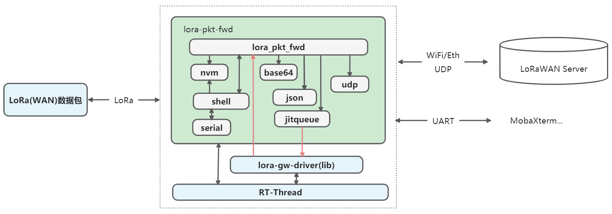
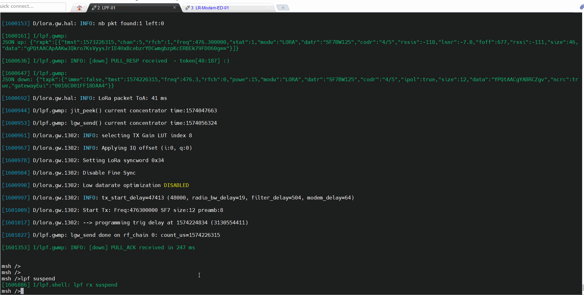
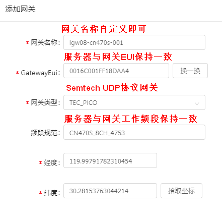
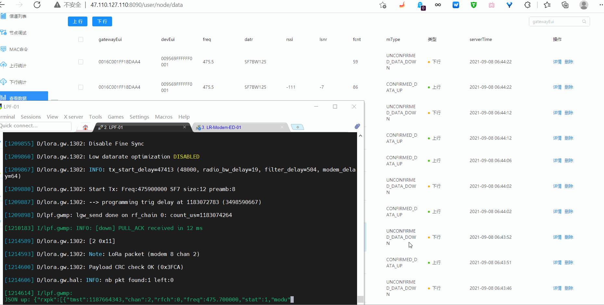
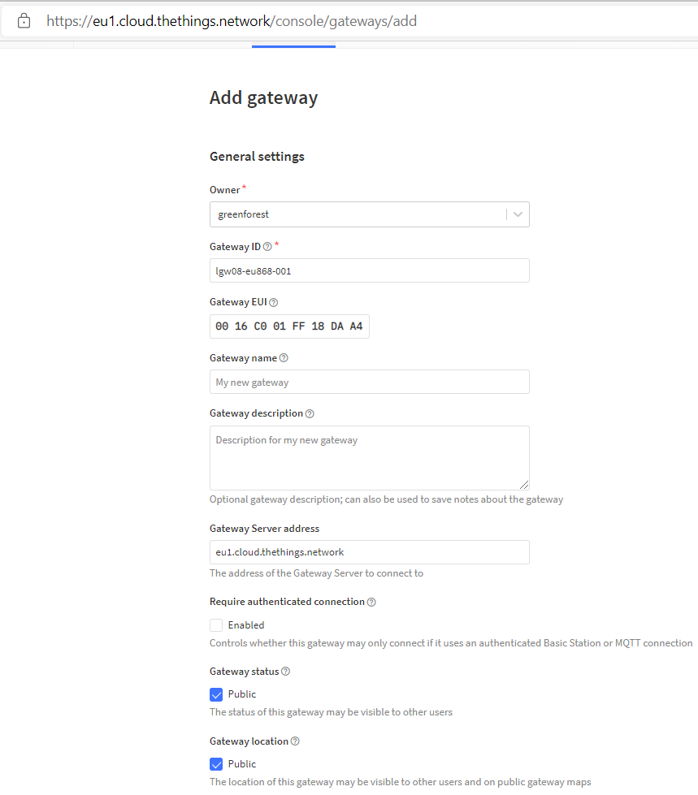
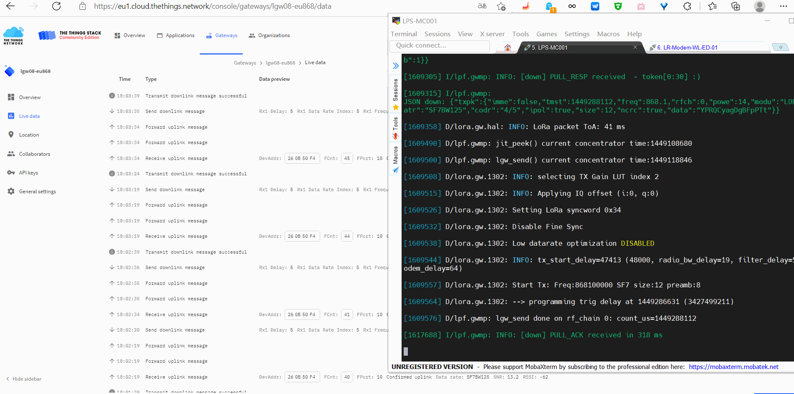

# 1 前言
lora-pkt-fwd软件包基于RTOS（RT-Thread）与LoRa网关模块(eg:SX1302模块..)实现了Semtech定义的GWMP协议，进而实现LoRaWAN数据包通过UDP转发到LoRaWAN服务器。lora-pkt-fwd软件包建立在UDP基础之上，可以用于构建符合Semtech定义的第一代LoRaWAN网关。
lora-pkt-fwd软件包使用lora-gw-driver软件包提供的lora数据包的发送与接收服务，当前主要支持SX1302芯片。
> lora-gw-fwd基于Semtech的packet_forwarder进一步构建实现，Semtech官方实现可参考如下
> [packet_forwarder] [https://github.com/Lora-net/sx1302_hal/tree/master/packet_forwarder](https://github.com/Lora-net/sx1302_hal/tree/master/packet_forwarder) 

## 1.1 功能说明
lora-pkt-fwd软件包当前实现了如下功能：

- 符合Semtech定义的第一代LoRaWAN网关
   - 支持Semtech定义的GWMP协议（UDP）
      - 支持接入标准LoRaWAN终端设备
      - 可对接到利尔达Unicore平台、TTN平台、腾讯云Iotexplorer平台等LoRaWAN服务器
- 串口shell
   - 支持动态调整LoRa网关工作参数（8个LoRa信道的工作频点）等
   - 支持设置北向接口
   - 支持设置服务器地址、端口号或者网关json配置文件名
   - 支持网关接收暂停与恢复
- 参数配置
   - 本地直接配置，可通过本地shell直接配置网关参数
      - 支持本地参数掉电存储与恢复、恢复出厂设置等
   - JSON配置文件，可以通过JSON配置网关工作参数
- 当前测试的IDE
   - [x] MDK5.29
   - [x] RT-Thread Studio 2.x

# 2 lora-pkt-fwd软件包概述
## 2.1 lora-pkt-fwd软件包功能框图
lora-pkt-fwd软件包功能框图如下所示




## 2.2 lora-pkt-fwd软件包组织结构
```c
$ lora-pkt-fwd
├── README.md
├── cfg
|   ├── xxx.json    
├── docs
|   ├── images
|   └── readme.md 
├── inc
├── src
    ├── lora_pkt_fwd.c
    ├── lora_pkt_fwd_shell.c
    ├── base64.c
    ├── jitqueue.c
    └── parson.c
```

- lora_pkt_fwd.c 实现lpf主线程lpf_thread_entry,thread_up,thread_down,thread_jit等
- lora_pkt_sniffer_shell.c实现lpf shell功能
- lora_pkt_sniffer_nvm.c实现lpf参数掉电存储与恢复
- base64.c实现16进制与base64编解码
- jitqueue.c下行发送队列管理
- parson.c json文件编解码
## 2.3 lora-pkt-fwd软件包shell命令
lora-pkt-fwd软件包shell功能基于finsh命令行来进一步实现
### 2.3.1 Shell缺省参数
串口通信参数 115200N81
### 2.3.2 Shell命令集
lpf当前支持的Shell命令如下所示:

| 序号 | shell命令 | 命令说明 |
| --- | --- | --- |
| 0  | lpf | 显示lpf所有支持的命令 |
| 1 | lpf probe | 测试LPF设备(SPI)访问是否正常，读取SX1302芯片版本号与芯片固化的EUI |
| 2 | lpf suspend  | 挂起lpf rx线程 |
| 3 | lpf resume | 恢复lpf rx线程  |
| 4 | lpf reboot | 重启lpf线程 |
| 5 | lpf save | 保存参数到FLASH |
| 6 | lpf factory | 恢复出厂参数 |
| 7 | lpf srv <cmd_type> <val> | 设置网关连接的服务器地址、端口等<br><cmd_type>为命令参数类型<br>当<cmd_type>="name"，快捷设置方式<br>- <val>: 为缺省支持的厂商LoRaWAN服务器<br>   - lierda：利尔达unicore服务器<br>   - ttn: TTN服务器(eu1)<br>   - tencent: 腾讯云iot explorer服务器<br>当<cmd_type>="srv"，<br>- <val>: 为服务器IP地址或者域名<br>当<cmd_type>="pup"，<br>- <val>: 为服务器的上行端口，缺省值1700<br>当<cmd_type>="pdn"，<br>- <val>: 为服务器的下行端口，缺省值1700<br>当<cmd_type>="json"，<br>- <val>: 网关json配置文件名，该文件默认存放在sdcard\lgw\目录下 |
| 8 | lpf nif <type> | 设置北向接口（wifi、eth）<br> 当<type>="wifi"，设置北向接口为wifi<br> 当<type>="eth"，设置北向接口为eth |
| 9 | lpf rxc <cmd_type> <val> | 配置接收参数<br> <cmd_type>:变参类型，有效值: "rf0"、"rf1"、"auto"<br> 当<cmd_type>="rf0" 或者 "rf1"，<br>- <val>:为radio chain0\1的channel Center Frequence，单位Hz，<br>当<cmd_type>设置为"auto",<br>- <val>为LGD工作信道组的起始频点，单位Hz<br>当<cmd_type>设置为"iq",<br>- <val>:rx iq invert，0-disable invert，1-enable invert |

# 3 lora-pkt-fwd软件包使用说明
## 3.1 依赖
### 3.1.1 RT-Thread

- RT-Thread 4.0.x
- spi device
- i2c device
- ulog
- netdev

lora-pkt-fwd软件包目前主要基于RT-Thread 4.0.3测试验证。
### 3.1.2 lora-gw-driver-lib
lora-gw-fwd软件包使用lora-gw-driver-lib软件包提供的基于SX130x模块的lora数据包接收服务。
使能lora-gw-fwd后，会自动使能 lora-gw-driver-lib软件包，用户需要根据实际情况，配置 lora-gw-driver-lib软件包中SX130x模块的相关选项（如SX130x模块的引脚）。
```c
RT-Thread online packages --->
    peripheral libraries and drivers --->
        [*] lora_gw_driver_lib: lora-gw-driver-lib is lora gateway chip(SX130x) driver binary libraries. --->
    	     Select LoRa Gateway Chip (SX1302)  ---> 
    		(lgd1302) Setup LoRa Gw Driver Spi Device Name
    	    (spi2) Setup LoRa Gw Driver Spi Bus Name (eg:spi1,spi2..,Define BSP_USING_SPIx in [Target Platform]\Board\Kconfig)
            (i2c3) Setup LoRa Gw Driver I2C Device Name for Temperture(eg:i2c1,i2c2..,Define BSP_USING_IICx in [Target Platform]\Board\Kconfig)
    		[ ]   Select lora-gw-driver Services
    	     [*]   Enable lora-gw-driver GPIO Setup
    			Select Supported Target Borad  --->
    				  --- ART-Pi and LRS007[LSD4WN-2K730NE0(SX1302)]                                         
                          [ ]   Select LoRa Gw GPIO by Pin Name (NEW)                                           
                          [*]   Select LoRa Gw GPIO by Pin Number (NEW)                                         
                          (128)   LoRa Gw SPI NSS Pin number (NEW)                                             
                          (15)    LoRa Gw RESET Pin number (NEW)                                                
                          (126)   LoRa Gw PowerOn Pin number (NEW)                                                
                          (127)   LoRa Gw PPS Pin number (NEW)                                                
                          (119)   LoRa Gw GPIO6 Pin number (NEW)
   		    Select LoRa GW Driver Samples  --->                                           
             Version (latest)  --->
```
### 3.1.3 内核组件 
#### 3.1.2.1 ulog

- ulog组件——用于打印过程信息
   - 使能ulog
      - ulog缓存大小设置≥ 2048 Byte
      - 使能ulog内置过滤功能
         - 可根据需要过滤不同等级的日志
```c
RT-Thread Components --->
   Utiliess --->
       [*] Enable ulog                                      
            The static output log level. (Debug)  --->     
    	    (2048) The log's max width.
       	    log format  --->
       	        [*] Enable float number support. It will using more thread stack.                                                   [*] Enable color log.
            [*]   Enable runtime log filter.                                                           
```

- ulog使用示例： 设置ulog日志过滤等级为Info
```c
msh >ulog_lvl
Please input: ulog_lvl <level>.
Assert  : 0
Error   : 3
Warning : 4
Info    : 6
Debug   : 7
msh >ulog_lvl 6
```
#### 3.1.2.2 easyflash
lora-pkt-sniffer软件包使用了easyflash进行参数的掉电存储与恢复
```c
RT-Thread online packages  --->
   tools packages  --->
    [*] EasyFlash: Lightweight embedded flash memory library.  --->
```
## 3.2 获取软件包
使用 lora-pkt-fwd软件包，需要在 RT-Thread 的包管理中选中它：

- 默认选择使用lora-gw-driver-lib软件包作为下层服务
```c
 --- lora_pkt_fwd:lora(wan) packet forward based on Semtech GWMP protocol(UDP)                                     
     [*]   Use lora-gw-driver-lib                                                                                  
     Select LoRaWAN Network Server (Lierda Unicore)  --->                                                          
     Enable LoRa Packet Forward Debug  --->                                                                        
     Version (latest)  --->
```
# 4 使用示例
## 4.1 硬件测试平台
当前所使用的硬件测试平台如下所示

| 序号 | 硬件平台 | MCU | LoRa模块 | 主要用户接口 |
| :-- | --- | --- | --- | --- |
| 1 | ART-Pi  | STM32H750XB | [LSD4WN-2K730NE0](http://bbs.lierda.com/forum.php?mod=viewthread&tid=87)<br />[ ( SX1302 )](http://bbs.lierda.com/forum.php?mod=viewthread&tid=87) | <br />- 用户接口定义<br />   - VCC  - 3.3V<br />   - GND<br />   - SCK    - PI1 (SPI2)<br />   - MISO  - PI2 (SPI2)<br />   - MOSI  - PI3 (SPI2)<br />   - NSS    - PI0<br />   - RESET - PA15<br />   - POWER_ON  - PH14<br />   - GPIO6- PA8<br /> |

## 4.2 测试
### 4.2.1 shell操作示例

### 4.2.2 对接利尔达unicore平台测试(自主CN470同频)
登录利尔达unicore服务器[47.110.127.110:8090](http://47.110.127.110:8090/login)

- 新增项目->设备管理
   - 网关 -> 添加
      - 
   - 节点 -> 添加


### 4.2.3 对接TTN平台测试(EU868)
登录TTN社区服务器，创建一个lorawan网络应用。TTN添加网关可参考 [https://www.thethingsindustries.com/docs/gateways/adding-gateways/](https://www.thethingsindustries.com/docs/gateways/adding-gateways/)

- [https://www.thethingsnetwork.org/](https://www.thethingsnetwork.org/) 
   - Start Building
      - [https://console.cloud.thethings.network/](https://console.cloud.thethings.network/) 
         - Gateway
            - Add Gateway
               - 



# 5 问题和建议

如果有什么问题或者建议欢迎提交 [Issue](https://github.com/Forest-Rain/lora-pkt-fwd/issues) 进行讨论。

