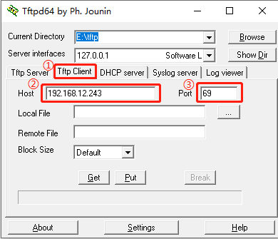
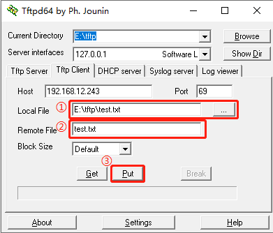

# TFTP: Simple File Transfer Protocol

## 1 Introduction

[TFTP](https://baike.baidu.com/item/TFTP) (Trivial File Transfer Protocol, Trivial File Transfer Protocol) is one of the TCP/IP protocol suites used to transfer simple files between the client and the server The transmission protocol provides an uncomplicated and inexpensive file transmission service. The port number is **69**, which is much lighter than the traditional FTP protocol and is suitable for small embedded products.

RT-Thread currently supports TFTP server and TFTP client.

## 2 TFTP server

The following will introduce the process of starting the TFTP server on the device side and reading and writing files from the device on the PC side as the client.

### 2.1 Start TFTP server

Before transferring files, you need to use the `tftp -s` command on the MSH terminal to start the TFTP server. The general effect is as follows:

```shell
msh />tftp -s
msh />tftp server start!
```

### 2.2 Client Configuration

Open the `Tftpd64` software on the PC and configure the client as follows:

- 1. Select `Tftp Client`;
- 2. Fill in the IP address of the TFTP server. You can use the `ifconfig` command to view under MSH of RT-Thread;
- 3. Fill in the port number of the TFTP server, default: `69`



#### 2.2.1 Send files to the device

- 1. Local File is the file path sent from the PC to the device;
- 2. `Remote File` is the path (including file name) where the file is saved on the server side. The server side supports relative and absolute paths. Because RT-Thread turns on the `DFS_USING_WORKDIR` option by default, the relative path is based on the directory currently entered by Finsh/MSH. Therefore, when using a relative path, be sure to switch the directory in advance;
- 3. Click the `Put` button to send the file to the device.

As shown in the figure below, send the file to the current directory, where **relative path** is used:



> Note: If `DFS_USING_WORKDIR` is not turned on and `Remote File` is empty, the file will be saved to the root path.

#### 2.2.2 Receive files from the device

- 1. Local File is the storage path of the received file on the PC (including the file name);
- 2. `Remote File` is the path of the file sent by the server (including the file name), and the options support relative and absolute paths. Since RT-Thread turns on the `DFS_USING_WORKDIR` option by default, the relative path is based on the directory currently entered by Finsh/MSH. Therefore, when using a relative path, be sure to switch the directory in advance;
- 3. Click the `Get` button.

As shown below, save `/web_root/image.jpg` locally, where **absolute path** is used:

```
msh /web_root>ls ##Check if the file exists
Directory /web_root:
image.jpg 10559
msh /web_root>
```


## 2.3 TFTP client

The following will introduce the process of reading and writing files from the PC on the device as a TFTP client.

### 2.3.1 Server configuration

Open the newly installed `Tftpd64` software and configure it as follows:

- 1. Select `Tftp Server`;
- 2. Configure the server folder path
- 3. In the drop-down box of `Server interfaces`, be sure to select the network card that is in the same network segment as RT-Thread;


### 2.3.1 TFTP command details

TFTP client read file command details

tftp -r/-w ip_addr file_name [-p]

- tftp: The first parameter is fixed `tftp`
- -w: write files to the server
- -r: read files from the server
- ip_addr: server IP address
- file_name: file name
- -p: server port number

### 2.3.2 TFTP read file

tftp -r ip_addr file_name

Use the above command to download a file on the tftp server to the local. Examples of commands are as follows:

eg: tftp -r 192.168.1.13 text.txt

Download the text.txt file from the server 192.168.1.13 to the local root path

### 2.3.2 TFTP write file

tftp -w ip_addr file_name

Use the above command to upload a local file to the tftp server. Examples of commands are as follows:

eg: tftp -w 192.168.1.13 text.txt

Upload the text.txt file under the local root path to the 192.168.1.13 server