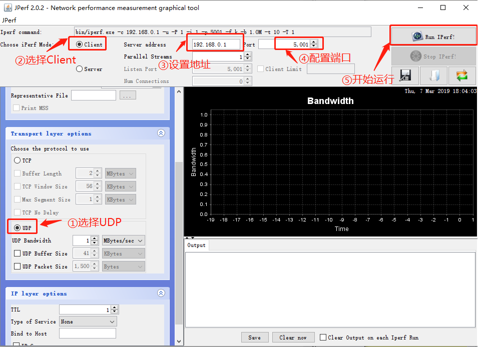
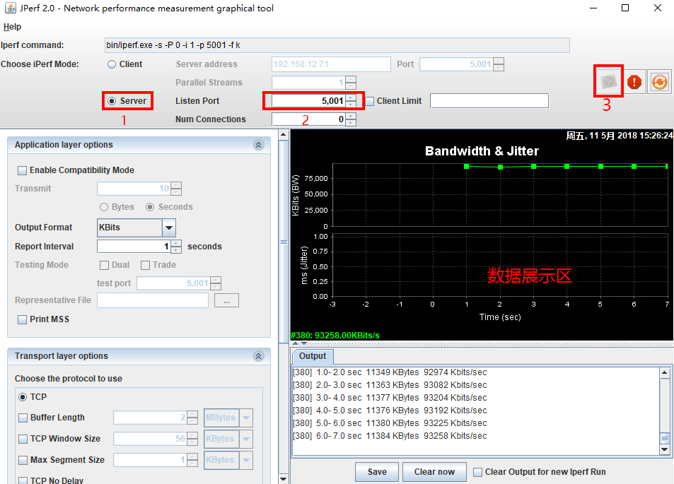
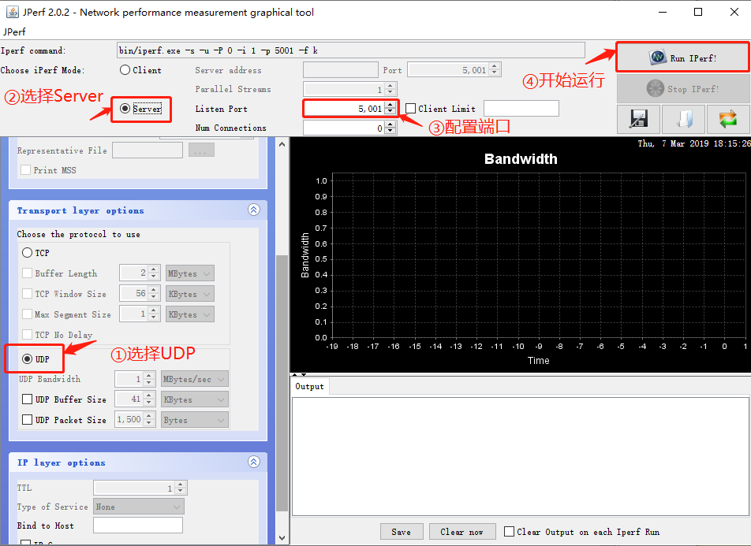

# iperf: Network bandwidth test tool

## 1 Introduction

[iperf](https://baike.baidu.com/item/iperf) is a network performance testing tool. iperf can test the maximum TCP and UDP bandwidth performance, has a variety of parameters and UDP characteristics, can be adjusted as needed, can report bandwidth, delay jitter and packet loss.

## 2. Use

iperf uses a master-slave architecture, that is, one end is a server, and the other end is a client. The iperf component package we provide implements the TCP server mode and the client mode. UDP testing is not currently supported. The usage of the two modes will be explained in detail below.

### 2.1 iperf server mode

#### 2.1.1 Get IP address

You need to use Finsh/MSH commands on RT-Thread to obtain an IP address. The general effect is as follows:

```
msh />ifconfig
network interface: e0 (Default)
MTU: 1500
MAC: 00 04 9f 05 44 e5
FLAGS: UP LINK_UP ETHARP
ip address: 192.168.12.71
gw address: 192.168.10.1
net mask: 255.255.0.0
dns server #0: 192.168.10.1
dns server #1: 223.5.5.5
```

-Write down the obtained IP address 192.168.12.71 (record according to the actual situation)

#### 2.1.2 Start iperf server

You need to use Finsh/MSH commands on RT-Thread to start the iperf server. The general effect is as follows:

tcp mode

```
msh />iperf -s -p 5001
```

udp mode

```
msh />iperf -u -s -p 5001
```

- -s means to start as a server
- -p means to monitor port 5001

#### 2.1.3 Install JPerf test software

The installation file is located in `/tools/jperf.rar`, this is a green software, the installation is actually a process of decompression, just unzip it to a new folder.

#### 2.1.4 Perform jperf test

Open the `jperf.bat` software and configure as follows:

- Select `Client` mode
- Enter the IP address 192.168.12.71 just obtained (fill in according to the actual address)
- Modify the port number to 5001
- Click `run Lperf!` to start the test
- Wait for the test to end. During the test, the test data will be displayed on the shell interface and JPerf software.

TCP mode software settings


udp mode software settings



### 2.2 iperf client mode

#### 2.2.1 Get the IP address of the PC

Use the ipconfig command on the command prompt window of the PC to obtain the IP address of the PC, and write down the obtained PC IP address as 192.168.12.45 (record according to the actual situation).

#### 2.2.2 Install JPerf test software

The installation file is located in `/tools/jperf.rar`, this is a green software, the installation is actually a process of decompression, just unzip it to a new folder.

#### 2.2.3 Start jperf server

Open the `jperf.bat` software and configure as follows:

- Select `Server` mode
- Modify the port number to 5001
- Click `run Lperf!` to start the server

#### 2.2.4 Start iperf client

You need to use Finsh/MSH commands on RT-Thread to start the iperf client. The general effect is as follows:

tcp mode

```
msh />iperf -c 192.168.12.45 -p 5001
```

udp mode

```
msh />iperf -u -c 192.168.12.45 -p 5001
```

- -c means to start as a client, and then need to add the IP address of the pc running the server
- -p means to connect to port 5001
- Wait for the test to end. During the test, the test data will be displayed on the shell interface and JPerf software.

TCP mode software settings



udp mode software settings

