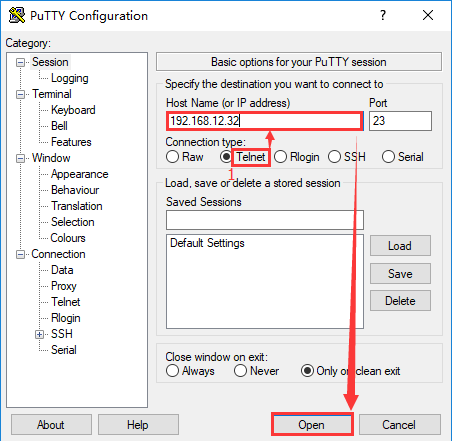
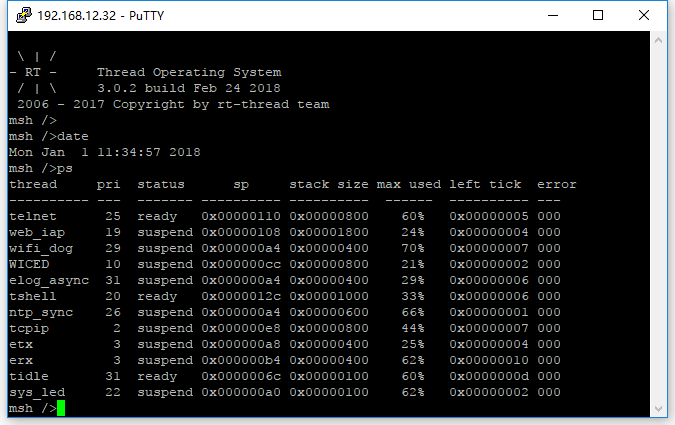

# Telnet: Remote login RT-Thread

## 1 Introduction

[Telnet](https://baike.baidu.com/item/Telnet) The protocol is an application layer protocol, used in the Internet and local area networks, in the form of a virtual terminal, providing two-way, text string-based Interactive function. It belongs to one of the TCP/IP protocol suites. It is the standard protocol and main method of Internet remote login service. It is often used for remote control of web servers and allows users to run work on the remote host on the local host.

RT-Thread currently supports Telnet server. After the Telnet client is successfully connected, it will remotely connect to the Finsh/MSH of the device to realize remote control of the device.

## 2. Use

### 2.1 Start Telnet server

You need to use the Finsh/MSH command on RT-Thread to start the Telnet server. The general effect is as follows:

```
msh />telnet_server
Telnet server start successfully
telnet: waiting for connection
msh />
```

### 2.2 Remote login to Telnet server

Install a terminal that supports Telnet client on the local computer, such as putty, Xshell, SecureCRT, here putty is used for demonstration:

- 1. Open putty and select `Telnet` mode;
- 2. Enter the Telnet server address and click Open;
- 3. After the connection is successful, you can use RT-Thread Finsh/MSH in the terminal;





### 2.3 Notes

- 1. After a successful connection with the Telnet server, the local Finsh/MSH of the device cannot be used. If you need to use it, just disconnect the connected Telnet client;
- 2. Telnet does not support the shortcut keys of `TAB` auto-completion, `Up`/`Down` to check history, etc.;
- 3. Currently, Telnet server only supports connecting to **1** clients.